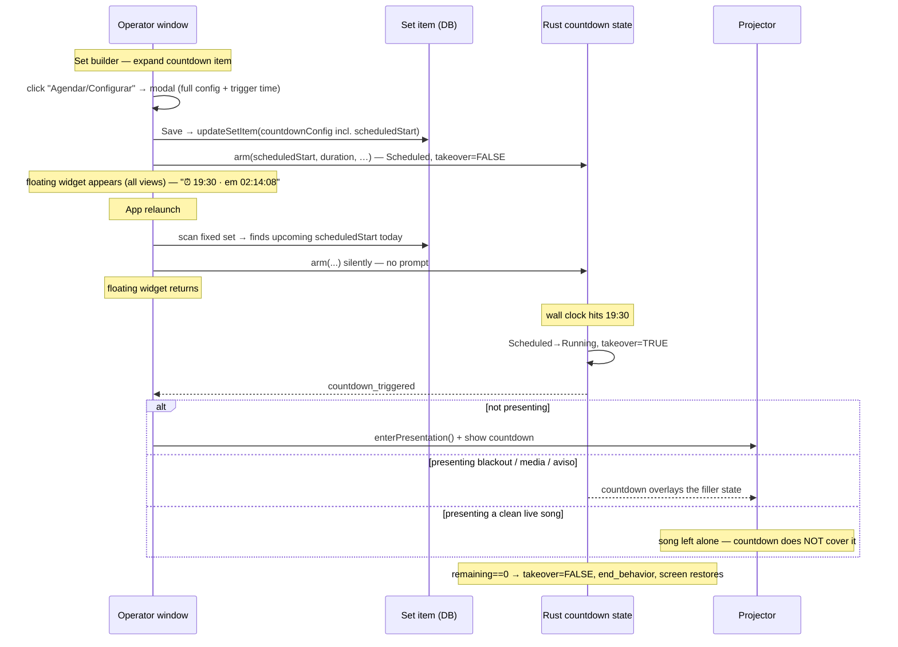

# Plan & Design — Countdown scheduling v2: config-in-modal + floating widget + soft takeover

Status: proposed · Date: 2026-06-04 · Branch target: feature branch off `main`

**Supersedes the entire arming model** from
`scheduled-countdown-launch-warning-autopresent.md` (launch prompt + header badge +
set-enter auto-arm). That model is **removed first**, then this one is built. The
takeover **render layer** from `splash-strophe-grid-16-10-countdown-takeover.md`
(landed `596d96f`) stays but its **precedence changes** (§D).

## Summary of the requested change

1. **Remove all the current scheduling behaviour first.** Delete the launch-warning
   modal (`CountdownLaunchPrompt`), the launch-time prompt scan in `OperatorApp`, the
   header "pending" badge in the overlay action bar, and the inline `scheduledStart`
   checkbox in the set-item editor.
2. **Schedule via a button → modal.** Expanding a countdown set item shows a
   **Schedule/Configure button** (replacing the inline config panel). Clicking it opens
   a **modal** holding the *full* countdown config (target = duration **or** fixed time,
   message, position, background, end behaviour) **plus** the trigger time.
3. **Save = arm now + persist.** Saving the modal **immediately arms** the countdown
   (Rust `Scheduled` ticker starts) **and** writes the config to the set item so it
   **survives a restart** — on next launch the schedule **re-arms silently** (no
   prompt).
4. **Floating mini-modal while armed.** Whenever a schedule is armed, a **global,
   draggable floating widget** shows the trigger time, a live "em mm:ss" countdown, an
   **Editar** button (reopens the modal pre-filled) and a **Cancelar** button (disarms
   + clears the schedule). Visible across **all operator views and during
   presentation**.
5. **Soft takeover at fire.** When the wall-clock time hits: if **not presenting**, open
   the presentation and show the countdown. If **presenting**, the countdown **overlays
   blackout / media overlay / aviso** — **but NOT a clean live song** (a song in
   progress is left alone). At 00:00 it auto-clears and the underlying screen returns
   (already implemented).

The two behavioural shifts vs. today: (a) arming happens **at config-save time**, owned
by the set item, not by a launch prompt; (b) the takeover is now **soft** — it yields to
a live song instead of covering everything.

---

## Current behaviour (findings)

- **Inline schedule config** — the `scheduledStart` checkbox + time input live in
  `src/components/set/CountdownSetItemEditor.tsx:306-338`; the whole editor is rendered
  inline when a countdown item is expanded in
  `src/components/set/SetBuilder.tsx:648-650`. Config round-trips through
  `CountdownConfig.scheduled_start` (`src-tauri/src/domain/countdown.rs:77`).
- **Launch-prompt arming** (the model being removed):
  - `src/components/system/CountdownLaunchPrompt.tsx` — one-shot modal.
  - `OperatorApp.tsx:126-138` scans the fixed set via
    `findUpcomingScheduledCountdown` (`src/runtime/scheduledCountdown.ts`) and shows the
    prompt; `OperatorApp.tsx:232-247` `handleKeepCountdown` arms on "keep".
  - `OperatorApp.tsx:63-65, 273-280` — `launchPrompt` state + render.
- **Header "pending" badge** — `OperatorPresentationLayout.tsx:77-92`
  (`armedCountdownLabel`, `handleCancelArmedCountdown`) → rendered by
  `OverlayActionBar.tsx:46-55` (`countdown-armed-badge`).
- **Set-enter behaviour** — `PresentationApp.tsx:166-173`: landing on a countdown item,
  if the store is `scheduled`/`running` do nothing, else `startCountdown` immediately
  (the "manual present" path). **Keep** this for unscheduled countdowns.
- **Arm command** — `arm_countdown` (`commands/countdown.rs:412-483`): lands in
  `Scheduled`, `takeover=false`; `tick_scheduled` (`:200-216`) flips to `Running` and
  sets `takeover=true` at the wall-clock fire; emits `countdown_triggered` (`:219-222`).
  `set_id`/`item_index` are passed to the trigger payload but **not stored** in
  `CountdownState`.
- **Trigger handler** — `OperatorApp.tsx:91-105`: `enterPresentation()`, and (only when
  *not* takeover) `jumpToItem`.
- **Render precedence (today)** — `PresentationApp.tsx:195-257`: takeover is the **top**
  branch (covers song/blank/overlay/idle), then announcement overlay, blank, media/
  webView overlay, idle. `LivePreview.tsx:67-` mirrors it.
- **`CountdownState`** has no `set_id`/`item_index` fields
  (`domain/countdown.rs:137-156`); the operator can't currently recover "which item is
  armed" from the store alone.
- **i18n** — `pt-BR.json:224-263` (`countdown.*`): `editor.scheduledStart*`,
  `schedule.badge`, `arm.cancel`, `launch.*` exist. Locale parity is enforced by a
  key-completeness test across `src/i18n/locales/*`.

---

## Desired behaviour

---

## Design

### A. Remove the old model (do this first)

- **Delete** `src/components/system/CountdownLaunchPrompt.tsx` (+ `.test.tsx`).
- **`OperatorApp.tsx`** — remove `launchPrompt` state (`:63-65`), the prompt render
  (`:273-280`), `handleKeepCountdown` (`:232-247`), the `getOrCreateDefaultSet()`
  prompt-scan block (`:126-138`), and the now-unused `CountdownLaunchPrompt` /
  `findUpcomingScheduledCountdown` imports. (A **silent** re-arm scan replaces the
  prompt scan — §E.)
- **`OperatorPresentationLayout.tsx`** — remove the badge derivation (`:77-92`) and the
  `armedCountdownLabel`/`onCancelArmedCountdown` props passed to `OverlayActionBar`
  (`:225-226`). `msToClock` moves to / is shared with the floating widget (§C).
- **`OverlayActionBar.tsx`** — delete the `armedCountdownLabel` block (`:46-55`) and its
  two props (`:18-24, 39-40`).
- **`CountdownSetItemEditor.tsx`** — remove the inline `scheduledStart`
  checkbox/time/hint block (`:306-338`) and related state (`scheduledEnabled`,
  `scheduledTime`). The rest of the inline editor is **superseded by the modal** (§B):
  the whole component is repurposed/replaced.
- **i18n** — drop `countdown.launch.*`, `countdown.editor.scheduledStart`,
  `countdown.editor.scheduledStartHint`, `countdown.arm.cancel`,
  `countdown.schedule.badge` once their refs are gone (re-add the ones the new UI needs
  in §G). Keep `countdown.scheduled.*` (renderer labels still used).
- **`findUpcomingScheduledCountdown`** — keep the function (reused by the silent
  re-arm scan, §E); only its prompt consumer is removed.

### B. Set-item Schedule button + config modal

**Set builder row** (`SetBuilder.tsx:646-650`): replace the inline
`<CountdownSetItemEditor>` with a compact summary + a **button**
(`t("countdown.schedule.button")`, e.g. "Configurar / Agendar") that opens the modal.
When the item already has a `scheduledStart`, also show a small "⏰ HH:MM" chip on the
row.

**New component `src/components/set/CountdownScheduleModal.tsx`:**
- Props: `{ item: SetItem; onClose(): void }`.
- Hosts the **full** countdown config — port the existing controls out of
  `CountdownSetItemEditor` (mode toggle duration/fixedTime, duration input, fixed-time
  input, message, end behaviour, background `MediaPicker`, position 3×3 grid) into the
  modal body. Reuse `msToDuration`/`durationToMs` (move to a shared helper or keep
  co-located).
- Adds a **"Agendar este cronômetro"** toggle + a `type="time"` trigger input
  (the former inline `scheduledStart` controls).
- Footer: **Cancelar** (close, no change) / **Salvar** (validate → persist + arm).
- Dialog idiom: reuse the project modal markup (`fixed inset-0 z-50 …
  bg-black/60`, `bg-surface` card) as in `OperatorPresentationLayout`'s dialogs.

**Save handler:**
1. `buildConfig()` (same shape as today, incl. `scheduledStart` when the toggle is on).
   Validate duration > 0; for a schedule require a duration target (fixed-time + schedule
   is contradictory — disable the schedule toggle in fixedTime mode, or coerce; see Edge
   cases).
2. `await updateSetItem({ id: item.id, countdownConfig })` — **persist**.
3. If scheduled: `useCountdownStore.getState().arm({ scheduledStart, durationMs,
   message, endBehavior, setId, itemIndex })` — **arm now** (no `takeover` — engages at
   fire). If the schedule toggle is **off**, ensure any prior arm for this item is
   cleared (`reset()`), so turning a schedule off disarms it.
4. `onClose()`.

> Unscheduled countdowns keep working: they're configured in the same modal with the
> schedule toggle off, and presented manually by navigating to the item (set-enter
> `startCountdown`, §F).

### C. Floating mini-modal (global, while armed)

**New component `src/components/system/ScheduledCountdownWidget.tsx`:**
- Renders only when `countdown.mode === "scheduled" || (countdown.mode === "running" &&
  countdown.takeover)`.
- Content: ⏰ icon, trigger `HH:MM` (derived from `scheduled_start_epoch_ms` or the armed
  item), live `t("countdown.widget.remaining", { remaining })` from
  `msToClock(countdown.remainingMs)`, and two buttons:
  - **Editar** → opens `CountdownScheduleModal` for the armed item.
  - **Cancelar** → `reset()` **and** clear the item's `scheduledStart`
    (`updateSetItem` with the schedule removed) so a relaunch won't re-arm.
- **Draggable**, corner-anchored (default bottom-right), `position: fixed`, high
  `z-index` (below true app modals, above content). Drag position kept in local state
  (session-only is fine).
- **Mounted at `OperatorApp` root**, *outside* the `isPresenting` branch (`:269-420`),
  so it shows in every view and over the presentation layout.

**Knowing which item is armed (for Editar / trigger jump):** add a small frontend-only
field to the countdown store — `armedItem: { setId: string; itemIndex: number } | null`
— set in `arm(...)` and cleared in `reset()`. On silent re-arm at launch (§E) it's set
from the scan hit. This avoids a Rust schema change while giving the widget and the
trigger handler the item reference. (Alternative: derive by matching
`scheduled_start_epoch_ms` against the fixed set — more fragile; prefer the store field.)

### D. Soft takeover — render precedence change

The countdown must overlay **blackout / media overlay / aviso**, but **yield to a clean
live song**. Define "clean live content" = `mode ∈ {live, frozen}` **and** no
`state.overlay`.

**`PresentationApp.tsx`** — move the takeover branch (`:195-207`) **below** the clean-
live-content guard. New order, top to bottom:

1. **Clean live set content** — if `mode ∈ {live, frozen}` and `!overlay`, render the
   normal set content (song/media-item/countdown-item/…) — *takeover does not apply.*
2. **Countdown takeover** — else if `countdown.takeover && countdown.mode !== "idle"`,
   render `CountdownRenderer` (now wins over announcement / blank / media overlay /
   idle).
3. announcement overlay → blank → media/webView overlay → idle (unchanged).

**`LivePreview.tsx`** — mirror the same reordering (`:67-` takeover block moves below the
clean-live guard) so the operator preview matches the projector.

> Net effect: the countdown covers every "filler" state but never interrupts lyrics
> already on the wall.

### E. Auto-present at fire + silent re-arm at launch

**Trigger handler (`OperatorApp.tsx:91-105`)** — adjust to the soft-takeover model:
- If **not presenting** → `await enterPresentation()` then
  `jumpToItem(armedItem.itemIndex)` so the countdown item becomes the live content and
  renders via the normal `itemType === "countdown"` branch (no reliance on takeover when
  freshly opened). 
- If **presenting** → do **not** jump; the takeover branch (§D) overlays filler states,
  and yields to a clean live song. (`item_index` from the payload or `armedItem`.)

**Silent re-arm at launch (`OperatorApp.tsx`, replacing the prompt scan):** after
`loadFixedSet()`, fetch the fixed set, run `findUpcomingScheduledCountdown(items, now)`,
and if a hit exists **arm it directly** (no modal) and set `armedItem`. Excludes
already-past-today schedules (resolver would roll to tomorrow — don't surprise-arm; same
rule as today's scan).

### F. Set-enter manual present (unchanged, kept)

`PresentationApp.tsx:166-173` stays: landing on a countdown item, if the store is
`scheduled`/`running` do nothing (don't disturb an armed schedule), else
`startCountdown` immediately. This is how an **unscheduled** countdown is presented.

### G. i18n — `src/i18n/locales/*`

- **Add:** `countdown.schedule.button` ("Configurar / Agendar"),
  `countdown.schedule.toggle` ("Agendar este cronômetro"),
  `countdown.schedule.triggerLabel` ("Disparar às"),
  `countdown.widget.remaining` (`{{remaining}}`), `countdown.widget.edit` ("Editar"),
  `countdown.widget.cancel` ("Cancelar"), `countdown.modal.title`,
  `countdown.modal.save`, `countdown.modal.cancel`.
- **Remove (dead after §A):** `countdown.launch.*`, `countdown.arm.cancel`,
  `countdown.schedule.badge`, `countdown.editor.scheduledStart`,
  `countdown.editor.scheduledStartHint`.
- Update every locale (parity test).

### H. Backend — minimal / none

`arm_countdown` already lands `Scheduled`/`takeover=false`; `tick_scheduled` already
sets `takeover=true` at fire and emits `countdown_triggered`. **No Rust changes
required** for arming. The soft-takeover decision is purely a **frontend render** change
(§D) — the `takeover` flag still means "wants to overlay"; the renderer now additionally
checks "is a clean live song showing?". `set_id`/`item_index` stay in the trigger
payload; `armedItem` is tracked frontend-side (§C), so no `CountdownState` schema change.

---

## Files touched

| File | Change |
|---|---|
| `src/components/system/CountdownLaunchPrompt.tsx` (+ test) | **delete** |
| `src/windows/operator/OperatorApp.tsx` | remove launch prompt; silent re-arm scan; mount floating widget; soft-takeover trigger handler |
| `src/components/presentation/OperatorPresentationLayout.tsx` | remove header pending badge + props |
| `src/components/presentation/OverlayActionBar.tsx` | remove `armedCountdownLabel` badge + props |
| `src/components/set/SetBuilder.tsx` | countdown row → summary + Schedule button (opens modal); ⏰ chip |
| `src/components/set/CountdownScheduleModal.tsx` | **new** — full config + schedule modal; save → persist + arm |
| `src/components/set/CountdownSetItemEditor.tsx` | remove inline scheduledStart; controls move into the modal (repurpose/replace) |
| `src/components/system/ScheduledCountdownWidget.tsx` | **new** — global draggable floating widget (edit/cancel/remaining) |
| `src/stores/countdown.ts` | track `armedItem {setId,itemIndex}` set on `arm`, cleared on `reset` |
| `src/windows/presentation/PresentationApp.tsx` | soft-takeover: move takeover below clean-live-content guard |
| `src/components/presentation/LivePreview.tsx` | mirror soft-takeover reorder |
| `src/i18n/locales/*` | add widget/modal/schedule keys; remove launch/arm/badge/editor.scheduled keys |
| `src/runtime/scheduledCountdown.ts` | unchanged (reused by silent re-arm) |
| `src-tauri/src/**` | **no change** (arm/fire/emit already correct) |

---

## Edge cases

- **Fixed-time target + schedule** — a fixed-time countdown already targets a wall clock;
  scheduling it (a second wall clock) is contradictory. Disable the schedule toggle when
  mode = fixedTime (schedules apply to **duration** countdowns only — matches
  `findUpcomingScheduledCountdown`, which ignores non-duration targets).
- **Schedule already past today at save/launch** — resolver rolls to tomorrow; the
  re-arm scan **excludes** past-today (no surprise tomorrow takeover). Saving a past time
  in the modal: warn / refuse, or arm for tomorrow explicitly? **Recommend** refusing
  with an inline hint ("horário já passou hoje").
- **Two scheduled countdowns in the set** — only one Rust countdown state exists; arming a
  second aborts the first. Modal-save arms the one being edited; the silent launch scan
  arms the **earliest upcoming**. Document one-at-a-time.
- **Fires while a clean live song is up** — per the decision, the countdown does **not**
  cover it; it still transitions to `Running` in the store and the floating widget shows
  it "running". The operator can navigate to the countdown item to show it, or it simply
  runs to 00:00 unseen (end behaviour still applies). Flag this as the deliberate trade.
- **Fires while presenting blackout/media/aviso** — overlays it; on finish, takeover
  clears and the filler state returns (existing restore).
- **Cancel from widget vs. turning the modal toggle off** — both disarm; widget Cancel
  also clears persisted `scheduledStart`. Modal toggle-off + Save likewise clears it.
- **App reopened after the trigger time** — schedule is past → not re-armed (excluded by
  the scan). Acceptable (no missed-takeover replay).

---

## Requirement traceability

| ID | Requirement | Where |
|---|---|---|
| CS-01 | Remove all old scheduling behaviour first | A |
| CS-02 | Schedule via a button on the set item → modal (full config + time) | B |
| CS-03 | Modal replaces the inline set-item config | A, B |
| CS-04 | Save arms immediately + persists; silent re-arm on relaunch | B, E |
| CS-05 | Floating mini-modal: info, time-to-trigger, cancel, edit (global) | C |
| CS-06 | At trigger: open + present if not presenting | E |
| CS-07 | At trigger while presenting: overlap blackout/media/aviso | D |
| CS-08 | Soft takeover: do NOT overlap a clean live song | D |
| CS-09 | Auto-clear at 00:00 restores underlying screen | (existing) |

---

## Tests

- **Frontend:**
  - `CountdownScheduleModal.test.tsx` — renders config controls; Save with schedule on
    calls `updateSetItem` **and** `arm` (duration + scheduledStart); schedule off calls
    `updateSetItem` only and `reset`; fixedTime mode disables the schedule toggle.
  - `ScheduledCountdownWidget.test.tsx` — renders only when `scheduled` / running-takeover;
    shows trigger time + remaining; **Editar** opens the modal; **Cancelar** calls
    `reset` + clears `scheduledStart`. Not rendered when idle.
  - `OperatorApp` launch — a later-today scheduled item **silently arms** (no prompt);
    past-today / absent → no arm; floating widget appears when armed. (Mock
    `getOrCreateDefaultSet` + countdown store.)
  - `PresentationApp.test.tsx` — **new precedence:** `takeover` + clean live song
    (`mode==="live"`, no overlay) → renders the **song**, not the countdown; `takeover`
    + `mode==="blank"` → renders the **countdown**; `takeover` + media/announcement
    overlay → countdown. Existing finish/auto-clear tests stay green.
  - `LivePreview.test.tsx` — mirror the precedence assertions.
  - `SetBuilder.test.tsx` — countdown row shows the Schedule button (mock the modal); ⏰
    chip when `scheduledStart` set.
- **Rust:** unchanged; existing `commands/countdown.rs` / `domain/countdown.rs` tests
  stay green (no backend change).
- **i18n:** key-completeness across all locales after add/remove.
- **Manual (real hardware, two monitors):** configure+save a duration schedule → widget
  appears, projector untouched; relaunch → widget returns (silent re-arm); at HH:MM while
  blacked-out/showing an aviso → countdown overlays; while a song is live → song stays;
  at 00:00 → underlying screen restores; Cancel from widget → disarms and won't re-arm.

---

## Risks / notes

- **Soft-takeover inversion is intentional and new** — yielding to a live song means a
  schedule can fire "invisibly" if lyrics are up. The floating widget + the
  running-takeover state keep it discoverable; document for operators.
- **Single countdown state** — only one schedule armed at a time (Rust constraint).
  Arming a second supersedes the first. Surface clearly in the modal if a different item
  is already armed (optional: confirm-replace).
- **CLAUDE.md invariants** — no new Rust state writes; the existing `takeover` write in
  `tick_scheduled` stays inside its `countdown.write().await` block (drops before
  `emit`). Two-window pattern intact (state Rust-owned; presentation window read-only).
- **`armedItem` is frontend-only** and resets on app restart — re-derived by the launch
  scan, so it's consistent with persistence without a schema migration.
- **No shared Toast/Dialog** — the modal and widget reuse the ad-hoc modal idiom; a
  shared component remains separately filed.

---

## Suggested commit slices

1. `refactor(countdown): remove launch-prompt arming model` — delete
   `CountdownLaunchPrompt`, the prompt scan/keep handler, the header pending badge, and
   dead i18n. (Old behaviour gone; app still builds, schedules simply not armable yet.)
2. `feat(countdown): config+schedule modal on set item` — `CountdownScheduleModal`,
   SetBuilder button, move config out of the inline editor; save → persist + arm; +i18n.
3. `feat(countdown): global floating scheduled-countdown widget` — `ScheduledCountdownWidget`,
   `armedItem` store field, edit/cancel; mount in `OperatorApp`.
4. `feat(countdown): silent re-arm at launch` — replace the prompt scan with a direct arm.
5. `feat(countdown): soft takeover yields to live song` — reorder precedence in
   `PresentationApp` + `LivePreview`; trigger handler open+jump when not presenting.

## Cross-cutting checks
- `npx vitest` + `cargo test --manifest-path src-tauri/Cargo.toml` green.
- i18n key-completeness across all locales (added widget/modal keys; removed
  launch/arm/badge/editor.scheduled keys).

---

## Open questions to confirm during implementation

- **Cancel semantics** — assumed widget **Cancelar** clears the persisted
  `scheduledStart` (won't re-arm next launch). If instead it should only disarm *this
  session* (keep config for next launch), flip step C/Cancel. Confirm.
- **Past-time save** — assumed refuse with a hint. If "arm for tomorrow" is wanted
  instead, relax §B/Edge.
- **Live-song-at-fire** — assumed the song wins and the countdown runs unseen. If the
  operator should instead get a prompt/auto-jump option, that's a follow-up.
