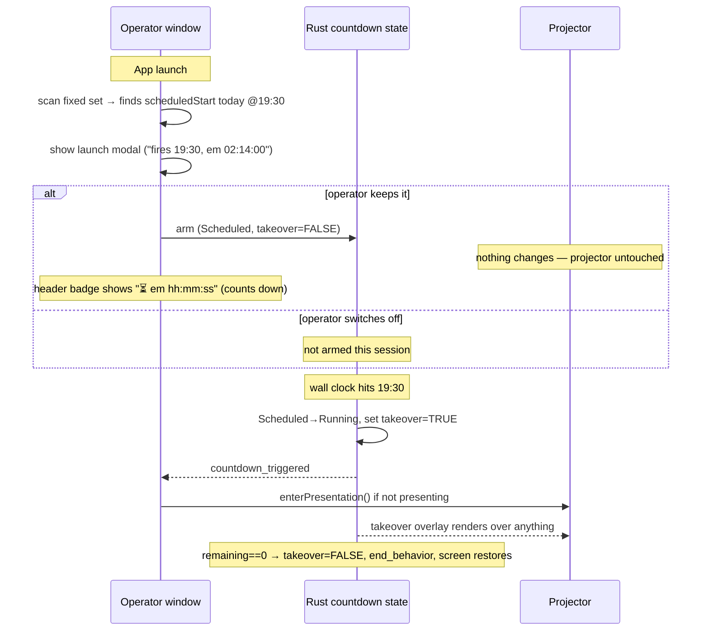

# Plan & Design — Scheduled-countdown: launch warning + auto-present (no manual arm)

Status: proposed · Date: 2026-06-04 · Branch target: feature branch off `main`

Supersedes the arming model from
`splash-strophe-grid-16-10-countdown-takeover.md` §3. The takeover **render layer**
landed in commit `596d96f` and stays; what changes is **how/when a scheduled
countdown is armed and when it seizes the screen**.

## Summary of the requested change

1. **Remove the manual "arm" affordance.** The `Armar contagem` button is opaque to
   operators ("people will not understand it") → delete it and its plumbing.
2. **Warn at app launch, declaratively.** If the current (fixed) set contains a
   countdown with a `scheduledStart`, on launch show a **modal**: "a countdown will
   fire at HH:MM (in mm:ss) and take over the screen — keep it on, or switch it off".
   If the app is **already presenting** when the schedule is live, surface the
   **time-remaining in the header** (the persistent badge) instead of a modal.
3. **Auto-present at the wall-clock time.** When the scheduled time hits: if not
   presenting, **open** the presentation and show the countdown; if presenting, the
   countdown **overlays** whatever is up (live song / blackout / media / aviso). At
   00:00 it auto-clears and the underlying screen returns (already implemented).
4. **Analysis** of this approach vs. the alternatives (§Pros/cons).

The linchpin: today `takeover` is set **the instant you arm** (see findings), so an
early arm would immediately black the projector with "Começa em 2:59:59". The new
model **defers `takeover` to the Scheduled→Running transition**, so arming hours ahead
is safe and invisible until the moment arrives.

---

## Current behaviour (findings)

- **Per-item schedule config** lives on `CountdownConfig.scheduledStart` (HH:MM),
  edited via the checkbox "Iniciar automaticamente em um horário" in
  `src/components/set/CountdownSetItemEditor.tsx:306-338`. Stored on the set item;
  round-trips through `src-tauri/src/domain/countdown.rs:77` (`scheduled_start`).
- **Two arm triggers exist today:**
  - *Auto-arm on set-enter* — `PresentationApp.tsx:161-181` effect keyed on
    `currentItem?.id`: when the runtime lands on a countdown item with
    `scheduledStart`, it calls `armCountdown(...)` **without** `takeover` (→ default
    `false`). Plain (unscheduled) countdown items call `startCountdown(...)`.
  - *Manual button* — `OperatorPresentationLayout.tsx:112-132` `handleArmCountdown`
    arms with `takeover: true`, opens the presentation, fires a local toast; the
    button + badge live in `OverlayActionBar.tsx:48-67`
    (`arm-countdown-button` / `countdown-armed-badge`).
- **`takeover` is set at arm/start time**, not at fire time:
  `arm_countdown` (`commands/countdown.rs:446-448`) and `start_countdown`
  (`:322-324`) both write `s.takeover = t` from the param. The state field is
  `domain/countdown.rs:154-155`.
- **Render precedence** — `PresentationApp.tsx:203-215`: a top branch returns the
  `CountdownRenderer` whenever `countdown.takeover && countdown.mode !== "idle"`
  (above announcement/blank/media/live). `LivePreview.tsx:67-?` mirrors it. So with
  the current "takeover-at-arm" semantics, a **Scheduled** countdown with
  `takeover=true` already covers the screen during the wait — undesirable for an
  early arm.
- **The Scheduled→Running ticker** (`tick_scheduled`, `commands/countdown.rs:161-236`)
  decrements toward the wall clock, then on `remaining == 0` flips to `Running`,
  emits `countdown_triggered {set_id,item_index}`, and hands off to `tick_countdown`.
  It **does not touch `takeover`** at the transition.
- **`countdown_triggered` handler** — `OperatorApp.tsx:82-96`: `await
  enterPresentation()`, and jumps to the item **only when not a takeover**.
- **Finish** — `tick_countdown` (`commands/countdown.rs:125-130`) sets
  `takeover=false` at `remaining==0`, then runs `end_behavior`. ✔ keep.
- **The "current set"** at launch is the **fixed/default set**: `OperatorApp` calls
  `loadFixedSet()` (`OperatorApp.tsx:115`) → `library.ts:75-82` →
  `getOrCreateDefaultSet()` which returns a full `ServiceSet` **including `items`**
  (`api/commands.ts:244`). So launch-time scanning needs no new command.
- **Launch lifecycle** — `OperatorApp.tsx:56` already gates a `SplashScreen` and a
  `RestoreInProgressDialog`/`UpdateBanner`; the new launch modal slots in beside them.
- **Toasts** are ad-hoc per component (local `useState` + `setTimeout`); the operator
  layout already has one (`OperatorPresentationLayout.tsx:47-56`). No shared `Toast`.
- **Dead i18n:** `countdown.schedule.*` (`pt-BR.json:247-252`) has **zero code refs**
  (left from the deleted `CountdownPanel`) — safe to remove alongside.

---

## Desired behaviour

---

## Design

### A. Backend — defer `takeover` to fire time (the linchpin)

**`src-tauri/src/commands/countdown.rs`**
- `tick_scheduled` — in the `remaining == 0` block that flips Scheduled→Running
  (around `:204-211`), **set `s.takeover = true`** in the same write that sets
  `mode = Running`. This is the *only* place a scheduled countdown becomes a takeover.
- `arm_countdown` (`:407`) — stop honouring an incoming `takeover: true` for the
  scheduled path: arm always lands in `Scheduled` with `takeover = false`. Simplest:
  drop the `if let Some(t) = takeover { s.takeover = t }` write (or force `false`).
  Keep the param in the signature for IPC compat, but it no longer arms a takeover.
- `start_countdown` (`:271`) — unchanged mechanically; with the manual button gone
  nothing passes `takeover:true` here anymore. Leave the param (compat); effectively
  always `false`.
- `tick_countdown` finish-clear (`:125-130`) — unchanged (still clears `takeover`).
- `reset_countdown`/`pause_countdown` — unchanged (`reset` already clears `takeover`).

**`src-tauri/src/domain/countdown.rs`** — no field change. Add a logic test asserting
the transition sets `takeover` (mirrors the existing drift-free unit tests; the
ticker itself isn't unit-tested, so assert the state-write rule in a small focused
test or document it as covered by the frontend precedence test).

### B. Frontend — remove the manual arm affordance

- `OverlayActionBar.tsx` — delete `showArmCountdown` / `onArmCountdown` and the
  `arm-countdown-button` block (`:57-67`). **Keep** the badge block but repurpose it
  (§D).
- `OperatorPresentationLayout.tsx` — delete `handleArmCountdown`, `canArmCountdown`,
  `scheduledDurationMs`, `activeCountdownConfig`, and the `showArmCountdown`/
  `onArmCountdown` props passed to `OverlayActionBar` (`:90-132`, `:269-270`). Keep
  the local toast plumbing (reused by nothing critical now, but harmless; or remove
  if it becomes unused — it currently *only* served the arm toast, so it can go).

### C. Frontend — launch warning modal

**New component `src/components/system/CountdownLaunchPrompt.tsx`:**
- Props: `{ scheduledHHMM: string; remainingMs: number; onKeep(): void; onDisable(): void }`.
- A centered modal (reuse the existing dialog markup idiom in
  `OperatorPresentationLayout` — `fixed inset-0 z-50 … bg-black/60`, `bg-surface`
  card). Body: `t("countdown.launch.body", { time, remaining })`. Two buttons:
  **Manter ativo** (primary) and **Desativar** (surface-2).
- No timers inside; it's a one-shot decision dialog.

**Wire-up in `OperatorApp.tsx`** (beside `showSplash`):
- After `loadFixedSet()` resolves, fetch the fixed set (`getOrCreateDefaultSet()` /
  `getSet(fixedSetId)`) and scan `items` for countdown items with `scheduledStart`.
- Compute each one's resolved start for **today** (local). **Only consider schedules
  that are later *today*** (not rolled to tomorrow — see Edge cases). Pick the
  **earliest upcoming** one.
- If one exists **and not presenting** → `setLaunchPrompt({ config, hhmm, remainingMs })`.
  - **Manter** → `useCountdownStore.getState().arm({ scheduledStart, durationMs,
    message, endBehavior, setId: fixedSetId, itemIndex })` (note: **no `takeover`** —
    defaults false). Close modal. Header badge takes over the "still pending" job.
  - **Desativar** → close modal, do **not** arm — no schedule, no takeover this
    session. The countdown reverts to an ordinary set item: presenting it is then
    **manual only**, by navigating to / clicking that item in presentation mode, which
    **starts it immediately** (counts down its duration, no takeover). The item's
    `scheduledStart` config is untouched (next launch re-prompts). See §E.
- If already presenting at detection time → skip the modal; the header badge (§D)
  shows the pending schedule. (Cold launch is never presenting, so this is the
  re-launch / mid-session edge.)
- Show at most once per process (component state, like `showSplash`).

### D. Frontend — header "time-remaining" indicator (presenting)

Repurpose the existing armed badge so it reflects the **scheduled** (pending) state,
counting down — this is the "toast on the header" the request asks for while presenting:
- In `OperatorPresentationLayout.tsx`, derive:
  - `isPending = countdown.mode === "scheduled"` → badge label
    `t("countdown.schedule.badge", { remaining: msToClock(countdown.remainingMs) })`
    e.g. **"⏳ Cronômetro em 02:14:00"** (use an hh:mm:ss formatter for >1h).
  - `isLive = countdown.mode === "running" && countdown.takeover` → optional
    "running takeover" badge (keep current behaviour).
- Pass `armedCountdownLabel` from `isPending || isLive`; clicking still calls
  `reset()` (cancel). The badge now appears **during the wait** (when `takeover` is
  false) — its render condition must switch from `countdown.takeover && …` to
  `countdown.mode === "scheduled" || (running && takeover)`.
- `LivePreview.tsx` takeover branch (`:67-`) — unchanged; it correctly only fires
  once `takeover` is true (i.e., at/after fire), since pending no longer sets takeover.

### E. Frontend — set-enter effect: never arm; immediate-start = manual present

`PresentationApp.tsx:161-181` — **remove the scheduled branch** (`if (scheduledStart)
{ armCountdown… }`). Arming is owned solely by the launch modal, so set-enter must
never arm/re-arm. New rule for landing on a countdown item:

- **If the store is already `scheduled` or `running`** (i.e. it was kept-and-armed at
  launch) → **do nothing**: leave the pending schedule alone. Navigating onto the item
  just previews it via the existing `itemType === "countdown"` branch (which reads the
  scheduled store → "Começa em …"); the takeover still fires at HH:MM regardless of
  where the operator is parked.
- **Otherwise** (no active schedule — unscheduled item, *or* the operator chose
  **Desativar**) → `startCountdown({ target, message, endBehavior })` **immediately**.
  This is the "manual present" path: clicking/navigating to the item runs the countdown
  now, ignoring `scheduledStart`, with no takeover. (CD-07)

This single guard makes "off" behave exactly as requested — a switched-off countdown is
presentable only by manually going to its set item — while a kept-on schedule is
untouched by navigation.

### F. Auto-present at fire — mostly already wired

With `takeover` now set in `tick_scheduled`, the existing `countdown_triggered`
handler (`OperatorApp.tsx:82-96`) already does the auto-present:
`enterPresentation()` opens the window if closed; the top render branch overlays if
open. No change needed beyond confirming the no-jump-on-takeover guard still holds
(it reads `state.takeover`, which is now true at trigger time). ✔

### G. i18n — `src/i18n/locales/*`

- **Add:** `countdown.launch.title`, `countdown.launch.body` (`{{time}}`,
  `{{remaining}}`), `countdown.launch.keep`, `countdown.launch.disable`;
  `countdown.schedule.badge` (`{{remaining}}`).
- **Remove (now dead):** `countdown.arm.button`, `countdown.arm.toast` (arm button +
  arm toast gone). Keep/repurpose `countdown.arm.cancel` for the badge title, or move
  it under `countdown.schedule.cancel`. Remove the orphaned `countdown.schedule`
  heading/startAt/armButton/hint block (zero refs).
- i18n key-completeness test enforces parity across all locales — update each.

---

## Files touched

| File | Change |
|---|---|
| `src-tauri/src/commands/countdown.rs` | set `takeover=true` at Scheduled→Running in `tick_scheduled`; stop arming takeover in `arm_countdown` |
| `src-tauri/src/domain/countdown.rs` | (test) assert fire-time sets takeover |
| `src/windows/operator/OperatorApp.tsx` | launch-scan fixed set; show `CountdownLaunchPrompt`; arm-on-keep |
| `src/components/system/CountdownLaunchPrompt.tsx` | **new** — launch warning modal |
| `src/components/presentation/OperatorPresentationLayout.tsx` | drop manual-arm plumbing; badge now reflects `scheduled` (remaining countdown) |
| `src/components/presentation/OverlayActionBar.tsx` | delete `arm-countdown-button` + arm props; keep/repurpose badge |
| `src/windows/presentation/PresentationApp.tsx` | remove scheduled branch from set-enter auto-arm effect |
| `src/i18n/locales/*` | add `countdown.launch.*`, `countdown.schedule.badge`; remove dead `arm.button`/`arm.toast`/`schedule.*` |
| `src/stores/countdown.ts` / `src/api/commands.ts` | none required (params already optional; frontend just stops sending `takeover:true`) |

---

## Pros / cons of this approach vs. the alternatives

**This approach — launch-time modal + arm-for-the-session, takeover deferred to fire:**
- ✅ Matches the operator's mental model: one yes/no question at the start of the
  service ("there's a timer at 19:30 — keep it?"), then it just works. No jargon.
- ✅ Removes the opaque "Armar" verb entirely (the explicit ask).
- ✅ Arming early is **safe** because takeover is deferred — the projector is never
  blacked out during the long wait; only the operator's header shows the countdown.
- ✅ Auto-present requires no operator action at the critical moment (the failure mode
  of the manual button: nobody remembers to press it).
- ⚠️ The decision is made **once at launch** off the fixed set; schedules added/edited
  **after** launch don't re-prompt (mitigated by the header badge once armed, and
  re-launch re-prompts). See open question.
- ⚠️ Only the **fixed/default set** is scanned — fine today (single live set), but a
  multi-set future would need to scan the *active* set on set-switch too.

**B) Manual "Arm" button near the event (current/old §3 model):**
- ✅ Zero ambiguity about *when* takeover starts (operator chooses the moment).
- ❌ Opaque label; operators don't understand "Armar" (the reported problem).
- ❌ Single point of human failure — forget to press → no countdown.
- ❌ Only reachable while presenting (button lives in the overlay action bar).

**C) Silent auto-arm on set-enter, no prompt (today's `PresentationApp` effect):**
- ✅ Zero clicks.
- ❌ No "warn + power to switch off" — the explicit ask is a *visible, optional* prompt.
- ❌ Arms only when you navigate onto the item, which may never happen before fire.
- ❌ With takeover-at-arm it also blacks the screen on entry (today's latent bug).

**D) Fully declarative (Rust arms itself from config at startup, no UI at all):**
- ✅ Most robust — survives operator inaction completely.
- ❌ No off-switch surfaced to a human; a stale `scheduledStart` would seize the screen
  unexpectedly. The request explicitly wants the operator to be able to **switch it
  off**, so a prompt is required. (This approach is essentially A minus the modal.)

**Verdict:** A is the best fit for the stated requirements — it keeps the safety of
automation (auto-present, no forgotten button) while honouring "warn the operator and
let them switch it off," and the takeover-defer fix removes the only real hazard of
arming early.

---

## Edge cases

- **Schedule already past today** → resolver rolls to *tomorrow*; the launch scan must
  **exclude** tomorrow-rolled times (don't prompt at 20:00 for a 19:00 schedule).
  Only prompt for "later today".
- **Multiple scheduled countdowns in the set** → prompt for the **earliest upcoming**
  only; arming a second would abort the first (`arm_countdown` aborts any running
  ticker). Document as a one-at-a-time limitation.
- **Operator disables, then relaunches** → re-prompts (session-only skip). Acceptable.
- **Fires while a media/aviso/blackout overlay is up** → takeover is top precedence and
  overlays it (the request). On finish, takeover clears and the underlying overlay
  returns (existing restore behaviour).
- **Empty / countdown-less set** → no scan hit, no modal, no change.
- **`enterPresentation` on empty set errors** — N/A here, the set has the countdown
  item, so it's non-empty.

---

## Requirement traceability

| ID | Requirement | Where |
|---|---|---|
| CD-01 | Remove manual "Armar" button + plumbing | B |
| CD-02 | Launch modal warns of scheduled countdown w/ on/off | C, G |
| CD-03 | While presenting, header shows time-remaining to launch | D |
| CD-04 | Takeover deferred to wall-clock fire (safe early arm) | A |
| CD-05 | Auto-present at fire (open if closed, overlay if presenting) | F |
| CD-06 | Auto-clear at 00:00 restores underlying screen | (existing) |
| CD-07 | If switched off, countdown presents only manually via its set item | E, C |

---

## Tests

- **Rust:** in `commands/countdown.rs` tests, assert the Scheduled→Running transition
  rule sets `takeover=true` (extract the state-mutation into a tiny testable helper if
  the ticker can't be driven directly), and that `arm_countdown` lands `takeover=false`.
  Existing drift-free / resolver tests stay green.
- **Frontend:**
  - `CountdownLaunchPrompt.test.tsx` — renders time/remaining; **Manter** calls
    `onKeep`, **Desativar** calls `onDisable`.
  - `OperatorApp` launch logic — given a fixed set with a later-today `scheduledStart`,
    the prompt shows; **Manter** invokes `arm` with no `takeover`; a tomorrow-rolled or
    absent schedule shows nothing. (Mock `getOrCreateDefaultSet` + countdown store.)
  - `OperatorPresentationLayout.test.tsx` — badge renders for `mode==="scheduled"`
    with a remaining label and **no** `arm-countdown-button`; clicking cancels (reset).
  - `PresentationApp.test.tsx` — existing takeover-precedence tests stay green; a
    `scheduled`+`takeover:false` state does **not** overlay (new assertion).
- **Manual (real hardware, two monitors):** launch with a later-today schedule → modal;
  keep → projector untouched, header counts down; at HH:MM → presentation opens (or
  overlays a live song / blackout / media); at 00:00 → screen restores.

---

## Risks / notes

- **Precedence inversion stays:** takeover deliberately covers the aviso overlay at
  fire. The header cancel badge must remain reachable so the operator can abort.
- **CLAUDE.md invariant:** the new `takeover=true` write in `tick_scheduled` is inside
  the existing `countdown.write().await` block that already drops before `app.emit()`
  — keep it there; don't emit while holding the guard.
- **No shared Toast:** the header indicator reuses the existing badge (not a toast
  component); a shared `Toast`/`useToast` refactor remains separately filed.
- **Two-window invariant intact:** takeover/scheduled state is Rust-owned; both windows
  project it; presentation window never mutates.

---

## Suggested commit slices

1. `fix(countdown): defer takeover to scheduled→running fire time` — Rust state rule +
   test; the safety prerequisite for everything else.
2. `feat(countdown): launch warning modal for scheduled countdowns` —
   `CountdownLaunchPrompt` + `OperatorApp` scan/arm-on-keep + i18n.
3. `feat(countdown): header time-remaining badge while pending` — repurpose badge for
   `scheduled` mode.
4. `refactor(countdown): remove manual Arm button + set-enter scheduled auto-arm` —
   delete the opaque affordance and the redundant auto-arm branch; drop dead i18n.

## Cross-cutting checks
- `npx vitest` + `cargo test --manifest-path src-tauri/Cargo.toml` green.
- i18n key-completeness across all locales (new `countdown.launch.*` / `schedule.badge`;
  removed `arm.button`/`arm.toast`/`schedule.*`).

---

## Open question to confirm during implementation

- **Mid-session schedules.** The launch modal decides off the fixed set at startup. If
  the operator *adds/edits* a `scheduledStart` after launch, there's no re-prompt.
  Options: (a) accept it (config-before-launch workflow, re-launch to re-prompt);
  (b) also prompt/auto-arm when a countdown item's `scheduledStart` is saved in the
  editor; (c) re-scan when the set changes (`onSetChanged`). Recommend (a) for v1,
  (c) as a follow-up. Confirm before building.
