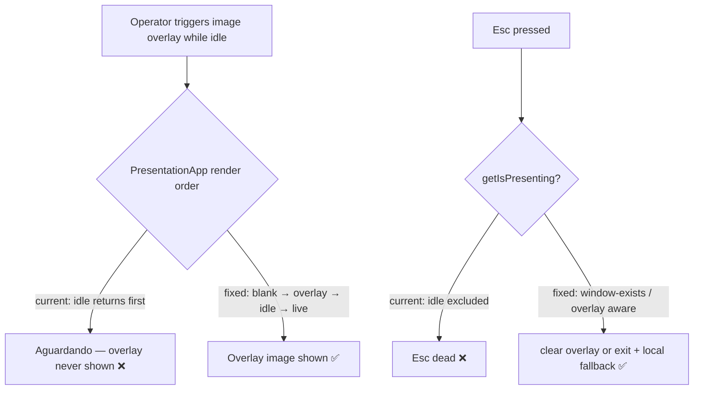

# Phase 10 — Stability Fixes Design

**Spec:** `./spec.md` (P10-01..P10-06)
**Date:** 2026-06-01

## Overview

Three fixes plus window-lifecycle hardening. Two share a single architectural root cause —
**the presentation window cannot be dismissed independently of its mode or of the operator
window.** The design fixes the specific render-ordering bug (P10-01), removes the mode gate on
Esc and adds a self-close fallback (P10-02), makes the parens logic idempotent in both renderers
(P10-03/04), and adds cross-window lifecycle management + observability (P10-05/06).



---

## P10-01 — Overlay renders over idle

**Files:** `src/windows/presentation/PresentationApp.tsx`

**Change:** Reorder the early-return branches so overlay precedence is correct. Target order:

1. `mode === "blank"` → solid black (beats everything — intentional blackout via F10).
2. `overlay` present → render overlay (Announcement/Media/WebView). **Now reached from idle too.**
3. `mode === "idle"` → countdown (if armed) else "Aguardando apresentação…".
4. live/frozen → set content.

Currently the order is idle (≈line 163) → blank (≈185) → overlay (≈191). Move the `blank` check
to the top, then the `overlay` block, then the idle block. The overlay JSX already exists
(announcement/media/webview branches) — only its position moves.

**Why not change the backend (`overlay.rs`) to set `mode`?** Overlays are deliberately
mode-independent transient layers (D-22). Making an overlay flip `mode` to Live would corrupt the
underlying set position when the overlay is cleared. The render layer is the correct place to fix
precedence. No Rust change for P10-01.

**Verify:** existing `PresentationApp.test.tsx` + new case: state `{mode:"idle", overlay:{type:"media",...}}` renders the media overlay, not the waiting text.

---

## P10-02 — Esc always escapes + local fallback

**Files:** `src/windows/presentation/PresentationApp.tsx`, `src/windows/operator/OperatorApp.tsx`, `src/runtime/keyboard.ts`

The mode gate `getIsPresenting() = mode ∈ {live,blank,frozen}` is what kills Esc in idle/overlay
states. Replace the gate with an "active presentation surface" predicate that is true whenever the
presentation window exists OR an overlay is set OR mode is presenting.

**Design:**

1. **New predicate.** Introduce `isPresentationActive(state)` = `state != null && (mode ∈ {live,blank,frozen} || overlay != null)`. The presentation window's mere existence also counts — when the presentation window itself handles a key, it knows it is open, so it should always treat Esc as "escape me".

2. **Presentation window (`PresentationApp.tsx` keydown):** On `Escape`, always `preventDefault()` and:
   - forward to operator (`forwardKeydown(e)`) for the clean single-owner exit (unchanged path), AND
   - arm a **local fallback**: after ~400 ms, if `getCurrentWindow()` still exists / state hasn't gone idle-with-no-window, call `getCurrentWindow().close()` directly. This guarantees escape even when the operator is gone (P10-06 / issue #3) or the round-trip stalls.
   - Remove the `isPresenting` mode condition around the Esc branch.

3. **Operator dispatcher (`runtime/keyboard.ts` + `OperatorApp.tsx`):** widen the hardcoded
   `getIsPresenting` check to the new `isPresentationActive` predicate so a forwarded Esc is
   honored in idle+overlay. The hardcoded `onEscape` already does the right branch:
   ```
   onEscape: if overlay present → clearOverlay(); else → exitPresentation()
   ```
   Note: today `OperatorApp.tsx:172` `onEscape` calls `exitPresentation()` (closes window) but the
   *user-binding* `exitPresentation` action at line 139-145 calls `pres().setMode("idle")` (does
   NOT close the window). Unify: both should clear overlay if present, else call the
   `exitPresentation()` command. This removes the inconsistency where the rebindable exit leaves the
   window open.

4. **Idempotency:** `exit_presentation` is already idempotent (D-28, window.rs:334-344) and tolerates
   a missing window. The frontend fallback must also no-op if the window is already closing (wrap in
   try/catch, ignore "window not found").

**Reference for the local-close API:** `getCurrentWindow().close()` from `@tauri-apps/api/window`
(confirm import already used elsewhere; `getCurrentWindow().label` is used per D-1). Step-3 of the
knowledge chain (Context7/Tauri docs) to confirm the exact close call if uncertain.

**Verify:** Vitest — Esc in idle-with-overlay forwards + clears; Esc in idle-no-overlay triggers
exit + (mocked) local close fallback after timeout.

---

## P10-03 / P10-04 — Smart author parentheses

The wrap logic is duplicated; both copies get the same idempotent normalizer. Rust and TS cannot
share code, so the logic is replicated with mirrored unit tests (spec criterion P1-smart-parens #6).

### Normalizer contract (identical in both languages)

```
fn credit_line(raw: &str, in_parens: bool) -> Option<String>:
    let t = raw.trim()
    if t.is_empty(): return None
    let stripped = if is_balanced_wrapped(t) { t[1..len-1].trim() } else { t }
    if stripped.is_empty(): return None          # credit was just "()"
    return Some(if in_parens { "(" + stripped + ")" } else { stripped })

fn is_balanced_wrapped(t):
    # starts with '(' and ends with ')' AND the opening paren closes only at the end
    if not (t.starts_with('(') and t.ends_with(')')): return false
    depth = 0
    for i, c in t:
        if c == '(': depth += 1
        if c == ')': depth -= 1
        if depth == 0 and i != last_index: return false   # closed early → not an outer wrap
    return depth == 0
```

This both **strips then re-wraps** (idempotent for flag ON) and **strips** (flag OFF), and rejects
`John (PD)` / `(A) and (B)` as non-wrapped.

### P10-03 — Backend (`src-tauri/src/commands/presentation.rs`)

Replace the body of `build_title_slide` (lines ≈86-92) to call a new private
`fn credit_line(raw: &str, in_parens: bool) -> Option<String>` + `fn is_balanced_wrapped(&str) -> bool`.
Existing tests at `presentation.rs:524-537` stay green; add cases for already-wrapped (ON → no
double-wrap) and wrapped-with-flag-OFF (→ stripped).

### P10-04 — Frontend (`src/components/presentation/SongPreviewPane.tsx`)

Replace the inline ternary (lines ≈46-50) with a `creditLine(raw, inParens)` helper (new util,
e.g. `src/components/presentation/credit.ts`) mirroring the Rust logic, with Vitest cases matching
the Rust cases 1:1. `SlideContent`/`SongPreviewPane` consume the helper output.

> Note: the backend is the source of truth for the *actual projected* slide (P10-03); the frontend
> helper only drives the editor preview (P10-04). Keeping them identical prevents preview drift.

---

## P10-05 / P10-06 — Operator resilience & observability

**Files:** `src-tauri/src/lib.rs` (and a small `commands/window.rs` helper if needed)

There is currently **no `on_window_event` handler and no panic hook** (confirmed: lib.rs has
neither). Issue #3 (operator vanishes on app-switch) cannot be reliably root-caused without
instrumentation. Strategy: instrument now, harden the lifecycle, and guarantee recovery.

### P10-05 — Observability

1. **`on_window_event` handler** in the Tauri builder (`lib.rs` `run()`), logging
   `WindowEvent::CloseRequested`, `Destroyed`, and `Focused(false)` with the window label,
   timestamp, and (where available) whether the close was user-initiated. Use `tracing` (already in
   use, see window.rs).
2. **Panic hook** (`std::panic::set_hook`) installed in `run()` before the builder, logging the
   panic payload + location via `tracing::error!`. This distinguishes "the whole process crashed"
   (panic → all windows gone) from "only the operator window closed" — the key diagnostic for #3.

### P10-06 — Lifecycle hardening

In the `on_window_event` handler, when the **operator** window emits `Destroyed`:
- close the presentation window if it exists (prevents an orphaned always-on-top fullscreen window
  the user can't reach — directly mitigates the worst-case of #3), and
- let the app exit naturally (default Tauri behavior once all windows are closed).

When the **presentation** window is destroyed alone: do nothing to the operator (it already
resets to idle via `exit_presentation`; ensure the path is robust to the window already being gone
— already handled at window.rs:354).

> **Uncertainty (flagged per knowledge chain Step 5):** the exact trigger for the spontaneous
> operator close is not yet reproduced. Leading hypotheses to confirm with the new logging:
> (a) WebView2 renderer/GPU process crash on focus loss (Windows), (b) a panic in an async command,
> (c) an OS/WM interaction with the always-on-top fullscreen presentation window stealing or
> dropping focus. The instrumentation (P10-05) is designed to disambiguate these on the next field
> occurrence. If logs show a WebView2 crash, a follow-up mitigation (e.g. disabling GPU accel or a
> watchdog re-open) would be a separate phase. The P10-02 local Esc fallback + P10-06 orphan
> prevention ensure that, regardless of cause, the user is never left stuck.

**Verify:** manual — close operator window → presentation window closes; logs show events. Rust
unit test for any extracted pure helper (e.g. "should-close-presentation-when-operator-destroyed").

---

## Architecture Invariants (unchanged, respected)

- Rust `AppState.presentation` stays the single source of truth; overlay precedence fix is render-only.
- `state.presentation.write().await` dropped before `app.emit()` (existing pattern preserved).
- All IPC through `src/api/commands.ts`; new `getCurrentWindow().close()` fallback uses the Tauri window API directly (window-control, not a domain command) — acceptable, mirrors existing `getCurrentWindow().label` usage (D-1).
- Esc/F10 remain hardcoded (D-33).

## Risk & Sequencing

| Item | Risk | Notes |
| ---- | ---- | ----- |
| P10-01 | Low | Pure reorder of existing branches; well-covered by tests. |
| P10-02 | Medium | Cross-window timing; the local fallback must not double-close (idempotent). |
| P10-03/04 | Low | Pure functions, mirrored tests. |
| P10-05 | Low | Additive logging. |
| P10-06 | Medium | Window-event semantics differ per OS; test the operator-close path on the target (Windows) hardware. |

Suggested order: P10-03/04 (isolated, low-risk) → P10-01 (root-cause fix) → P10-02 (escape hatch) →
P10-05 (observability) → P10-06 (lifecycle). P10-02 and P10-06 together deliver the "never stuck"
guarantee.
