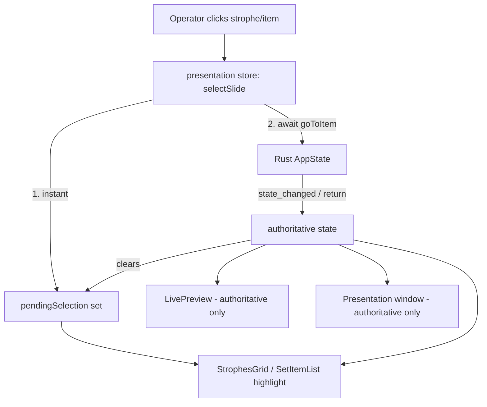

# Phase 11: Operator Polish — Design

**Spec**: `.specs/features/phase11-operator-polish/spec.md`
**Status**: Draft

Scope is small and frontend-only (no Rust, no schema, no IPC contract change). Backend `PresentationState` stays the single source of truth (architecture invariant); every change here is a render-layer or store-projection change.

---

## Architecture Overview

Three independent concerns, all in the frontend:

1. **Render precedence (P11-01/02)** — reorder the render branches in `PresentationApp` and `LivePreview` so an **announcement** overlay draws above `blank` (blackout), while Oferta/Câmera overlays stay below it. No backend change — `overlay.rs` already keeps `mode` independent (D-40), so clearing the announcement restores blackout for free.
2. **Optimistic selection (P11-03/04)** — add a `pendingSelection` projection to the presentation store that updates instantly on click and is cleared whenever authoritative state arrives. The operator's *selection highlight* reads `pendingSelection ?? state`; the LIVE preview and projection keep reading authoritative `state` only (they must stay truthful to the projector).
3. **Card cropping (P11-05)** — make each strophe card's outer element the 16:9 box and stop the grid from stretching cards past their content.



---

## Code Reuse Analysis

### Existing Components to Leverage

| Component | Location | How to Use |
| --------- | -------- | ---------- |
| `usePresentationStore` | `src/stores/presentation.ts` | Add `pendingSelection` field + `selectSlide` action; clear pending in the `onStateChanged` handler and on `goToItem` resolve/reject |
| `goToItem` | `src/api/commands.ts:276` | Already the command both click handlers call; reused unchanged by `selectSlide` |
| `SlideStage` | `src/components/presentation/SlideStage.tsx` | Letterbox scaler — unchanged; card cropping must preserve it |
| `SlideContent` | `src/components/presentation/SlideContent.tsx` | Announcement render path (`itemType="blank"` + `warningText`) reused as-is for the over-blackout branch |
| `PRESET_COLORS` | `src/components/presentation/layout.ts` | Announcement background color (announcement preset) — already used in both files |

### Integration Points

| System | Integration Method |
| ------ | ------------------ |
| Backend `state_changed` event | Listener in `usePresentationStore.subscribe` clears `pendingSelection` on every authoritative update — this is the reconciliation point |
| `goToItem` IPC command | `selectSlide` awaits it and sets the returned authoritative state (and clears pending) |

---

## Components

### `usePresentationStore` (modify) — P11-03/04 core

- **Purpose**: Hold an optimistic selection that the operator highlight can read before the backend round-trip completes.
- **Location**: `src/stores/presentation.ts`
- **Interfaces**:
  - `pendingSelection: { itemIndex: number; slideIndex: number } | null` — new field, default `null`
  - `selectSlide(itemIndex: number, slideIndex: number): Promise<void>` — sets `pendingSelection` synchronously, then `await goToItem(itemIndex, slideIndex)`, sets the returned authoritative `state` and clears `pendingSelection`; on error, clears `pendingSelection` (reconcile to last authoritative state) and logs.
  - `onStateChanged` handler (existing, inside `subscribe`) — change `set({ state: newState })` → `set({ state: newState, pendingSelection: null })` so any authoritative update (incl. nav from the other window) wins.
- **Dependencies**: `goToItem`, `onStateChanged` (both already imported)
- **Reuses**: existing `subscribe`/`goToItem` plumbing; no new IPC.
- **Note**: `pendingSelection` MUST NOT be folded into `state` — the LIVE preview and projection read `state` and must stay truthful to the projector. Optimism is scoped to the selection highlight only.

### `StrophesGrid` (modify) — P11-03 consume + P11-04 memo + P11-05 crop

- **Purpose**: Operator's strophe grid — instant highlight, no per-state full re-render, tight 16:9 cards.
- **Location**: `src/components/presentation/StrophesGrid.tsx`
- **Changes**:
  - **P11-03**: highlight uses `effectiveSlideIdx = (pendingSelection && pendingSelection.itemIndex === currentItemIndex) ? pendingSelection.slideIndex : currentSlideIndex`; `onClick` calls `selectSlide(currentItemIndex, slideIdx)` instead of `goToItem(...)`.
  - **P11-04**: wrap `SlideCard` in `React.memo`; memoize `appearance` with `useMemo`; give the grid a stable `onSelect(slideIdx)` via `useCallback` (pass `slideIdx` + stable handler instead of a fresh inline closure) so only cards whose `isActive` flips re-render.
  - **P11-05**: move the `aspect-video` (16:9) onto the card's outer `<button>` (the grid item) and add `items-start` to the grid container so a card never grows taller than its 16:9 content. Keep the active `ring-2`, badge overlay, and `SlideStage` letterbox intact.
- **Dependencies**: `usePresentationStore` (T3), `SlideStage`, `SlideContent`
- **Reuses**: existing `SlideCard` markup; only the wrapper box + memo + handler wiring change.

### `SetItemList` (modify) — P11-03 consume

- **Purpose**: Set-item list — instant active-item highlight.
- **Location**: `src/components/presentation/SetItemList.tsx`
- **Changes**: `isActive = (pendingSelection ? pendingSelection.itemIndex : currentItemIndex) === idx`; `onClick` calls `selectSlide(idx, 0)` instead of `goToItem(idx, 0)` (still guarded against clicking the already-active item).
- **Dependencies**: `usePresentationStore` (T3)
- **Reuses**: existing list markup.

### `PresentationApp` (modify) — P11-01 render precedence

- **Purpose**: Projection window — announcement draws over blackout.
- **Location**: `src/windows/presentation/PresentationApp.tsx`
- **Changes**: reorder the render branches to `announcement-overlay → blank → other-overlay(media/webView) → idle → live/frozen`. Concretely: lift an `overlay?.type === "announcement"` branch above the `if (mode === "blank")` return; leave the media/webView overlay branches where they are (after blank). Update the D-40 precedence comment to the D-45 order.
- **Dependencies**: none new
- **Reuses**: existing announcement branch (`SlideStage` + `SlideContent warningText`).

### `LivePreview` (modify) — P11-02 render precedence

- **Purpose**: Operator LIVE pane mirrors announcement-over-blackout.
- **Location**: `src/components/presentation/LivePreview.tsx`
- **Changes**: same reorder — announcement overlay card above the `mode === "blank"` blackout card; media/webView overlay cards stay below blackout.
- **Dependencies**: none new
- **Reuses**: existing announcement preview card.

---

## Data Models

No persisted models. One new in-memory store field:

```typescript
// src/stores/presentation.ts
interface PendingSelection {
  itemIndex: number;
  slideIndex: number;
}
// added to PresentationStore:
//   pendingSelection: PendingSelection | null;
//   selectSlide: (itemIndex: number, slideIndex: number) => Promise<void>;
```

---

## Error Handling Strategy

| Error Scenario | Handling | User Impact |
| -------------- | -------- | ----------- |
| `goToItem` rejects after optimistic set | `selectSlide` clears `pendingSelection` in `catch`, logs via `console.error` | Highlight snaps back to the last authoritative slide (no stuck phantom selection) |
| `state_changed` arrives from other-window nav while a pending is in flight | `onStateChanged` clears `pendingSelection` → authoritative wins | Highlight follows the real projector state; no double-jump |
| Click on already-active item | `SetItemList` keeps its `idx !== liveIdx` guard; `StrophesGrid` no-op pending equals current | No flicker |

---

## Tech Decisions (non-obvious only)

| Decision | Choice | Rationale |
| -------- | ------ | --------- |
| Where optimism lives | Separate `pendingSelection` field, NOT merged into `state` | LIVE preview + projection must read truthful `state`; only the operator highlight is optimistic (D-46) |
| Announcement-only over blackout | Lift only the `announcement` branch above `blank`; media/webView stay below | User decision OD-1 / D-45 |
| Reconciliation trigger | Clear pending on every authoritative `set state` (event + goToItem resolve + reject) | Single, race-free rule; backend stays source of truth |
| Card cropping mechanism | `aspect-video` on the outer button + grid `items-start` | Guarantees the rectangle equals the 16:9 content; avoids `align-items: stretch` growth (P11-05) |

---

## Risks / Concerns

- `React.memo` on `SlideCard` requires stable prop identities — `appearance` (useMemo), `onSelect` (useCallback), and the per-card `activeRef` (only the active card receives it) must not churn, or the memo is defeated. Verified in the StrophesGrid test by asserting non-active cards don't re-render is hard in RTL; instead assert correct highlight + that clicking is instant via the store, and rely on stable-identity props.
- Visual "no empty space" (P11-05) is not directly unit-testable; the task asserts structural proxies (outer button carries the aspect ratio, grid has `items-start`) plus a manual verify step.
</content>
