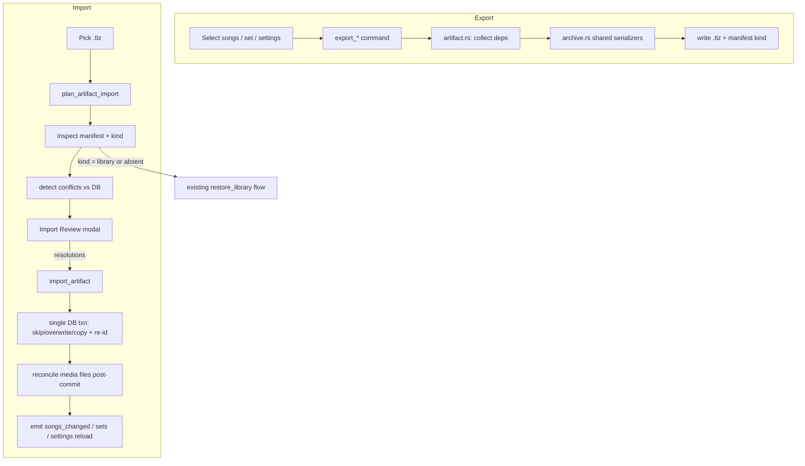

# Phase 12: Artifact Share — Design

**Spec**: `.specs/features/phase12-artifact-share/spec.md`
**Context**: `.specs/features/phase12-artifact-share/context.md`
**Status**: Draft

This feature is **additive** to the existing whole-library backup. It reuses the `.tlz` ZIP engine, JSON-row helpers, `backup_progress` event, and `SchemaTooNew` guard already in `services/archive.rs`. The single most important invariant: **the selective import path never wipes the target** (no Replace semantics) — only the legacy `library` route keeps the destructive restore.

---

## Architecture Overview

Three layers, all reusing existing infrastructure:

1. **Shared serialization core (`archive.rs` refactor)** — extract the song/section/set/media/settings → JSON serializers and the JSON-row read helpers into `pub(crate)` functions so both the full-library backup *and* the new selective exporter use one code path. This is where **Concern C-1** is fixed: a single `SONG_JSON_OBJECT` SQL fragment that includes the migration 007/008 columns, used by both exporters.
2. **Selective service (`services/artifact.rs`, new)** — dependency collection (transitive for sets), scoped `.tlz` writing with `kind` in the manifest, and a two-phase import: **plan** (inspect + detect conflicts, no writes) then **apply** (resolutions → transactional insert with re-id remapping).
3. **Commands + UI (`commands/artifact.rs` new, `BackupScreen`/library/set UI)** — Tauri commands wrapped in `api/commands.ts`, plus an **Import Review** modal that renders the plan and collects per-conflict resolutions.



> Diagrams here are inline Mermaid (house style). The `mermaid-studio` skill is available if a rendered SVG/PNG of this architecture is ever wanted.

---

## Code Reuse Analysis

### Existing Components to Leverage

| Component | Location | How to Use |
| --------- | -------- | ---------- |
| `.tlz` ZIP writer (`write_zip`) | `services/archive.rs:362` | Generalize: accept a `JsonDump` + `kind` instead of always full-library; selective export reuses the temp-file + atomic-rename logic verbatim |
| `read_archive_data` / `read_zip_entry_str` | `services/archive.rs:660,694` | Reused for reading selective archives; promote to `pub(crate)` |
| `parse_json_array` / `str_val` / `int_val` | `services/archive.rs:709-736` | The row→bind helpers for import; promote to `pub(crate)` and share |
| `inspect_archive` / `SchemaTooNew` | `services/archive.rs:186` | Manifest read + version guard reused unchanged for SHARE-14 |
| `ManifestCounts` / `ExportSummary` / `ImportSummary` / `ExportProgress` | `services/archive.rs:88-143` | Reused as-is; `ImportSummary` extended with copy/overwrite/skip tallies |
| `normalize()` duplicate rule | `commands/import.rs:50` | Same normalized title+artist used for song "possible duplicate" detection (move to a shared util) |
| `backup_progress` event + `onBackupProgress` | `backup.rs:42` / `commands.ts:431` | Progress for selective export/import reuses the same event name + frontend listener |
| `new_id()` (UUID) | `commands/song.rs` | Fresh ids for import-as-copy remapping; same generator media uses |
| `save`/`open` dialog pattern | `components/backup/BackupScreen.tsx:32,132` | Export/import file pickers copy this exact pattern (`.tlz` filter, dated default name) |
| `media.rs` UUID file naming | `commands/media.rs:104` | Insight: media file names are UUIDs → import-as-copy media just mints a new UUID name; no collision-rename needed (SHARE-15 simplified) |

### Integration Points

| System | Integration Method |
| ------ | ------------------ |
| `lib.rs` invoke_handler | Register 5 new commands alongside `export_library` (line 173) |
| `songs_fts` | Rebuild after any song insert/overwrite (`INSERT INTO songs_fts(songs_fts) VALUES('rebuild')`), as `do_import` already does |
| Events | `songs_changed` (songs/sets touched), settings reload path (P3), reusing existing emit patterns |
| Library / Set UI | Add export entry points; selection already exists in library list and set editor |

---

## Components

### `archive.rs` — shared serialization core (refactor)

- **Purpose**: One source of truth for serializing/deserializing each entity, fixing the 007/008 drop (C-1).
- **Location**: `src-tauri/src/services/archive.rs`
- **Interfaces (new `pub(crate)`)**:
  - `const SONG_JSON_OBJECT: &str` — the `json_object(...)` field list for songs, now including `background_mode`, `background_preset`, `font_family`, `font_size`, and the 008 text-casing column.
  - `fn write_tlz(out, media_dir, dump: JsonDump, kind: ArchiveKind, on_progress)` — generalized `write_zip`.
  - `pub(crate) fn parse_json_array / str_val / int_val / read_zip_entry_str` — promoted from private.
- **Dependencies**: `zip`, `serde_json`, sqlx pool.
- **Reuses**: itself (the existing whole-library export switches to `write_tlz` with `kind = Library`).

### `services/artifact.rs` — selective export/import (new)

- **Purpose**: Collect dependencies, write scoped artifacts, plan + apply imports with conflict resolution and re-id remapping.
- **Location**: `src-tauri/src/services/artifact.rs`
- **Interfaces**:
  - `async fn export_songs(pool, media_dir, ids: &[String], out: &Path, on_progress) -> Result<ExportSummary>` — SHARE-01/02/03
  - `async fn export_set(pool, media_dir, set_id, out, on_progress) -> Result<ExportSummary>` — SHARE-04/05
  - `async fn export_settings(pool, out) -> Result<ExportSummary>` — SHARE-06
  - `async fn plan_import(pool, path: &Path) -> Result<ImportPlan>` — SHARE-07 (inspect + conflict detect, **no writes**)
  - `async fn apply_import(pool, media_dir, path, resolutions: &[Resolution]) -> Result<ImportSummary>` — SHARE-07/10/11
- **Dependencies**: `archive.rs` shared helpers, `new_id()`, `normalize()`.
- **Reuses**: `JsonDump`, ZIP read/write, `inspect_archive`.

**Dependency collection (export):**
- *Songs*: for each song → its `song_sections` + (if `background_mode='media'` and `background_id`) that one media row + binary.
- *Set*: `sets` row + `set_items` → for each item resolve `song_id`→song(+sections+bg media), `media_id`→media; de-dup media by id (SHARE-05); include soft-deleted referenced rows; skip dangling refs with a summary warning.

**Re-id remapping (import-as-copy, SHARE-11):**
- Build `HashMap<old_id,new_id>` for every copied entity (songs, sections, media, set, set_items).
- Rewrite FKs through the map before insert: `song_sections.song_id`, `songs.background_id`, `set_items.{set_id,song_id,media_id}`. Media gets a fresh UUID file name too; binary written under the new name.

### `commands/artifact.rs` — Tauri commands (new)

- **Purpose**: Thin command layer; spawn progress forwarder like `export_library` does.
- **Location**: `src-tauri/src/commands/artifact.rs`
- **Interfaces** (registered in `lib.rs`):
  - `export_songs(song_ids, out_path) -> ExportSummary`
  - `export_set(set_id, out_path) -> ExportSummary`
  - `export_settings_profile(out_path) -> ExportSummary`
  - `plan_artifact_import(path) -> ImportPlan`
  - `import_artifact(path, resolutions) -> ImportSummary`
- **Reuses**: `backup.rs::media_dir`, `backup_progress` channel pattern (`backup.rs:37-52`).

### `ImportReviewModal` — frontend (new)

- **Purpose**: Render the `ImportPlan`, default + override per-conflict resolution, confirm.
- **Location**: `src/components/backup/ImportReviewModal.tsx` (co-located with `BackupScreen`)
- **Interfaces**: props `{ plan: ImportPlan; onConfirm(resolutions); onCancel }`.
- **Dependencies**: `api/commands.ts` wrappers, i18n strings (pt-BR + en-US).
- **Reuses**: existing modal/toast/progress primitives; `BackupScreen` open/save dialog pattern.

### Export entry points — frontend

- **Library**: "Export selected" action on multi-select (SHARE-12). **Set editor**: "Export set" button. **BackupScreen**: "Import artifact" alongside existing restore.

---

## Data Models

```rust
// archive.rs — manifest gains a kind discriminator (backward compatible)
#[derive(Serialize, Deserialize, Debug, Clone, PartialEq, Default)]
#[serde(rename_all = "camelCase")]
pub enum ArchiveKind {
    #[default] Library,   // legacy/full backup; default when field absent (C-2)
    Songs,
    Set,
    Settings,
}

pub struct ArchiveManifest {
    pub schema_version: u32,        // bumped to 2 (C-3)
    #[serde(default)] pub kind: ArchiveKind,   // missing → Library
    pub exported_at: i64,
    pub app_version: String,
    pub counts: ManifestCounts,
}
```

```typescript
// api/commands.ts — import planning + resolution
export type ArchiveKind = "library" | "songs" | "set" | "settings";
export type ConflictKind = "sameId" | "sameTitleArtist" | null;
export type ResolutionAction = "skip" | "overwrite" | "copy";

export interface ImportPlanItem {
  artifactType: "song" | "set" | "media" | "settings";
  id: string;
  title: string;            // display label
  conflict: ConflictKind;   // null = no conflict
  defaultAction: ResolutionAction; // copy when sameTitleArtist, etc.
}
export interface ImportPlan {
  kind: ArchiveKind;
  schemaVersion: number;
  counts: ManifestCounts;
  items: ImportPlanItem[];
}
export interface Resolution { id: string; action: ResolutionAction; }
```

**Relationships**: An `ImportPlan` is produced by `plan_artifact_import` (read-only); the operator's `Resolution[]` is fed to `import_artifact`. `ImportSummary` (existing) gains `*_overwritten` / `*_copied` / `*_skipped` tallies.

---

## Error Handling Strategy

| Error Scenario | Handling | User Impact |
| -------------- | -------- | ----------- |
| `schemaVersion > 2` | Reuse `SchemaTooNew` in `plan_import` | "Update Lyrizzy to import this file" (existing message) |
| Unknown `kind` value (future type) | serde fails / explicit guard in `plan_import` | "Unsupported artifact type" error toast (SHARE-14) |
| Selective file but user on import-restore screen | `plan_import` returns `kind`; if `library`, route to existing `restore_library` (SHARE-09) | Seamless — old backups still restore |
| Dangling `set_items.song_id` on export | Skip item, add to summary warnings (SHARE edge) | Export succeeds; summary notes skipped item |
| Media binary missing in archive | Insert row, `media_failed += 1` (existing pattern) | Summary shows failed media count |
| DB error mid-apply | Single transaction → rollback; no partial state (SHARE-10) | "Import failed, nothing changed" |
| User cancels save/open dialog | Return early, no error (SHARE-01.5) | No toast |

---

## Tech Decisions (non-obvious)

| Decision | Choice | Rationale |
| -------- | ------ | --------- |
| New module vs. extend `archive.rs` | New `services/artifact.rs` + promote shared helpers in `archive.rs` to `pub(crate)` | Keeps the destructive full-restore code physically separate from the never-wipe selective path; shared serializers avoid divergence (C-1) |
| Manifest `kind` default | `#[serde(default)]` → `Library` | Old `.tlz` files have no `kind`; must keep restoring (C-2/SHARE-09) |
| Schema version | Bump `SUPPORTED_SCHEMA_VERSION` 1→2 | Adds `kind` + 007/008 song columns; v1 backups still import (reader accepts `<= 2`); v2 files rejected by old app via existing `SchemaTooNew` (acceptable, C-3) |
| Import atomicity | One sqlx transaction for all DB rows; media files written **after** commit | DB rollback guarantees all-or-nothing rows (SHARE-10); media stays best-effort/resilient as today |
| Conflict default for same title+artist, new id | Default `copy` | Never silently skip a genuinely different song that happens to share a title (spec edge) |
| Media collision on copy | Mint new UUID file name | media names are already UUIDs (`media.rs:104`); no rename heuristic needed (SHARE-15 simplified) |
| Two-phase import (plan then apply) | Separate `plan_artifact_import` + `import_artifact` commands | Conflict review must be read-only before any write (SHARE-07/08) |

---

## Requirement Traceability (updated)

| Requirement ID | Design element | Status |
| -------------- | -------------- | ------ |
| SHARE-01 | `export_songs` + `write_tlz(kind=Songs)` | In Design |
| SHARE-02 | shared `SONG_JSON_OBJECT` incl. 007/008 (fixes C-1) | In Design |
| SHARE-03 | dependency collection: song→bg media + binary | In Design |
| SHARE-04 | `export_set` transitive collection | In Design |
| SHARE-05 | media de-dup by id; include soft-deleted | In Design |
| SHARE-06 | `export_settings_profile` | In Design |
| SHARE-07 | `plan_import` + `ImportReviewModal` + `apply_import` resolutions | In Design |
| SHARE-08 | selective `apply_import` has no wipe branch | In Design |
| SHARE-09 | `kind` default `Library` → route to `restore_library` | In Design |
| SHARE-10 | single sqlx txn; media post-commit | In Design |
| SHARE-11 | re-id `HashMap` + FK rewrite | In Design |
| SHARE-12 | library/set/backup UI entry points | In Design |
| SHARE-13 | reuse `backup_progress` + summary toast | In Design |
| SHARE-14 | `SchemaTooNew` + unknown-kind guard | In Design |
| SHARE-15 | new-UUID media file name on copy | In Design |

**Coverage:** 15/15 mapped to design elements. 0 unmapped.

---

## Open Questions for Tasks/Execute

- Whether to physically split `archive.rs` into an `archive/` module folder (export/import/manifest/serialize) or keep one file with promoted helpers — defer to Tasks; recommend the lighter "one file + `pub(crate)`" first.
- Migration: bumping schema version needs **no SQL migration** (it's an in-archive constant), but the 007/008 fix to the *full* backup serializer should land with a round-trip test proving those fields now survive.
- Exact UI placement of "Export selected" in the library (context menu vs. bulk toolbar) — confirm during Execute against the current library component.
