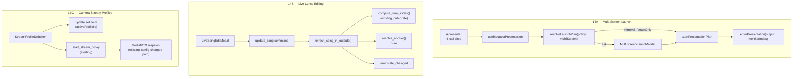

# Phase 14 Design — Multi-Screen Launch, Live Lyrics Editing, Camera Stream Quality

**Spec:** `.specs/features/phase14-multiscreen-liveedit-camera/spec.md` (P14-01..P14-30)
**Status:** Draft
**Date:** 2026-08-11

---

## Design Question Resolutions

The five questions left open by the spec, resolved against the code:

| # | Question | Resolution |
|---|----------|------------|
| DQ-1 | Monitor identity key for stable naming | OS name (`Monitor::name()`) when present and non-empty; geometry fallback `{w}x{h}@{x},{y}`. Stored as a JSON map in one `settings` row — no migration |
| DQ-2 | Anchoring granularity for live edits | `(section_id, ordinal)` — the ordinal counts occurrences of that `section_id` among the item's slides. Handles sections split across several slides *and* `RepeatMode::Duplicate` |
| DQ-3 | Targeted regeneration vs. generalising `load_set_for_presentation` | Neither: a shared helper reusing the already-`pub(crate)` `compute_item_slides`, invoked from `update_song` so **every** edit path stays consistent |
| DQ-4 | Stream profiles in `WebViewConfig` or a sibling collection | In-place on `WebViewConfig`. `set_items.webview_config` is a `TEXT` JSON column, so `#[serde(default)]` fields are a zero-migration change |
| DQ-5 | New launch modal vs. a mode of `OutputLaunchModal` | New component. `OutputLaunchModal` picks a set *and* a start item for one output; this is a binary question for all outputs — different concern, near-zero reuse |

---

## Architecture Overview

Three independent slices. 14A and 14B both touch presentation launch/state; 14C is isolated to the camera item and the MediaMTX proxy.



---

## Code Reuse Analysis

### Existing components to leverage

| Component | Location | How used |
|---|---|---|
| `compute_item_slides` | `commands/presentation.rs:334` | Already `pub(crate)` with the exact signature needed — reuse verbatim for regeneration |
| Append-item lock pattern | `commands/presentation.rs:428-450` | Copy its lock order: slides write → (slides read → presentation write) → drop → emit |
| `emit_state` | `commands/presentation.rs:227` | Reuse for the post-regeneration broadcast |
| `resolve_next_slide` | `commands/presentation.rs` | Recompute the lookahead after regeneration, as the append path does |
| `start_stream_proxy` | `commands/stream.rs:104` | Already kills and respawns when the rendered config differs — profile switching needs **no new Rust command** |
| `StreamSourceInput` | `commands/stream.rs:18` | Existing discriminated input; profiles feed it a different URL/transport |
| `launchOutputAt` / `fanOutToMirror` | `utils/outputDispatch.ts:74,35` | Reuse for the mirror-all launch path |
| `enterPresentation(output, monitorIndex)` | `api/commands.ts:64` | Already resolves the per-output monitor key — unchanged |
| `MonitorPicker` | `components/settings/MonitorPicker.tsx` | Extend to render monitor *names* rather than raw OS labels |
| `SongEditor` | `components/library/SongEditor.tsx:195` | Mount unchanged inside a modal shell; it is propless and driven by `useLibraryStore().editingSongId`, closing itself via `closeEditor()` |
| `settings` key/value table | `migrations/001_initial.sql` | Both new settings are rows here — no migration (precedent: D-19, D-39) |
| `OutputLaunchModal` | `components/presentation/OutputLaunchModal.tsx` | Reference for modal structure/styling only; not extended (DQ-5) |

### Integration points

| System | Integration |
|---|---|
| `set_items.webview_config` (`TEXT` JSON) | New `#[serde(default)]` fields deserialize existing rows unchanged |
| `settings` key/value | `output.launch_policy`, `display.monitor_names` |
| `state_changed` event | Regeneration reuses the existing tagged `{output, state}` payload — no contract change |
| `update_song` command | Gains a post-write call into the regeneration helper |

### CONCERNS.md mitigations

- **CONCERN-7 (deadlock, High):** every new backend path drops all guards before `app.emit()`. The regeneration helper follows the append path's proven lock order rather than inventing one.
- **Monitor ordering is OS-dependent** (CLAUDE.md gotcha, D-32): names key on identity, never on index — that is the entire point of DQ-1's resolution.

---

## 14A — Multi-Screen Launch & Screen Naming

### Problem: four uncoordinated launch call sites

`enterPresentation()` is called bare from `HomeSetBuilder.tsx:85`, `HomeSetBuilder.tsx:95`, `OperatorApp.tsx:155`, and `SetBuilder.tsx:381`. Applying the policy at each site would guarantee drift. **All four route through one hook instead.**

### Components

#### `resolveLaunchPlan` (pure)

- **Purpose:** decide what Apresentar does, with no I/O
- **Location:** `src/utils/outputDispatch.ts`
- **Interface:** `resolveLaunchPlan(policy: LaunchPolicy, multiScreenEnabled: boolean): LaunchPlan`
- **Rules:** `multiScreenEnabled === false` → always `mainOnly` (P14-04); otherwise `ask` → `"ask"`, `mirror_all` → `"mirrorAll"`, `main_only` → `"mainOnly"`
- **Reuses:** nothing — pure, fully unit-testable

#### `startPresentationPlan`

- **Purpose:** execute a resolved plan
- **Location:** `src/utils/outputDispatch.ts`
- **Interface:** `startPresentationPlan(plan: "mirrorAll" | "mainOnly", setId: string): Promise<void>`
- **Behaviour:** `mainOnly` → `enterPresentation("one")`. `mirrorAll` → set `mirrorEnabled`, then for every output `loadSetForPresentation(setId, o)` → `enterPresentation(o)` → `goToItem(0, 0, o)` (P14-02)
- **Reuses:** `launchOutputAt` semantics; deliberately *not* `engageMirror`, which starts at the master's current position rather than item 0

#### `PresentationLaunchProvider` + `useRequestPresentation`

- **Purpose:** mount the modal once and give all four call sites one entry point
- **Location:** `src/components/presentation/PresentationLaunchProvider.tsx`
- **Interface:** `useRequestPresentation(): (setId: string) => Promise<void>`
- **Dependencies:** `useSettingsStore` (policy, `multiScreenEnabled`); mounted in `OperatorApp`
- **Note:** operator window only — the presentation window never mounts it (read-only invariant)

#### `MultiScreenLaunchModal`

- **Purpose:** the yes/no question
- **Location:** `src/components/presentation/MultiScreenLaunchModal.tsx`
- **Interface:** `{ onAnswer: (mirrorAll: boolean) => void; onCancel: () => void }`
- **Behaviour:** Esc and the close control call `onCancel`, which launches nothing (P14-05)

#### `LaunchPolicySetting` + `MonitorNameSettings`

- **Location:** `src/components/settings/`
- **Behaviour:** three-value radio group, disabled with an explanatory note when multi-screen is off (P14-10); a per-monitor name list writing `display.monitor_names`

### Monitor identity (DQ-1)

```ts
function monitorIdentity(m: MonitorInfo): string {
  const name = m.name?.trim();
  return name ? `name:${name}` : `geom:${m.width}x${m.height}@${m.x},${m.y}`;
}
```

Names live in one settings row so unplugged monitors keep their entry (P14-15) and nothing is ever reassigned by index.

```jsonc
// settings["display.monitor_names"]
{ "name:\\\\.\\DISPLAY2": "Congregação", "geom:1920x1080@1920,0": "Púlpito" }
```

**Known limitation (accept, document):** two identical monitors that both report no OS name produce distinct geometry keys only while their positions differ. If the OS reports neither name nor stable position for either, they can collide. Windows reports `\\.\DISPLAYn`, so this is a Linux/Wayland edge case; the fallback chain (P14-13) keeps the UI correct even when identity is ambiguous.

**Resolution display order (P14-13):** operator name → OS name → `Monitor {i+1} — {w}×{h}`.

---

## 14B — Live Lyrics Editing

### Regeneration trigger (DQ-3)

Hooked into `update_song` rather than a frontend-invoked command, so the projection stays correct no matter which screen the edit came from — the library editor and the live modal share one path. This preserves the invariant that Rust owns presentation state.

`update_song` (`commands/song.rs`) after a successful DB write calls:

```rust
presentation::refresh_song_in_outputs(&app, &state, pool, &song_id).await
```

Module-boundary note: this is a command calling a sibling command's module. The regeneration logic is therefore a `pub(crate)` **helper** in `commands/presentation.rs`, not the `update_song` command reaching into another command handler — consistent with how `compute_item_slides` is already shared.

### Anchoring (DQ-2)

A section splits into multiple slides that all carry the same `section_id` (`slide_splitter.rs:34,42,53`), and `RepeatMode::Duplicate` can repeat a whole run. So `section_id` alone is insufficient — the ordinal disambiguates.

```rust
pub struct SlideAnchor {
    pub section_id: String,
    /// Index of this slide among slides sharing `section_id` within the item.
    pub ordinal: usize,
}

/// Capture the anchor of `index` within `slides`. Pure.
pub fn anchor_of(slides: &[Slide], index: usize) -> Option<SlideAnchor>;

/// Find where `anchor` landed after regeneration. Pure.
/// Falls back, in order: exact (section_id, ordinal) → last slide with that
/// section_id → clamp `old_index` to `new_len - 1` → 0.
pub fn resolve_anchor(new_slides: &[Slide], anchor: Option<&SlideAnchor>, old_index: usize) -> usize;
```

Both pure and unit-tested independently of Tauri — the pattern D-43 established for `credit_line`.

`resolve_anchor` never returns an out-of-range index and never signals "blank", satisfying P14-19. Synthetic slides (`__title__`, `__blackout__`) carry a `section_id` too, so they anchor by the same rule with no special case.

### `refresh_song_in_outputs`

- **Location:** `src-tauri/src/commands/presentation.rs`
- **Interface:** `pub(crate) async fn refresh_song_in_outputs(app, state, pool, song_id) -> Result<(), ErrorPayload>`
- **Algorithm**, for each output in `[One, Two]`:
  1. Read the output's set; collect every item index whose `song_id` matches (P14-20 falls out — no matches means no work; the edge case of one song twice in a set is handled by iterating *all* matches)
  2. For each match, `compute_item_slides(pool, item, &config, &settings)`
  3. If the match is the current item, capture `anchor_of(old_slides, current_slide_index)` **before** splicing
  4. Splice into `presentation_slides`; recompute `item_slide_counts`
  5. If the current item changed, set `current_slide_index = resolve_anchor(...)` and refresh `current_slide` / `next_slide`
  6. **Leave `mode`, `frozen_at` and `overlay` untouched** — satisfies P14-22 without a special case
  7. Drop all guards, then `emit_state`
- **Mirror (P14-21):** falls out for free — the loop covers both outputs, each emitting its own tagged `state_changed`

### `LiveSongEditModal`

- **Location:** `src/components/presentation/LiveSongEditModal.tsx`
- **Behaviour:** calls the library store's editor-open action for the projected song, renders `<SongEditor />` inside an overlay shell. `SongEditor` already calls `closeEditor()` on save and needs **no prop changes**; the wrapper unmounts when `editingSongId` clears.
- **Entry point:** an edit affordance in `OperatorPresentationLayout`'s SET pane / LIVE preview, enabled only for `Song` items
- **P14-23:** cancel does nothing (`SongEditor` only writes on save); a save failure surfaces its existing error toast and leaves slides untouched, because regeneration runs only after a successful DB write
- **Cleanup:** exiting presentation while the editor is open must clear `editingSongId` so no orphaned overlay survives

---

## 14C — Camera Stream Profiles

### Data model (DQ-4)

`set_items.webview_config` is `TEXT` holding JSON (`003_media_phase2.sql:39`), so additive `#[serde(default)]` fields need **no migration** and existing rows deserialize unchanged.

```rust
#[derive(Serialize, Deserialize, Clone, Debug, PartialEq)]
#[serde(rename_all = "camelCase")]
pub struct StreamProfile {
    pub id: String,
    /// Operator-facing label, e.g. "Alta (4K)" / "Baixa (1080p)".
    pub label: String,
    pub url: String,
    #[serde(default, skip_serializing_if = "Option::is_none")]
    pub rtsp_transport: Option<RtspTransport>,
}

// Added to WebViewConfig:
#[serde(default, skip_serializing_if = "Vec::is_empty")]
pub profiles: Vec<StreamProfile>,
#[serde(default, skip_serializing_if = "Option::is_none")]
pub active_profile_id: Option<String>,
```

`mode` stays item-level — a camera does not change protocol between profiles. Profiles vary only URL and transport, matching P14-24's "its own URL and, where the protocol supports it, its own transport".

### Legacy compatibility (P14-28)

When `profiles` is empty the item behaves exactly as today, resolving its source from the existing `url` + `rtsp_transport`:

```ts
function resolveActiveSource(cfg: WebViewConfig): { url: string; transport?: RtspTransport } {
  if (cfg.profiles.length === 0) return { url: cfg.url, transport: cfg.rtspTransport };
  const active = cfg.profiles.find(p => p.id === cfg.activeProfileId) ?? cfg.profiles[0];
  return { url: active.url, transport: active.rtspTransport };
}
```

The `?? cfg.profiles[0]` fallback also covers a deleted active profile.

### Switching needs no new Rust command

`start_stream_proxy` already compares the rendered config and kills/respawns when it differs (`stream.rs:124-134`). Switching = persist `activeProfileId` on the item, then re-invoke `start_stream_proxy` with the new source. P14-29 falls out: `to_source` still returns `stream.invalid_url` and, because the existing proxy is only killed *after* validation succeeds, an invalid URL leaves the running stream alone.

### Components

| Component | Location | Purpose |
|---|---|---|
| `StreamProfileSwitcher` | `src/components/presentation/` | Operator-facing profile switch, mid-presentation (P14-25). Hidden when fewer than two profiles (P14-28) |
| `StreamProfileEditor` | `src/components/set/` | Add/rename/remove profiles inside `WebViewSetItemEditor`; carries the explanatory help text (P14-30) |
| `resolveActiveSource` | `src/utils/` | Pure resolver above; unit-tested |

**P14-30 help text** must state that profiles select *which camera stream is pulled*, that a lighter sub-stream reduces network load, and that it does not affect what other consumers (OBS/YouTube) pull. This is the guard against the feature being misread as the rejected "resolution" control.

---

## Error Handling Strategy

| Scenario | Handling | User impact |
|---|---|---|
| Empty set on mirror-all launch | Existing `presentation.empty_set` per output, before any window opens | Toast; nothing opens (P14-06) |
| All monitors phantom | Existing `presentation.no_monitors` (D-32) | Toast; nothing opens |
| Launch modal dismissed | No state mutation at all | Nothing happens (P14-05) |
| Mirror-all partially fails | Per-output failure is caught; succeeding outputs stay up | Toast naming the failed screen |
| Song save fails | Regeneration never runs (it is post-write) | Existing editor error toast; projection untouched (P14-23) |
| Edited song's sections all deleted | `compute_item_slides` already falls back to `blank_slide()` | Item stays navigable |
| Anchor section vanished | `resolve_anchor` fallback chain | Nearest valid slide; never blank (P14-19) |
| Invalid profile URL | Existing `stream.invalid_url`, before the proxy is killed | Error shown; active stream keeps playing (P14-29) |
| Profile switch fails | Revert `activeProfileId` in the store | Error shown; previous profile stays selected (P14-29) |
| MediaMTX missing | Existing `stream.mediamtx_not_found` | Existing banner, unchanged |
| Monitor name for absent monitor | Entry retained, never reassigned | Name returns on reconnect (P14-15) |

---

## Tech Decisions

| Decision | Choice | Rationale |
|---|---|---|
| Where the launch policy is applied | One hook, four call sites refactored | Four bare `enterPresentation()` calls would otherwise drift apart |
| Regeneration trigger | Inside `update_song`, not a frontend command | Keeps Rust the source of truth; works from every edit path; frontend cannot forget to call it |
| Anchor granularity | `(section_id, ordinal)` | `section_id` alone is ambiguous — sections split across slides and `RepeatMode::Duplicate` repeats runs |
| Mirror-all start position | Explicit item 0 slide 0, not `engageMirror` | `engageMirror` copies the master's *current* position; P14-02 requires the first item |
| Stream profiles storage | Additive `serde(default)` fields on `WebViewConfig` | `webview_config` is a JSON `TEXT` column — zero migration, zero risk to existing items |
| Profile switching backend | No new command | `start_stream_proxy` already handles config-changed respawn |
| Monitor identity | OS name, geometry fallback | Index is unusable (OS-dependent ordering); documented collision edge case is Linux-only |
| `SongEditor` reuse | Mount unchanged, no new props | Already propless and store-driven; avoids touching a heavily-tested component |
| RTSP transport default | Unchanged (`udp`) | D-57 — flipping it would change behaviour for installs that work today |

---

## Testing Strategy

| Layer | What | Where |
|---|---|---|
| Rust pure | `anchor_of` / `resolve_anchor` — exact hit, ordinal overflow, missing section, shrink-to-clamp, empty slides, repeat-mode runs | `commands/presentation.rs` `#[cfg(test)]` |
| Rust pure | `StreamProfile` serde round-trip; legacy `WebViewConfig` JSON without `profiles` still deserializes | `domain/set.rs` |
| Rust integration | `refresh_song_in_outputs` — same song twice in a set, non-current item, mode/overlay preserved | `commands/presentation.rs` |
| TS pure | `resolveLaunchPlan` — all three policies × multi-screen on/off | `utils/outputDispatch.test.ts` |
| TS pure | `resolveActiveSource` — empty profiles, missing active id, deleted active | `utils/*.test.ts` |
| TS pure | `monitorIdentity` — named, unnamed, name fallback chain | settings tests |
| Component | `MultiScreenLaunchModal` answer/cancel/Esc; `StreamProfileSwitcher` hidden below two profiles | Vitest + Testing Library |
| i18n | Every new string in both `en-US` and `pt-BR` | Existing parity test |

**Gate:** `tsc --noEmit` clean, Vitest green, `cargo test` green, `cargo clippy -D warnings` clean.

---

## Manual Verification (cannot be gated locally)

Two-monitor hardware is required for 14A, and a real camera for 14C:

1. Launch policy across all three values, from all four Apresentar call sites
2. Monitor names surviving restart, unplug/replug, and enumeration reorder
3. Live edit mid-song: no black frame, position held, with blackout and frozen modes engaged
4. Profile switch mid-presentation while OBS pulls the 4K main stream concurrently — confirm OBS is unaffected and latency stops growing

---

## Implementation Order

Slices are independent and can proceed in parallel. Within each, backend precedes frontend.

1. **14C** — smallest, highest production urgency, no new Rust command
2. **14B** — pure anchoring helpers first, then the helper, then the modal
3. **14A** — settings and pure resolvers first, then the provider, then the four call-site refactors last
