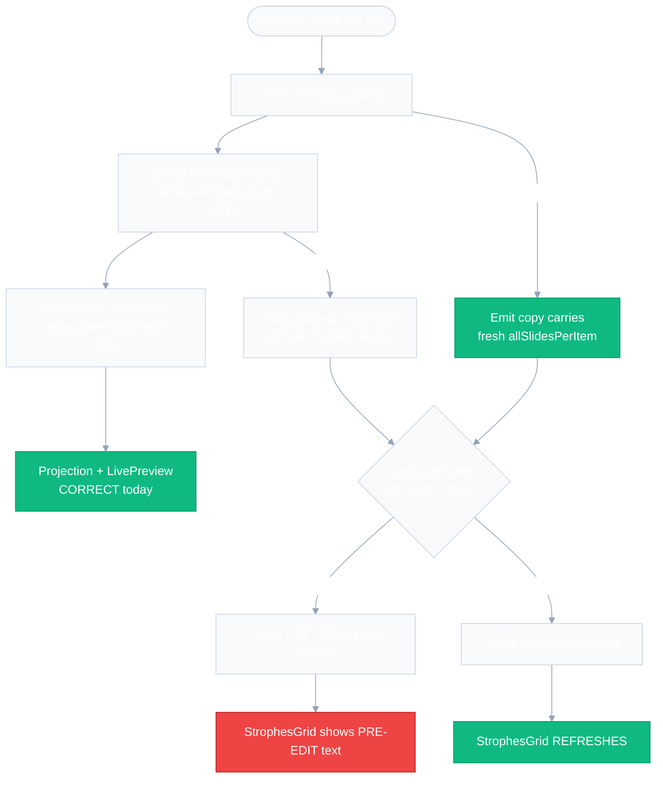
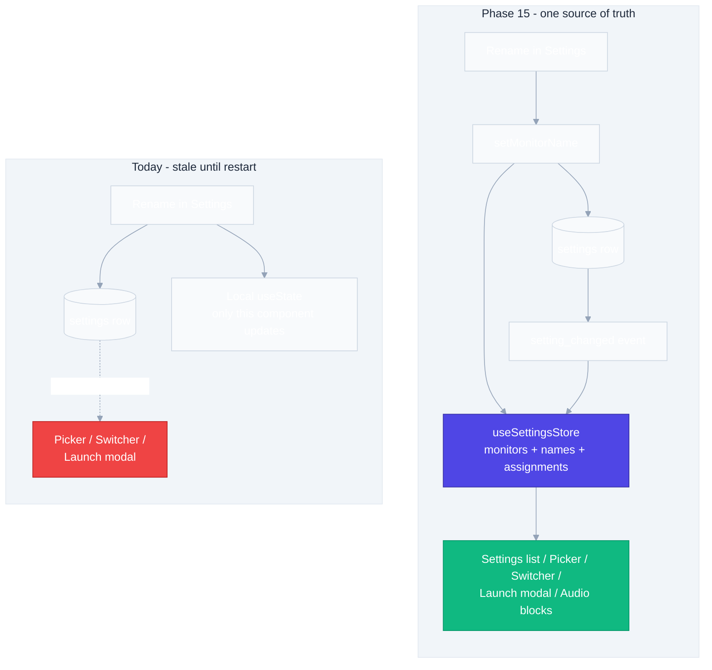

# Phase 15 Design — Free-Text Lyrics Editor, Live-Edit Refresh & Operator UX Fixes

**Spec:** `.specs/features/phase15-freetext-lyrics-ux-fixes/spec.md`
**Status:** Draft — awaiting approval before Tasks

---

## Architecture Overview

Five of the six groups are localised changes with no new architecture. Two need a deliberate design:

1. **15A** turns on a payload that already exists but is deliberately emptied — the design must keep the *stored* state slim while the *emitted* copy carries the slides, and prove that invariant with a test rather than a comment.
2. **15B** collapses four independent mount-time caches into one store slice fed by the `setting_changed` event that already exists.

**15E is deliberately shallow at the boundary:** the Rust side, the IPC payloads, the schema and both import wizards are untouched. The editor stops *authoring* sections and starts *deriving* them from text, in two pure functions. Everything downstream sees the same `SectionPayload[]` it always has.

### 15A — Where the stale strophes come from



**The frontend needs no change.** `reconcileSlides` already takes a non-empty incoming list verbatim (`stores/presentation.ts:27`) — it was written for exactly this case. The whole fix is making the emitted copy non-empty.

### 15B — Monitor names: four caches become one store slice



---

## Code Reuse Analysis

### Existing components to leverage

| Component | Location | How to use |
|-----------|----------|------------|
| `reconcileSlides` | `src/stores/presentation.ts:23` | **No change.** Its non-empty branch is the fix's landing point; add a regression test pinning it |
| `emit_state` | `src-tauri/src/commands/presentation.rs:227` | Unchanged — pass a fuller payload to the same function |
| `onSettingChanged` handler | `src/windows/operator/OperatorApp.tsx:180-184` | Extend the existing `presentation.*`/`announcement.*` branch with the monitor-setup keys |
| `monitorIdentity` / `resolveMonitorName` | `src/utils/monitorNames.ts:22,33` | **Pure, already unit-tested — do not touch.** Consumers keep calling them, just with store-supplied arguments |
| `useSettingsStore` `loadX` pattern | `src/stores/settings.ts:287-450` | Add `loadMonitorSetup` / `setMonitorName` following `loadOutputAudio` / `setOutputAudio` verbatim |
| `parse_plain_text` | `src-tauri/src/services/text_import.rs:35` | **Keep** — still backs the import wizard. The editor deliberately does *not* call it (D-69) |
| `SongPreviewPane` | `src/components/presentation/SongPreviewPane.tsx` | Unchanged props; the editor feeds it derived blocks instead of section drafts |
| `splitSectionBody` | `src/utils/slidePreview.ts` | Unchanged — already mirrors `slide_splitter`'s blank-line rule |
| `SlideAnchor` / `anchor_of` / `resolve_anchor` | `src-tauri/src/domain/slide.rs:36-92` | Anchor **basis** changes (see DD-1); the fallback-chain structure and its tests stay |
| `LiveSongEditModal` | `src/components/presentation/LiveSongEditModal.tsx` | **No change.** It mounts `SongEditor` unmodified, so P15-17 is satisfied by not breaking it |
| `NotesField` | `src/components/common/NotesField.tsx` | Keep — three set-item editors still use it. Only `SectionCard`'s use goes away |

### Integration points

| System | Integration method |
|--------|--------------------|
| `song_sections` table | Unchanged. The editor writes derived rows through the existing `SectionPayload[]` contract |
| `songs_fts` triggers | Unchanged — they index `song_sections.body`, which still receives the same text |
| `.tlz` backup / artifact export | Unchanged — `archive.rs` dumps and restores sections by id, and ids keep their current generation (see DD-1) |
| `state_changed` event | Payload shape unchanged; only the `allSlidesPerItem` field's population changes for one emit site |
| `setting_changed` event | Reused as the invalidation signal for the monitor-setup store slice |

### CONCERNS.md check

`CONCERN-7 (deadlock risk)` is the one that applies. 15A modifies a function that holds **two** locks (`presentation_slides` read + `presentation` write). The design keeps the existing lock ordering and scope exactly as-is and only changes what is *cloned out* of that scope — `emit_state` is still called after both guards drop. No new lock is introduced.

---

## Components

### 15A — `with_full_slides`

- **Purpose:** Produce an emit-ready `PresentationState` carrying every slide body, without mutating the slim stored state.
- **Location:** `src-tauri/src/domain/presentation.rs`
- **Interface:** `pub fn with_full_slides(state: &PresentationState, all: &[Vec<Slide>]) -> PresentationState`
- **Dependencies:** none (pure)
- **Reuses:** `PresentationState`
- **Why a helper rather than two inline lines:** `commands/*.rs` carries no tests per TESTING.md's matrix, and `refresh_song_in_outputs` takes an `AppHandle` so it cannot be reached from `src-tauri/tests/` either (L-7, D-66). Putting the payload construction in `domain/` makes P15-02's "stored state stays slim" a *testable assertion* instead of a comment. Same reasoning as D-65.

**Call-site change** in `refresh_song_in_outputs` (`commands/presentation.rs:520-560`): inside the existing `presentation_slides` read + `presentation` write scope, return `with_full_slides(&pres, &all)` instead of `pres.clone()`. `pres` itself is never assigned the slides, so the stored state is untouched.

### 15A/E — Slide anchoring by content (DD-1)

- **Purpose:** Hold the operator's position on the *same strophe* across a regeneration, including when strophes are inserted or removed above it.
- **Location:** `src-tauri/src/domain/slide.rs` (existing file)
- **Interface (changed):**
  - `pub struct SlideAnchor { pub key: String, pub ordinal: usize }`
  - `pub fn anchor_of(slides: &[Slide], index: usize) -> Option<SlideAnchor>` — key = each line trimmed, joined with `\n`
  - `pub fn resolve_anchor(new_slides: &[Slide], anchor: Option<&SlideAnchor>, old_index: usize) -> usize` — unchanged fallback structure: exact `(key, ordinal)` → last slide with `key` → `old_index` clamped → `0`
- **Dependencies:** `Slide`
- **Reuses:** the existing function shape, signatures and fallback chain — only the matching basis changes

### 15B — Monitor-setup store slice

- **Purpose:** One source of truth for the monitor list, the operator-chosen names, and each output's monitor assignment.
- **Location:** `src/stores/settings.ts`
- **Interface:**
  - state: `monitors: MonitorInfo[]`, `monitorNames: MonitorNameMap`, `outputMonitorIndex: Record<OutputId, number | null>`
  - `loadMonitorSetup(): Promise<void>` — `listMonitors()` + `loadMonitorNames()` + both monitor-index settings, each degrading to its empty/`null` default on failure
  - `setMonitorName(identity: string, name: string): Promise<void>` — merges into the store map optimistically, then persists the whole map via `setSetting`
- **Dependencies:** `api/commands` (`listMonitors`, `getSetting`, `setSetting`), `utils/monitorNames`
- **Reuses:** `loadOutputAudio` / `setOutputAudio` as the structural template; `loadMonitorNames`'s malformed-row tolerance
- **Note:** `setMonitorName` merges from **store state**, which was loaded whole from the DB — so names for monitors that are not currently detected are preserved, exactly as `saveMonitorName`'s read-modify-write does today.

### 15B — `outputScreenName`

- **Purpose:** Resolve one output's display name, so the launch modal, the output switcher and the audio blocks cannot drift apart.
- **Location:** `src/utils/monitorNames.ts`
- **Interface:** `outputScreenName(monitors: MonitorInfo[], names: MonitorNameMap, index: number | null, fallback: string): string` — returns `resolveMonitorName(...)` when `index` addresses a real monitor, else `fallback`
- **Reuses:** `resolveMonitorName`; replaces the duplicated logic in `OutputSwitcher.labelFor` (`:72-77`) and `PresentationLaunchProvider` (`:63-68`)

### 15E — Lyrics text ↔ sections

- **Purpose:** The entire section model, reduced to two pure functions.
- **Location:** `src/utils/lyricsText.ts` (new) + `lyricsText.test.ts`
- **Interface:**
  - `lyricsToBlocks(text: string): string[]` — split on runs of blank (whitespace-only) lines, trim each block, drop empties
  - `blocksToSectionPayloads(blocks: string[]): SectionDraftPayload[]` — `{ label: "", type: "verse", body, sortOrder: i, repeatCount: 1 }`
  - `sectionsToLyrics(sections: { body: string }[]): string` — join trimmed bodies with `\n\n`
- **Round-trip contract (P15-14):** `sectionsToLyrics(blocksToSectionPayloads(lyricsToBlocks(t))) === lyricsToBlocks(t).join("\n\n")` — i.e. the text is stable after the first normalisation (leading/trailing and multiple blank lines collapse once, then never change).
- **Reuses:** nothing — deliberately independent of `parse_plain_text` (D-69)

### 15E — `SongEditor` (rewrite of the lyrics half)

- **Location:** `src/components/library/SongEditor.tsx`
- **Changes:**
  - state `sections: SectionDraft[]` → `lyrics: string`
  - **removed:** the whole `DndContext`/`SortableContext` block, `handleDragEnd`, `addSection`, `removeSection`, `updateSection`, `newSection`, `nextDndId`, `applyPaste`, `showPaste`/`pasteText`/`pasteBusy` state, the paste modal, the sensors, and every `@dnd-kit` import
  - **added:** one `<textarea>` bound to `lyrics`, generous `rows` and `resize-y`
  - load: `setLyrics(sectionsToLyrics(song.sections))`
  - save: `sections: blocksToSectionPayloads(lyricsToBlocks(lyrics))`
  - validate: `lyricsToBlocks(lyrics).length > 0`
  - preview: `sections={blocks.map(b => ({ body: b }))}`, `repeatCounts={blocks.map(() => 1)}`
  - notes textarea `rows={2}` → `rows={6}` (P15-20)
- **Deleted file:** `src/components/library/SectionCard.tsx` (+ its test) — `SongEditor` is its only consumer
- **Untouched:** title, artist, language, background, casing, rights panel, delete flow, toasts

### 15E — `OperatorNotesPanel.useCurrentNotes`

- **Location:** `src/components/presentation/OperatorNotesPanel.tsx:8-28`
- **Change:** for `itemType === "song"`, return `song.notes ?? null` instead of looking up `song.sections.find(s => s.id === currentSlide.sectionId).notes`. Non-song items keep `item.notes` (P15-21).
- **Side effect:** the panel no longer depends on `state.currentSlide.sectionId`, so it stops re-resolving per slide — one fewer reason to re-render mid-song.

### 15D — App icon

- **Location:** `src-tauri/icons/icon.svg` (single source), rasters via `npx tauri icon`, `public/icons/{icon.ico,128x128.png,32x32.png}` synced by hand
- **Palette (unchanged, read from the current source):** background radial gradient `#34365c` → `#1c1d30` → `#0f0f18` on a `rx=90` rounded square in a `512×512` viewBox; mark in `#7C74F5`
- **Construction:** one vesica-shaped lobe path, instantiated three times at `rotate(0|120|240)` about the canvas centre, stroked (not filled) with round caps so the interlace reads; three filled circles as noteheads at the lobe tips. Stroke weight must survive the 32×32 downscale — verify against `32x32.png`, not the SVG.
- **Retires:** the D-64 L-as-music-note mark

---

## Data Models

No schema change. The only type change is in-memory:

```rust
// src-tauri/src/domain/slide.rs — basis changes, shape does not
pub struct SlideAnchor {
    /// Slide content key: each line trimmed, joined with '\n'.
    pub key: String,
    /// Nth slide carrying the same key within the item.
    pub ordinal: usize,
}
```

```ts
// src/stores/settings.ts — new slice
monitors: MonitorInfo[];
monitorNames: MonitorNameMap;              // identity -> operator-chosen name
outputMonitorIndex: Record<OutputId, number | null>;
```

Derived sections written by the editor are always:

```ts
{ label: "", type: "verse", body: <block>, sortOrder: <i>, repeatCount: 1 }
```

---

## Error Handling Strategy

| Scenario | Handling | User impact |
|----------|----------|-------------|
| `listMonitors()` fails during `loadMonitorSetup` | Store keeps `monitors: []`; `outputScreenName` returns the `Tela N` fallback | Numbered labels, as today — no error surface |
| `display.monitor_names` row missing/malformed | `loadMonitorNames` already returns `{}` | Default names, no throw |
| `setMonitorName` persist fails | Store keeps the optimistic value; the write is retried on the next edit | Name looks applied but is lost on restart — matches today's fire-and-forget `.catch(() => {})` |
| Lyrics box empty on save | Existing `editor.validation.bodyRequired` message; save button disabled | Cannot create an empty song, and cannot empty a live one |
| Edited song not present in an output's set | `regenerate_song_slides` returns empty → `continue` (existing behaviour) | That output is untouched |
| Current strophe deleted during a live edit | `resolve_anchor` falls through to the clamped `old_index` | Projector lands on the nearest surviving slide; never blanks |
| Icon raster regeneration fails | `npx tauri icon` non-zero exit fails the task | Build fails loudly rather than shipping a mixed asset set |

---

## Tech Decisions

| # | Decision | Choice | Rationale |
|---|----------|--------|-----------|
| DD-1 | Anchor basis for live-edit position | **Slide content key + ordinal**, *not* the deterministic section ids the spec proposed | **This corrects P15-19 AC-1.** Position-derived ids (`{song_id}-s{N}`) do not solve the problem — they make it worse. Insert a strophe at position 2 and every later strophe's id shifts down by one, so the anchor's exact-match branch would resolve to the *wrong* strophe rather than failing safe to the clamp. Content matching holds the right strophe on insert and delete, and degrades to today's clamp when the current slide's own text was edited (where the clamp is already correct, since the slide count is unchanged). Strictly better than today in every case, never worse — and it needs no DB, id-generation or `archive.rs` change |
| DD-2 | Where the full-slide payload is built | Pure `with_full_slides` in `domain/presentation.rs` | `commands/*.rs` is untested by the coverage matrix and `refresh_song_in_outputs` takes an `AppHandle`, so it is unreachable from `src-tauri/tests/` (L-7). A pure helper makes "stored state stays slim" an assertion, not a hope |
| DD-3 | Monitor-setup invalidation | Reuse the existing `setting_changed` listener in `OperatorApp` | The event, the emit and the listener all already exist; adding a key branch is smaller than any new mechanism and covers renames made from any surface |
| DD-4 | Store slice scope | Names **plus** the monitor list **plus** the per-output assignment | The assignment indices were cached at mount in exactly the same way and feed the same labels; fixing names alone would leave a second stale cache behind the same symptom |
| DD-5 | Section labels for derived sections | Empty string | Strophe badges already fall back to the ordinal (`StrophesGrid.tsx:18-26`), and `sectionLabel` is otherwise only a sentinel carrier (`__title__`, `__blackout__`). Auto-labelling "Estrofe N" would put a wrong label on every chorus for no gain |
| DD-6 | `parse_plain_text` in the editor | Not used | It consumes `[Label]` lines, which breaks exact round-trip in a box edited live (D-69). The import wizard keeps it |
| DD-7 | `SectionCard.tsx` | Deleted | `SongEditor` is its only consumer. `NotesField` survives — three set-item editors still use it |
| DD-8 | Repeat mode | Remove the Settings control only | Store field and backend read stay so legacy `repeat_count > 1` still renders (P15-18 AC-3). Consistent with D-70 |

---

## Test Plan

Per TESTING.md's coverage matrix:

| Change | Test type | Location |
|--------|-----------|----------|
| `with_full_slides` | Rust unit | `domain/presentation.rs` `#[cfg(test)]` — asserts the payload carries slides *and* the input is unmodified |
| `anchor_of` / `resolve_anchor` (new basis) | Rust unit | `domain/slide.rs` `#[cfg(test)]` — rewrite existing cases to the content basis; **add** insert-above, delete-above, and edited-current-slide cases |
| `regenerate_song_slides` | Rust integration | `src-tauri/tests/presentation.rs` — existing coverage, unchanged |
| `lyricsToBlocks` / `blocksToSectionPayloads` / `sectionsToLyrics` | Vitest unit | `src/utils/lyricsText.test.ts` — round-trip, multiple blank lines, leading/trailing blanks, whitespace-only lines, single block, empty input |
| `outputScreenName` | Vitest unit | `src/utils/monitorNames.test.ts` (existing file) |
| Monitor-setup slice | Vitest unit | `src/stores/settings.test.ts` — load, optimistic set, malformed row |
| `reconcileSlides` non-empty branch | Vitest unit | `src/stores/presentation.test.ts` — regression pin for P15-01 |
| `SongEditor` | Vitest component | existing `SongEditor.test.tsx` — rewrite: no section controls, no paste button, round-trip through load/save |
| `OperatorNotesPanel` | Vitest component | song notes shown, non-song notes unchanged, hidden when empty |
| `MicAudioSettings` | Vitest component | existing name shown, fallback when unassigned |
| Locale parity | Vitest | `src/i18n/locales.test.ts` — already enforces both locales |

**Gate:** `cargo test --manifest-path src-tauri/Cargo.toml && npx vitest run`, plus `npx tsc --noEmit` and `cargo clippy -D warnings` once at the end (L-9: concurrent tasks surface nullable-type mismatches no individual gate catches).

**Baselines to not regress:** 546 Vitest, 327 Rust. `SectionCard.test.tsx` deletion is an expected, accounted-for reduction.

---

## Spec Amendment Required

**P15-19 AC-1** currently reads *"section ids SHALL be derived deterministically from the song id and the block's position"*. Per DD-1 this is wrong — it mis-anchors on insertion. It must be restated as: *"the slide anchor SHALL match on slide content rather than section id, so a strophe that was not itself edited keeps its position when strophes are inserted or removed above it."* No other requirement changes.
