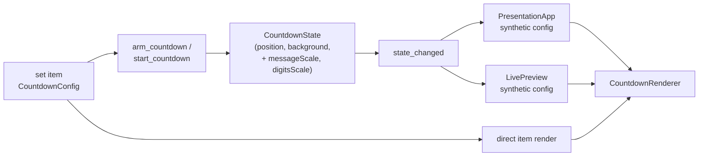
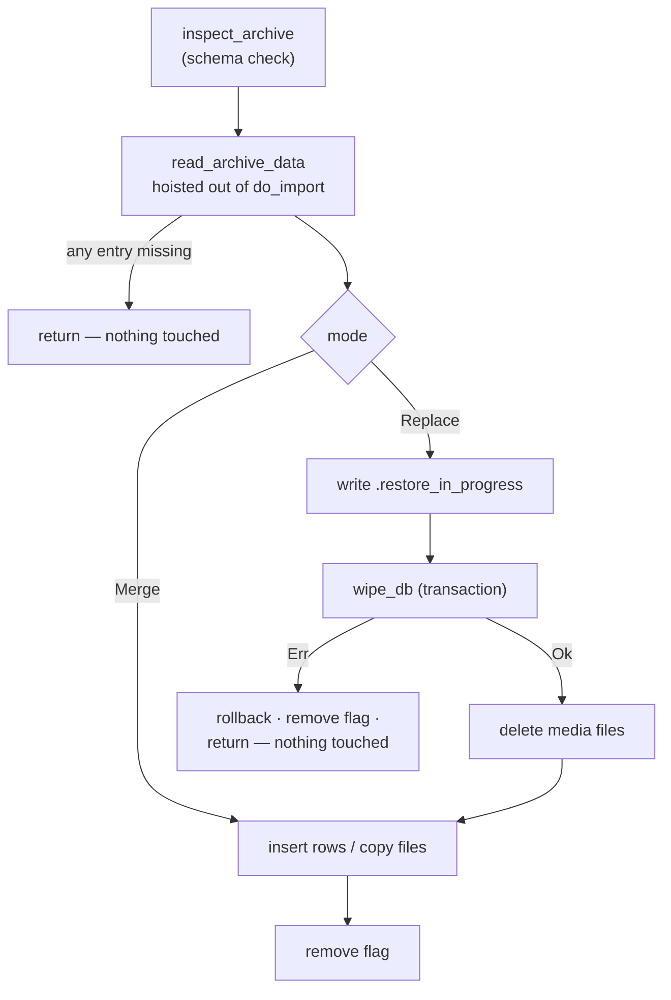

# Phase 17 — Design

**Spec:** `.specs/features/phase17-sets-countdown-camera-restore/spec.md`
**Status:** Draft
**Date:** 2026-09-04

---

## Architectural Position

Four of the five groups are contained edits inside layers that already exist; none introduces a new architectural concept.

| Group | Layers touched | Schema | IPC surface |
|-------|----------------|--------|-------------|
| 17A countdown name | `domain/countdown.rs` (JSON blob), 3 label sites, i18n | none — `set_items.countdown_config` is a TEXT blob | none |
| 17B countdown sizing | `domain/countdown.rs`, `commands/countdown.rs` (mirroring), `CountdownRenderer`, `LivePreview`, `PresentationApp`, modal | none | 2 commands gain 2 params |
| 17C restore | `services/archive.rs`, `commands/backup.rs`, `commands/set.rs`, `BackupScreen`, i18n | none | +1 command (`get_set_play_count`) |
| 17D sets on Home | `stores/library.ts`, new `SetPicker`, `HomeSetBuilder`, `OperatorApp`, `SetBuilder`, `SlideController` | none — one `settings` row | none (uses existing set CRUD) |
| 17E camera | `domain/set.rs`, `services/mediamtx.rs`, `commands/stream.rs`, `WebViewRenderer`, `WebViewSetItemEditor`, `StreamProfileEditor/Switcher`, i18n | none — `webview_config` is a TEXT blob | `StreamSource` shrinks to one kind |

**No migration is needed anywhere.** `countdown_config` and `webview_config` are JSON TEXT columns, so new optional fields are additive and removed fields are ignored on read (serde ignores unknown keys — neither struct sets `deny_unknown_fields`). The one persisted scalar 17D needs is a row in the existing `settings` key/value table.

**Invariants respected:** the write guard on `state.presentation` is still dropped before every `app.emit()` (17B touches the mirroring block inside `commands/countdown.rs`, which already follows this); every new frontend call goes through `src/api/commands.ts`; all slide/label generation stays where it already lives.

---

## 17A — Countdown identity

### Data model

`CountdownConfig` gains one optional field. It has a **hand-written `Deserialize`** (for the legacy flat `durationMs` shape), so the field must be read explicitly there as well as added to the struct:

```rust
pub struct CountdownConfig {
    pub target: CountdownTarget,
    /// Operator-supplied item name. `None` → the UI shows its localized default.
    pub name: Option<String>,          // NEW
    pub message: Option<String>,
    // … unchanged …
}
```

In the manual `Deserialize`, `name` reads exactly like `message` does today (`value.get("name").and_then(as_str).map(to_string)`), so every pre-Phase-17 blob deserializes with `name: None`.

### The three label sites

| Site | Today | After |
|------|-------|-------|
| `SetBuilder.tsx:449-455` | `t("builder.countdownSummary", {dur})`, `dur` falling back to the literal `"10min"` | `cfg?.name?.trim() \|\| t("builder.countdownDefaultName")` |
| `itemMeta.tsx:60-70` | hardcoded `` `Cronômetro — ${h}:${m}` `` | same expression, via a `t` passed in |
| Operator surfaces (`OperatorPresentationLayout`, `SetItemList`, `OutputLaunchModal`, `StrophesGrid`) | call `itemLabel(...)` | unchanged — they inherit the fix |

`itemLabel` is a **pure function with no hooks** (its doc comment says so) and four call sites, all inside components that already hold `t`. Rather than importing `i18next` into it — which would break that purity and its tests — the signature takes the translator:

```ts
export function itemLabel(item, songs, media, t: TFunction, fallback = "—"): string
```

Four call sites each add `t`; `bodies.tsx`/`SlideChip` do not use it. `builder.countdownSummary` and its `"10min"` literal are deleted outright, not repurposed — nothing else consumes the key.

### Editing

The name input goes at the top of `CountdownScheduleModal`, above Duration, and rides the existing save path (`updateSetItem({ id, countdownConfig })`). Whitespace-only trims to `undefined`, matching how `message` is already handled at `:121`.

---

## 17B — Countdown sizing

### Model and rendering

```rust
/// Percent of the built-in size. 100 = the Phase 16 rendering exactly.
/// Clamped to 50..=300 on read; never rejected.
pub message_scale: u16,   // NEW, default 100
pub digits_scale: u16,    // NEW, default 100
```

The manual `Deserialize` clamps rather than errors (spec AC-4): `value.get("messageScale").and_then(as_u64).map(|n| n.clamp(50, 300) as u16).unwrap_or(100)`.

Application multiplies **all three terms** of the existing clamp, so the container-query behaviour that keeps the operator's small live preview proportional is preserved:

```ts
const scaled = (min: string, mid: string, max: string, pct: number) =>
  `clamp(calc(${min} * ${pct / 100}), calc(${mid} * ${pct / 100}), calc(${max} * ${pct / 100}))`;

// message: scaled("0.75rem", "3cqmin", "2rem", messageScale)
// digits:  scaled("2rem",   "30cqmin", "18rem", digitsScale)
```

At 100% this is `calc(X * 1)`, which computes identically to the bare value — the spec's "byte-identical" criterion is verified by asserting the *computed* pixel size against the unscaled control in a Vitest case, not by string comparison.

### Why the takeover path needs mirroring

A countdown **set item** renders from `currentItem.countdownConfig`, so per-item scales work there for free. A **takeover** does not: both the presentation window (`PresentationApp.tsx:225-231`) and the operator preview (`LivePreview.tsx:84-89`) synthesize a `CountdownConfig` from `CountdownState`, which is why Phase 14 had to mirror `position` and `background_media_id` onto that state. The scales follow the identical route:



`CountdownState` gains the same two fields with `#[serde(default)]` (defaulting to 100 via a helper, since `Default` for a `u16` is 0), mirrored in the two blocks that already assign `s.position` / `s.background_media_id` (`commands/countdown.rs:349-350` and `:489-490`) and reset alongside them at `:426-427`.

**Argument count:** `start_countdown` and `arm_countdown` already carry `#[allow(clippy::too_many_arguments)]`. Grouping the mirrored fields into a `CountdownAppearance` struct was considered and rejected: it would rewrite both signatures, the `commands.ts` wrappers and both commands' tests for a cosmetic gain, against a Phase 14 precedent that added `position`/`background_media_id` as flat params. Two more flat params, same pattern.

### DD-1 — defect found at design time

`OperatorApp.tsx:267` re-arms a scheduled countdown silently at launch from `findUpcomingScheduledCountdown`, whose `UpcomingScheduledCountdown` interface (`runtime/scheduledCountdown.ts:3-14`) carries **no `position` and no `backgroundMediaId`**. So the same countdown armed at launch takes over centred with no background, while armed from the modal it honours both. Since every arm/start call site is being touched to add the scales anyway, the interface carries the full appearance set (`position`, `backgroundMediaId`, `messageScale`, `digitsScale`) and the launch re-arm passes them through. Tracked as **P17-37**.

### Call sites to update (complete list)

| Site | Change |
|------|--------|
| `CountdownScheduleModal.tsx:132` (`store.arm`) | pass the two scales |
| `OperatorApp.tsx:267` (`store.arm`, launch re-arm) | pass position + background + scales (DD-1) |
| `PresentationApp.tsx:199` (`startCountdown`) | pass the two scales |
| `stores/countdown.ts:73-90` (`start`/`arm` params) | widen both param types |
| `api/commands.ts:372,391` (`StartCountdownParams`/`ArmCountdownParams`) | widen both |

---

## 17C — Restore integrity

### The wipe

```rust
// FK-safe order. song_plays FIRST — its song_id/set_id FKs have no ON DELETE
// clause (NO ACTION), so it blocks DELETE FROM sets / songs while rows exist.
pub async fn wipe_db(pool: &SqlitePool) -> Result<(), ArchiveError> {
    let mut tx = pool.begin().await?;
    for sql in [
        "DELETE FROM song_plays",   // NEW — the RC-3 blocker
        "DELETE FROM set_items",
        "DELETE FROM sets",
        "DELETE FROM songs",        // cascades song_sections, song_tags
        "DELETE FROM media",
        "DELETE FROM settings",
    ] { sqlx::query(sql).execute(&mut *tx).await?; }
    sqlx::query("INSERT INTO songs_fts(songs_fts) VALUES('rebuild')").execute(&mut *tx).await?;
    tx.commit().await
}
```

Wrapping it in one transaction is what makes AC-3/AC-4 achievable: a failure rolls the whole wipe back, so "the wipe failed" and "nothing was destroyed" become the same state. `tags` rows are deliberately left (orphaned, harmless, and not carried in the archive either — logged as a follow-up rather than silently changing behaviour).

### The ordering

Today: flag → **delete every media file** → wipe DB → import. The media is gone before the step that fails.



Two changes carry this: `read_archive_data` moves out of `do_import` and up into `import()` before the destructive branch, so a truncated or malformed `.tlz` is rejected while the library is still intact; and the wipe moves ahead of the media deletion. `do_import` takes the already-parsed data instead of a path — it is `pub(crate)` with one caller, so the signature change is contained.

### `delete_set` (RC-7)

Same FK, same fix, plus a count for the confirmation:

```rust
// delete_set: one transaction
"DELETE FROM song_plays WHERE set_id = ?"   // NEW
"DELETE FROM sets WHERE id = ?"             // set_items cascades

// NEW command, read-only, for the confirm dialog
get_set_play_count(id: String) -> i64
```

A separate read-only command rather than a `playCount` field on `ServiceSet`, because `ServiceSet` is deserialized in a dozen places and only the delete dialog needs the number.

### Error surfacing (RC-4)

The pieces already exist and are simply not wired together on this screen: `normalizeError` (`api/commands.ts:32`) coerces an unknown rejection into `ErrorPayload`, and the modern `error.*` i18n namespace is what `HomeSetBuilder.tsx:87` already uses. One shared helper replaces the four `String(err)` sites:

```ts
// src/i18n/commandError.ts
export function formatCommandError(err: unknown, t: TFunction): string {
  const { code, params } = normalizeError(err);
  return t([`error.${code}`, "error.generic"], { ...params, code });
}
```

`t()`'s array form falls back to `error.generic` ("Something went wrong ({{code}})") when a code has no entry, so an unmapped code degrades to a readable sentence carrying the code instead of `[object Object]`. New `error.backup.*` entries cover `export_failed`, `inspect_failed`, `restore_failed`, `abort_failed`, `db_not_ready`, `path_error`, plus `error.set.db_error`/`not_found` for 17D; the existing locale-parity test guards both files. The legacy `i18n/error-codes.ts` map is left alone — it is a Phase-1 remnant with no `backup.*` entries and is not on this path.

`ImportSummary` is already returned to the screen, so AC "state that the ledger was cleared" is a static line in the Replace-mode summary, not new plumbing.

---

## 17D — Sets on Home

### State

`fixedSetId` becomes `activeSetId`, and the resolver gains a persisted preference:

```ts
export const ACTIVE_SET_KEY = "ui.active_set_id";   // src/stores/library.ts

loadActiveSet: async () => {
  let id: string | null = null;
  try { id = await getSetting(ACTIVE_SET_KEY); } catch { /* unset → fall through */ }
  if (id) {
    try { await getSet(id); }            // still exists?
    catch { id = null; }
  }
  if (!id) id = (await getOrCreateDefaultSet()).id;   // most-recently-updated, else create
  set({ activeSetId: id });
},

setActiveSet: async (id) => {
  set({ activeSetId: id });
  await setSetting(ACTIVE_SET_KEY, id);   // fire-and-forget failure is non-fatal
},
```

`getSetting` **rejects** for a missing key (`settings.rs:29` returns `settings.not_found`), so the try/catch is required — this mirrors the established pattern at `api/commands.ts:71-79`. The existence check makes AC-4 hold after a restore replaces the library.

### The picker

- **New component** `src/components/setbuilder/SetPicker.tsx`, rendered in the `HomeSetBuilder` header above the builder.
- Reads `useSetsStore` (already written: `sets`, `refresh`) and subscribes to `onSetChanged` exactly as the dying `SetList` does — that subscription logic is lifted from `SetList.tsx:19-24` before the file is deleted.
- Actions map 1:1 onto existing commands: `createSet`, `updateSet` (rename), `deleteSet`, plus `setActiveSet`.
- Deletion reuses `ConfirmDialog` (`components/common/ConfirmDialog.tsx`) with the play-count line; disabled when `sets.length === 1`.
- `disabled` while presenting, from the `presState` `HomeSetBuilder` already reads — same predicate the nav buttons use.

### Retiring the dead views

| File | Change |
|------|--------|
| `stores/library.ts` | drop `editingSetId`, `openSetBuilder`; `AppView` loses `"sets"` and `"set-builder"` |
| `OperatorApp.tsx:599-603` | delete both view branches and the standalone `SetBuilder` render |
| `OperatorApp.tsx:263` | launch re-arm reads the **active** set, not `getOrCreateDefaultSet()` |
| `SetBuilder.tsx:494-502` | remove the back button and the now-vacuous `hideBack` prop (Home is the only host) |
| `SlideController.tsx:87` | back target `"set-builder"` → `"home"` |
| `SetList.tsx` + its tests | deleted |

This is the one place the design deliberately *removes* capability surface: after it, exactly one path manages sets.

---

## 17E — Camera

### Mode set

`WebViewMode` keeps six variants but splits them by role. The three removed modes stay as **deserialization-only discriminants** so a `v1.3.0` row still loads:

```rust
pub enum WebViewMode {
    Iframe, Mjpeg, Rtsp,              // offered
    Rtmp, Srt, Multicast,             // legacy: parse-only, never offered, never rendered
}
impl WebViewMode {
    pub fn is_supported(self) -> bool { matches!(self, Self::Iframe | Self::Mjpeg | Self::Rtsp) }
}
```

Keeping the variants is what makes AC "deserialize without error into an explicit unsupported state" true with **zero** custom serde and an exact round-trip for an item the operator has not yet reconfigured. The TS union stays closed and honest:

```ts
export type WebViewMode = "iframe" | "mjpeg" | "rtsp";
export type LegacyWebViewMode = "rtmp" | "srt" | "multicast";
// WebViewConfig.mode: WebViewMode | LegacyWebViewMode
```

Everything else about those modes goes: `SrtConfig`, `SrtMode`, `MulticastConfig`, the `srt_config`/`multicast_config` fields on `WebViewConfig`, their editor blocks, their i18n keys, the `rtmp` hint. Dropping the two config fields is safe on read (unknown JSON keys are ignored) and lossy only on re-save of an item that must be reconfigured anyway.

### Proxy pipeline collapses

RTSP is the only surviving proxied mode — MJPEG and iframe never touched MediaMTX (`isProxyMode` excludes them). So:

- `mediamtx::Source` (4 variants) → a single `RtspSource { url, transport: Option<String> }`; `render_config` loses the SRT-server branch and the `Pull`/`SrtPull`/`SrtListen` arms with it.
- `commands/stream.rs`: `StreamSource` keeps only its `rtsp` kind.
- `WebViewRenderer.isProxyMode(mode)` → `mode === "rtsp"`; `buildStreamSource` collapses to the one branch.

### Profiles, scoped to where they work (RC-10)

`resolveActiveSource` is consulted today only in the `rtmp`/`rtsp` branches. With rtmp gone the rule becomes explicit and symmetric:

```ts
export const PROFILE_MODES: WebViewMode[] = ["rtsp", "mjpeg"];
```

- `WebViewSetItemEditor` renders `StreamProfileEditor` only when `PROFILE_MODES.includes(mode)` — so **Página web has no profile section** (the operator's ask), and MJPEG gains one.
- `WebViewRenderer`'s MJPEG path routes its URL through `resolveActiveSource(config)` so the profile it now offers actually takes effect.
- `StreamProfileSwitcher` adds the same mode gate to its existing `profiles.length < 2` guard.
- Orphaned profiles on an iframe item are inert (the iframe path reads `config.url`) and are dropped by `buildConfig` on the next save, which already rebuilds the object from form state.

### Naming

Labels change; **keys do not**. The `webview.*` i18n namespace holds ~45 keys, and renaming it to `camera.*` would produce a large diff with no operator-visible difference. What changes:

| Key | en-US | pt-BR |
|-----|-------|-------|
| `builder.add.webView` | `Camera` | `Câmera` |
| `webview.editor.modes.iframe` | `Web page (URL)` | `Página web (URL)` |
| `webview.editor.modes.mjpeg` / `.rtsp` | `MJPEG` / `RTSP` | idem (the "(camera)" suffix is now redundant) |
| new `webview.editor.unsupportedMode` | `This mode is no longer supported — choose RTSP, MJPEG or Web page.` | pt-BR equivalent |

`itemMeta.itemLabel`'s `web_view` branch returns `Câmera — <host>` for rtsp/mjpeg and `Página web — <host>` for iframe, replacing today's `mode === "mjpeg" ? "Câmera" : "Web"`. `SetBuilder`'s add button keeps its `Globe` icon (a camera glyph is available from lucide — `Video` — and is the better fit; swapping it is a one-word change in `SetBuilder.tsx:859` and `itemMeta.tsx:29`).

---

## Component Inventory

| Component | Location | New/Changed | Purpose |
|-----------|----------|-------------|---------|
| `SetPicker` | `src/components/setbuilder/SetPicker.tsx` | **New** | Active-set dropdown + create/rename/delete on Home |
| `formatCommandError` | `src/i18n/commandError.ts` | **New** | One `ErrorPayload` → localized string helper for every screen |
| `CountdownConfig` / `CountdownState` | `src-tauri/src/domain/countdown.rs` | Changed | `name`, `messageScale`, `digitsScale` |
| `wipe_db`, `import` | `src-tauri/src/services/archive.rs` | Changed | Ledger-aware transactional wipe; validate-then-destroy ordering |
| `delete_set`, `get_set_play_count` | `src-tauri/src/commands/set.rs` | Changed / **New** | Ledger-aware delete + count for the confirm dialog |
| `WebViewMode`, `WebViewConfig` | `src-tauri/src/domain/set.rs` | Changed | Supported/legacy split; SRT + multicast configs removed |
| `mediamtx::Source` → `RtspSource` | `src-tauri/src/services/mediamtx.rs` | Changed | Single-protocol proxy |
| `CountdownRenderer` | `src/components/presentation/` | Changed | Scale-aware clamps |
| `LivePreview` | `src/components/presentation/` | Changed | Mirrored position (RC-11) + scales |
| `itemLabel` | `src/components/presentation/itemMeta.tsx` | Changed | Takes `t`; countdown + camera branches localized |
| `WebViewSetItemEditor` | `src/components/set/` | Changed | 3 modes, profile scoping, unsupported banner |
| `SetList` | `src/components/set/SetList.tsx` | **Deleted** | Superseded by `SetPicker` |

---

## Reuse

| Existing | Location | How this phase uses it |
|----------|----------|------------------------|
| `useSetsStore` | `stores/sets.ts` | Already lists sets and is currently consumed only by the dying `SetList` — becomes the picker's source |
| `onSetChanged` subscription | `SetList.tsx:19-24` | Lifted verbatim into `SetPicker` before deletion |
| `ConfirmDialog` | `components/common/ConfirmDialog.tsx` | Set-deletion confirmation, as `SetList` already did |
| `normalizeError` | `api/commands.ts:32` | The coercion half of `formatCommandError` |
| `error.*` i18n namespace | `locales/*.json` | Extended with `backup.*` / `set.*`, same pattern as `error.media.*` |
| `getSetting`/`setSetting` + try/catch idiom | `api/commands.ts:71-79,522-526` | Active-set persistence |
| `resolveActiveSource` | `utils/streamProfile.ts` | Extended to the MJPEG render path unchanged |
| Phase 14 mirroring block | `commands/countdown.rs:349,489` | The scales follow `position`/`background_media_id` line for line |
| `CountdownConfig` manual `Deserialize` | `domain/countdown.rs:82` | Already the pattern for backward-compatible blob fields |

---

## Error Handling Strategy

| Scenario | Handling | Operator sees |
|----------|----------|---------------|
| Replace restore, wipe fails for any reason | Transaction rolls back; flag removed; media untouched | Localized `error.backup.restore_failed` with detail; library unchanged |
| Archive unreadable / entry missing | Rejected before the destructive branch | `error.backup.inspect_failed`; library unchanged |
| Command error with no i18n entry | `t([...])` falls back to `error.generic` | "Something went wrong (backup.restore_failed)" — never `[object Object]` |
| Deleting the last remaining set | Delete disabled in the picker | Disabled control with a tooltip reason |
| Deleting a presented set | `song_plays` removed in the same transaction | Confirmation names the set and its play-record count |
| Active set missing at launch | Fallback chain: stored id → most-recently-updated → create default | Home opens on a real set, silently |
| Camera item on a legacy mode | `is_supported()` false → builder banner, presentation shows the standard camera-error surface | "This mode is no longer supported — choose RTSP, MJPEG or Web page." |
| Scale outside 50–300 in a hand-edited blob | Clamped on deserialize | Renders at the clamped size; no error |

---

## Tech Decisions

| Decision | Choice | Rationale |
|----------|--------|-----------|
| Countdown fields | Add to the JSON blob | `countdown_config` is TEXT; no migration, and the manual `Deserialize` already handles legacy shapes |
| Scale representation | `u16` percent, clamped 50–300 | Clamping keeps a hand-edited or future-format config renderable (spec AC-4); percent reads directly in the UI |
| Scale application | Multiply all three `clamp()` terms | Preserves container-query scaling in the small preview; 100% computes identically to today |
| Mirroring scales | Flat params on the two commands | Matches the Phase 14 precedent for `position`/`background_media_id`; a grouped struct would rewrite both signatures and their tests for cosmetics |
| `itemLabel` localization | Pass `t` in | Keeps the function pure and testable; four call sites already hold `t` |
| Wipe atomicity | One transaction | Makes "failed" and "nothing destroyed" the same state, which AC-3/AC-4 both depend on |
| Archive read | Hoisted before the destructive branch | A malformed `.tlz` must not be able to empty the library first |
| Play count | Separate read-only command | Avoids widening `ServiceSet`, deserialized in a dozen places, for one dialog |
| Legacy camera modes | Keep the enum variants, remove everything else | Exact round-trip for un-migrated rows with no custom serde; the TS union stays closed |
| i18n namespace | Rename values, keep `webview.*` keys | ~45 keys renamed would be a large diff with zero operator-visible effect |
| Dead sets views | Delete rather than wire up | GA-3 chose the picker; two management paths is one more than asked for |

---

## Risks

| Risk | Mitigation |
|------|------------|
| The RC-3 fix is only provable against a **populated** ledger, which no existing test has | The regression test seeds `song_plays` before restoring — without that seed it passes on the broken code too |
| `read_archive_data` holds every media file in memory | Pre-existing (`do_import` already does this); hoisting does not worsen it. Logged as a follow-up, not addressed here |
| `itemLabel` signature change ripples through 4 components + tests | Mechanical and compiler-enforced; `tsc --noEmit` catches every miss |
| Deleting `SetList.tsx` while `SetBuilder` still imports view navigation | `SetBuilder`'s back button is removed in the same task; `AppView` narrowing makes any stale `setView("sets")` a type error |
| Removing SRT/multicast structs could break a set that still references them | Covered by a round-trip test: a `v1.3.0` SRT blob must deserialize to `mode: Srt` with no panic and `is_supported() == false` |
| Locale drift | The existing parity test fails the build on any key added to one file only |
| `CountdownState` scale defaults | `#[serde(default)]` on a `u16` yields **0**, not 100 — both fields need an explicit `default = "hundred"` helper, and a test asserting an old serialized state deserializes to 100 |

---

## Verification Beyond Unit Tests

Manual checks that need the real install and cannot be gated in CI:

1. **Restore** — take a fresh `.tlz` from the production library (which has presentation history), restore with "substituir tudo" onto a copy, confirm completion and that media files are present afterwards.
2. **Sets** — three sets, switch, restart, confirm the selection survived; delete a presented set and confirm the play-record count in the dialog.
3. **Countdown** — a scaled countdown projected on the real 16:9 wall at 50%, 100% and 300%, plus a takeover armed from launch (DD-1) to confirm position, background and sizes all follow.
4. **Camera** — the production RTSP camera with two profiles, switched mid-presentation; an MJPEG source with two profiles to confirm the newly-honoured switch; a Página web item to confirm no profile section appears.
