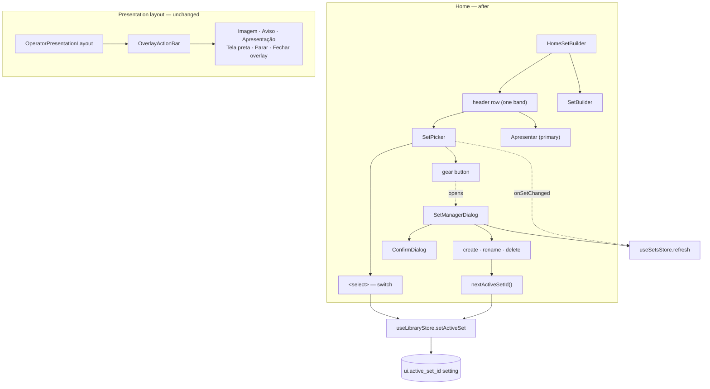

# Phase 18: Home Simplification — Design

**Spec:** `.specs/features/phase18-home-simplification/spec.md`
**Status:** Draft
**Designed:** 2026-09-11
**Scope:** Frontend + CI only. No Rust, no migration, no IPC contract change.

---

## Architecture Overview

Home's header today is two stacked bordered bands — a `SetPicker` management panel over a shared
`OverlayActionBar`. This design collapses both into one purpose-built row, and moves set management
into its own dialog.



The data path is unchanged: `useSetsStore` for the list, `useLibraryStore` for the selection,
`ui.active_set_id` for persistence. Only the surfaces move.

> The diagram is inline mermaid, which renders natively in the repo's markdown viewers. The
> `mermaid-studio` skill is installed if a rendered SVG/PNG is ever wanted — say so and I'll
> generate one.

---

## Design Decisions

### DD-1 — Home stops mounting `OverlayActionBar` (amends P18-02)

**Spec assumption:** P18-02 makes `onOferta` / `onAviso` / `onPdf` optional so Home can render the
bar without them.

**Problem:** with all three omitted and `Apresentar` promoted out of the bar, Home's instance
becomes a bordered strip containing at most one conditional button — and, after DD-2, *no* buttons
at all. P18-09 requires exactly one bordered header band on Home, which an empty second band
violates.

**Decision:** Home builds its own single-row header and no longer mounts `OverlayActionBar` at all.
`OverlayActionBar` becomes exclusively the presentation layout's bar and sheds the two props that
only Home ever set: `showApresentarButton` and `onApresentar` (`OperatorPresentationLayout.tsx:303`
already passes `showApresentarButton={false}`). `onOferta` / `onAviso` / `onPdf` stay **required** —
its one remaining caller always supplies them, so making them optional would add a branch nothing
takes.

**P18-02 restated:** *`OverlayActionBar` sheds its Home-only props (`showApresentarButton`,
`onApresentar`) and is mounted only by `OperatorPresentationLayout`; Home renders its own header
row.*

### DD-2 — P18-04 (`Fechar overlay` on Home) is retired as unreachable

**Spec assumption:** an overlay raised from the presentation layout could outlive it, so Home should
keep a dismiss control as an escape hatch.

**Traced, and it cannot happen:**

1. After P18-01, the only callers of `setMediaOverlay` / `setAnnouncementOverlay` are
   `OperatorPresentationLayout.tsx:169,173,189,193` — reachable only while presenting.
2. `exit_presentation` (`src-tauri/src/commands/window.rs:520-540`) sets `pres.overlay = None`
   unconditionally, inside the same write-lock critical section that sets `mode = Idle`, before the
   state snapshot is taken. Ending a presentation always clears the overlay.
3. `OperatorApp.tsx:433` keeps `HomeSetBuilder` unmounted while any output presents
   (`presentingOutputs.size > 0`), so Home cannot be on screen during the window where an overlay
   exists.
4. An overlay renders only in the presentation window, which is closed when idle — so even a
   hypothetical stranded overlay would be drawing on nothing.

**Decision:** drop P18-04. Keeping the button would reintroduce exactly the dead-code class that F-2
retires in this same phase — an always-false conditional with a test that can only reach it by
passing props directly.

**Consequence:** Home's header contains three controls total: the select, the gear, `Apresentar`.

### DD-3 — `Apresentar` moves into Home's header row, sized against its neighbours

P18-06 asks for "strictly greater rendered height and font size". jsdom performs no layout, so the
gate test asserts the utility classes; the visual check is manual (see Verification).

| Control | Classes |
| --- | --- |
| `Apresentar` | `px-5 py-2.5 text-sm font-semibold bg-primary hover:bg-primary-hover text-fg-on-primary rounded-lg inline-flex items-center gap-2` + `<Play size={16} className="fill-current" />` |
| Set `<select>` | `text-xs px-2 py-1.5 bg-surface border border-border rounded-lg focus:outline-none focus:border-primary` |
| Gear | `p-1.5 text-muted hover:text-inherit rounded` + `<Settings size={14} />`, icon-only with `aria-label` |

`text-sm` > `text-xs` and `py-2.5` > `py-1.5` make the relation true by construction rather than by
eyeball. All colours are semantic tokens, so `scripts/check-theme-tokens.ps1` stays clean.

### DD-4 — The manage modal is a new component, not a bigger `SetPicker`

`SetPicker` becomes ~60 lines (select + gear + dialog mount). Folding the list, rename, delete,
create and `ConfirmDialog` back into it would leave it at today's ~256 lines and defeat the phase.
A separate `SetManagerDialog.tsx` matches the codebase's one-modal-per-file convention
(`StopPresentationModal`, `MultiScreenLaunchModal`, `OutputLaunchModal`, `ImportReviewModal`).

### DD-5 — Draft text is local and never re-seeded from the store

The spec's edge case ("a `set_changed` event while the modal is open must not discard typing") is
satisfied structurally: `renamingId`, `renameValue` and `newName` are component state, and
`useSetsStore.refresh()` writes only `sets`. Nothing derives an input's `value` from the store, so a
refresh cannot clobber a keystroke.

One guard is still needed: if a refresh removes the row being renamed (deleted in another window),
`renamingId` would point at a set that is no longer listed. A `useEffect` on `sets` clears
`renamingId` when `sets.every(s => s.id !== renamingId)`.

The `onSetChanged` subscription stays in `SetPicker` (always mounted on Home), not in the dialog, so
the select stays live whether or not the dialog is open. The dialog reads `useSetsStore` directly —
the codebase's normal store access — rather than taking `sets` as a prop.

### DD-6 — Successor selection is a pure helper

F-1's fix needs a deterministic answer to "which set becomes active when the active one is deleted".
Extracted as `nextActiveSetId(sets, deletedId)` in `src/utils/setSelection.ts` with co-located
tests, matching the `outputDispatch.ts` / `monitorNames.ts` pure-helper convention.

Rule: the set **after** the deleted one in list order; if it was last, the one **before** it;
`null` when it was the only set (delete is blocked in that case by the last-set guard, so `null` is
a defensive return, not a reachable path).

Call order matters: compute the successor **before** `deleteSet` (the list still contains the
deleted row, so "after" and "before" are meaningful), then apply it after the delete succeeds and
the store refreshes. Applying it only on success means a failed delete leaves the active set alone,
satisfying the spec's `deleteSet`-fails edge case.

### DD-7 — Release notes: pure composition, I/O in the workflow

`scripts/release-notes.mjs` follows `version-files.mjs` / `fix-updater-manifest.mjs`: exported pure
functions plus an `isMainModule`-guarded CLI. No network, no `git`, no `fs` in the pure path — the
workflow hands it two files.

```js
export function hasChangeEntries(generatedBody)         // → boolean
export function extractCompareLink(generatedBody)       // → string | null
export function composeReleaseNotes({                   // → string
  generatedBody,      // string  — body from GitHub's generate-notes endpoint ("" if it failed)
  commitSubjects,     // string[] — `git log --no-merges --pretty=%s` lines
  installLine,        // string  — "Baixe o instalador para a sua plataforma abaixo."
  compareUrl,         // string | null — fallback when the generated body carries no link
})
```

Composition rules:

1. Always emit `installLine`, then a blank line.
2. If `hasChangeEntries(generatedBody)` — GitHub found merged PRs — append `generatedBody` verbatim.
3. Otherwise (this repo's normal case, F-3) emit `## What's Changed`, one `* <subject>` per surviving
   commit subject, then the compare link from `extractCompareLink(generatedBody)` or built from
   `compareUrl`.
4. Subjects matching `NOISE_SUBJECT_PATTERNS` (currently just `/^chore\(release\):/`) are dropped —
   the version-bump commit is noise in its own release notes.
5. Never emit an empty `## What's Changed`: with no surviving subjects and no generated entries, the
   heading is omitted and only the install line and compare link remain.

`hasChangeEntries` is `/^\s*[*-]\s+\S/m` — GitHub's generated bodies bullet each PR with `* `, and an
empty result is the literal heading plus the `**Full Changelog**` line and nothing between them.

### DD-8 — The notes job is additive and cannot destroy a release

A third job in `release.yml`:

```yaml
release-notes:
  needs: build
  runs-on: ubuntu-24.04
  steps:
    - uses: actions/checkout@v4
      with: { fetch-depth: 0 }        # git log <prev>..<tag> needs full history + tags
    - uses: actions/setup-node@v4
      with: { node-version: lts/* }
    - name: Compose and apply release notes
      continue-on-error: true          # a notes failure must not fail the release
      env:
        GH_TOKEN: ${{ secrets.GITHUB_TOKEN }}
        TAG: ${{ github.ref_name }}
      run: |
        PREV="$(git describe --tags --abbrev=0 "${TAG}^" 2>/dev/null || true)"
        # ... gh api generate-notes → generated.md
        # ... git log --no-merges --pretty=%s → commits.txt
        # ... node scripts/release-notes.mjs → notes.md
        # ... gh release edit "$TAG" --notes-file notes.md
```

The job only ever **PATCHes an existing release's body**. It never creates, publishes, deletes, or
uploads, so P18-24 ("a failure leaves the draft and its artifacts intact") holds by construction
rather than by careful ordering. `continue-on-error` on the single step keeps the workflow run green
while still surfacing a red annotation in the log — the build and its signed artifacts are the part
that must not be reported as broken.

`fetch-depth: 0` is mandatory: `actions/checkout` defaults to a shallow, single-ref clone, on which
`git describe` and `git log <prev>..<tag>` both fail.

No new secret. `GITHUB_TOKEN` with the workflow's existing `contents: write` covers both the
`generate-notes` call and `release edit`; the signing secrets are not referenced by this job.

### DD-9 — Open verification point (flagged, not assumed)

Whether `gh release edit <tag>` resolves a **draft** release by tag name is **not verified**. The
`gh` manual documents `--notes-file` and `--draft` on `release edit` (confirmed), but not draft
lookup semantics, and `gh` is not installed in this dev environment to test against.

The implementation task must confirm this on the first real tag push. Documented fallback if it does
not resolve:

```bash
ID="$(gh api "repos/$GITHUB_REPOSITORY/releases" --jq ".[] | select(.tag_name==\"$TAG\") | .id")"
gh api -X PATCH "repos/$GITHUB_REPOSITORY/releases/$ID" -f body@notes.md
```

This is called out rather than guessed because a wrong assumption here would only surface during an
actual release.

---

## Code Reuse Analysis

### Existing components to leverage

| Component | Location | How it is used |
| --- | --- | --- |
| `ConfirmDialog` | `src/components/common/ConfirmDialog.tsx` | Delete confirmation inside `SetManagerDialog` — unchanged, same props as today |
| `StopPresentationModal` | `src/components/presentation/StopPresentationModal.tsx` | Pattern source for `SetManagerDialog`: `fixed inset-0 z-50 flex items-center justify-center bg-black/70` backdrop, `bg-surface rounded-xl shadow-2xl w-[Npx]` panel, titled header with an `X` close button, `Escape` via a `window.addEventListener("keydown")` effect |
| `MonitorPicker` | `src/components/settings/MonitorPicker.tsx` | Pattern source for the `<select>`: markup, token classes, and `onChange` → persist shape |
| `useSetsStore` | `src/stores/sets.ts` | List + `refresh()`, unchanged |
| `useLibraryStore` | `src/stores/library.ts` | `activeSetId` / `setActiveSet`, unchanged — this is why no "main set" is needed (CS-3) |
| `outputDispatch.ts` | `src/utils/outputDispatch.ts` | Pattern source for `setSelection.ts`: pure decision function + co-located `.test.ts` |
| `version-files.mjs` | `scripts/version-files.mjs` | Pattern source for `release-notes.mjs`: exported pure functions, `isMainModule` CLI guard, co-located `.test.mjs` |
| `onSetChanged` | `src/api/commands.ts` | Live refresh subscription, unchanged |

### Integration points

| System | Integration |
| --- | --- |
| Tauri IPC | None new. `listSets`, `createSet`, `updateSet`, `deleteSet`, `getSetPlayCount`, `getSetting`/`setSetting` all exist and are unchanged |
| SQLite | No migration. No schema touched |
| Events | `set_changed` only, already subscribed |
| CI | One new job in `release.yml`, one new script, no new secret |

### CONCERNS.md

Checked. Its seven entries are all Phase 0-era (`App.tsx` dead file, empty Rust stubs, missing
`vitest.config.ts` — since resolved) and none names a component this phase touches. No fragile-area
mitigation is required. **The file is stale and should be re-run against the current tree at some
point** — logged as a note, not addressed here.

---

## Components

### `SetPicker` (rewritten)

- **Purpose:** the compact Home set control — switch via a native select, open management via a gear.
- **Location:** `src/components/setbuilder/SetPicker.tsx` (~256 lines → ~60)
- **Props:** none. The `disabled` prop is **removed** (P18-19 / F-2).
- **Renders:** `<select>` of all sets (name only, no counts) with `value={activeSetId}`; a gear
  `<button aria-label={t("sets.manage.open")}>`; `<SetManagerDialog>` when open.
- **Owns:** the `onSetChanged` → `refresh()` subscription (mount/unmount), and the dialog's open flag.
- **Reuses:** `useSetsStore`, `useLibraryStore`, `MonitorPicker`'s select markup.
- **Edge case:** while `sets` is empty (not yet loaded) the select renders a single disabled option
  holding the active set's name if known, so it never flashes blank or `undefined`.

### `SetManagerDialog` (new)

- **Purpose:** create, rename and delete sets, out of the way until asked for.
- **Location:** `src/components/setbuilder/SetManagerDialog.tsx`
- **Props:** `{ onClose: () => void }` — mounted only when open, like `StopPresentationModal`.
- **Renders:** titled header + `X`; a scrollable `<ul>` (`max-h-[60vh] overflow-y-auto`) with one row
  per set showing `{name}` and `t("sets.item", { count })`, each row carrying rename and delete; an
  inline create form; `<ConfirmDialog>` for delete.
- **Closes on:** `Escape` (window keydown effect), backdrop click, `X`. All three call `onClose`,
  which unmounts the component — so pending `renameValue` / `newName` are discarded by construction
  (P18-18).
- **Dependencies:** `useSetsStore`, `useLibraryStore`, `createSet`, `updateSet`, `deleteSet`,
  `getSetPlayCount`, `nextActiveSetId`, `ConfirmDialog`.
- **Delete flow:** `getSetPlayCount` → `ConfirmDialog` with `sets.picker.deleteWithPlays` → on
  confirm: compute `nextActiveSetId(sets, id)` → `deleteSet(id)` → `refresh()` → if the deleted id
  was active and a successor exists, `setActiveSet(successor)`.
- **Guards:** delete disabled with the `sets.picker.lastSetHint` tooltip when `sets.length <= 1`;
  rename/create reject empty or whitespace-only names.

### `src/utils/setSelection.ts` (new)

- **Purpose:** decide the surviving active set after a delete.
- **Interface:** `nextActiveSetId(sets: ServiceSet[], deletedId: string): string | null`
- **Pure.** No store, no IPC. Co-located `setSelection.test.ts`.

### `OverlayActionBar` (slimmed)

- **Change:** `showApresentarButton` and `onApresentar` props and the `Apresentar` button are
  removed (DD-1). Everything else is byte-identical.
- **Callers after:** `OperatorPresentationLayout` only.

### `HomeSetBuilder` (slimmed)

- **Keeps:** song sidebar, drag-and-drop, `SetBuilder`, `errorToast`, `handleApresentar`.
- **Gains:** the single header row (`px-3 py-2 border-b border-border flex items-center gap-3
  flex-wrap shrink-0`) holding `<SetPicker />`, a `flex-1` spacer, and the `Apresentar` button with
  `data-testid="apresentar-button"` preserved.
- **Loses (P18-05):** `showAnnouncementDialog`, `announcementText`, `announcementRef`,
  `showMediaPicker`, `isImportingPresentation`, `handleOferta`, `handleSelectMediaOverlay`,
  `handleConfirmAnnouncement`, `handleClearOverlay`, `handleAvisoClick`, `handleImportPresentation`,
  `ensurePresentation`, `isOverlayActive`, `isPresenting`, `imageMedia`, the announcement dialog and
  media picker JSX, and the now-unused imports (`open` from `@tauri-apps/plugin-dialog`, `X`,
  `clearOverlay`, `importPresentation`, `setAnnouncementOverlay`, `setMediaOverlay`, `useMediaStore`,
  `mediaUrl`, `usePresentationStore`, `OverlayActionBar`). Roughly −150 lines.
- **`src/api/commands.ts` is unchanged** — every command dropped here is still used by
  `OperatorPresentationLayout` or `SetBuilder`.

### `scripts/release-notes.mjs` (new)

Interface and rules in DD-7. CLI:

```
node scripts/release-notes.mjs \
  --generated generated.md --commits commits.txt \
  --install-line "Baixe o instalador para a sua plataforma abaixo." \
  --compare-url https://github.com/OWNER/REPO/compare/v1.4.0...v1.5.0 > notes.md
```

### `.github/workflows/release.yml` (one job added)

Shape in DD-8. `verify-version` and `build` are untouched.

---

## Data Models

No new models, no schema change, no IPC type change. `ServiceSet` is consumed as it exists
(`src/types/index.ts`). The only persisted state is the existing `ui.active_set_id` setting.

---

## Locale Keys

Both `pt-BR.json` and `en-US.json` must gain the same keys — `src/i18n/locales.test.ts` and
`src/tests/i18n/key-completeness.test.ts` enforce parity.

| Key | pt-BR | Use |
| --- | --- | --- |
| `sets.manage.title` | Gerenciar conjuntos | Dialog header |
| `sets.manage.open` | Gerenciar conjuntos | Gear `aria-label` + `title` |
| `sets.manage.close` | Fechar | Dialog `X` `aria-label` |
| `sets.picker.switch` | Trocar conjunto | **Repurposed** as the select's `aria-label` (was a visible heading) |

Reused unchanged: `sets.picker.label`, `sets.picker.create`, `sets.picker.rename`,
`sets.picker.delete`, `sets.picker.deleteWithPlays`, `sets.picker.lastSetHint`,
`sets.namePlaceholder`, `sets.cancelButton`, `sets.delete.confirm`, `sets.item`,
`presentation.action.present`.

**Do not delete** `home.overlay.image`, `home.overlay.aviso`, `home.overlay.pdf`,
`home.overlay.pdfTooltip`, `home.overlay.closeOverlay` — still used by `OverlayActionBar` under the
presentation layout. `home.overlay.announcementTitle`, `home.overlay.announcementPlaceholder`,
`home.overlay.confirm`, `home.overlay.cancel`, `home.overlay.selectMedia` are also still used —
`OperatorPresentationLayout` has its own copies of the announcement dialog and media picker.

---

## Error Handling Strategy

| Scenario | Handling | User impact |
| --- | --- | --- |
| `deleteSet` rejects | `console.error`; dialog stays open, set stays listed, `setActiveSet` not called | The set is still there; nothing silently switches |
| `createSet` / `updateSet` reject | `console.error`; form stays open with the typed value intact | Retry without retyping |
| `getSetPlayCount` rejects | Fall back to `0` and still show the confirmation (today's behaviour, `SetPicker.tsx:107`) | Confirmation says 0 plays rather than blocking the delete |
| `setActiveSet` persist fails | `console.error`; in-memory selection still switches (today's behaviour, `library.ts:113`) | Works this session; reverts at next launch |
| Sets list empty on first render | Select shows the active name as a single disabled option | No blank flash |
| `gh api generate-notes` fails | Composer receives `generatedBody: ""` → falls through to the `git log` path | Notes still populated |
| `git describe` finds no previous tag | `PREV` empty → `git log` runs over full history, `generate-notes` omits `previous_tag_name` | Non-empty body on a first tag |
| `gh release edit` fails | `continue-on-error` on that step | Draft keeps the default body and all artifacts; log shows the annotation |

---

## Requirement Coverage

| ID | Where |
| --- | --- |
| P18-01 | `HomeSetBuilder` header row (DD-1) |
| P18-02 | `OverlayActionBar` — **restated by DD-1**: sheds `showApresentarButton`/`onApresentar`; Home no longer mounts it |
| P18-03 | `OperatorPresentationLayout` untouched; regression test |
| P18-04 | **Retired by DD-2** — unreachable |
| P18-05 | `HomeSetBuilder` deletions |
| P18-06 | `Apresentar` classes (DD-3) |
| P18-07 | `handleApresentar` + `data-testid` unchanged |
| P18-08 | `HomeSetBuilder` header row |
| P18-09 | One `border-b` band; `flex-wrap` |
| P18-10 | `SetPicker` select |
| P18-11 | `SetPicker` `onChange` → `setActiveSet` |
| P18-12 | `SetPicker` gear → `SetManagerDialog` |
| P18-13 | `SetManagerDialog` list rows |
| P18-14 | `SetManagerDialog` create form |
| P18-15 | `SetManagerDialog` rename → `updateSet`; select re-renders from the store |
| P18-16 | `nextActiveSetId` + delete flow (DD-6) |
| P18-17 | `ConfirmDialog` + last-set guard |
| P18-18 | Unmount-on-close discards drafts (DD-5) |
| P18-19 | `disabled` prop removed; `isPresenting` deleted from `HomeSetBuilder` |
| P18-20 | `scripts/bump-version.mjs` → 1.5.0 |
| P18-21 | Existing `verify-version` + `build` jobs |
| P18-22 | `release-notes` job (DD-8) |
| P18-23 | `scripts/release-notes.mjs` (DD-7) |
| P18-24 | Job is PATCH-only + `continue-on-error` (DD-8) |

**22 of 24 requirements map to a component.** P18-04 is retired (DD-2); P18-02 is restated (DD-1).

---

## Testing Strategy

| File | What it covers |
| --- | --- |
| `SetPicker.test.tsx` (rewritten) | Select lists all sets and shows the active one; change → `setActiveSet`; gear opens the dialog; no create/rename/delete in the closed state; the `disabled` test at `:183` is **deleted** with F-2 |
| `SetManagerDialog.test.tsx` (new) | List with counts; create → active; rename → `updateSet`; delete → confirm → `deleteSet`; deleting the active set reassigns it (F-1 regression); last-set guard; `Escape`/backdrop/`X` close and discard a pending rename; a `set_changed` refresh mid-typing does not clear the input |
| `setSelection.test.ts` (new) | Middle → next; last → previous; only set → `null`; unknown id → `null` |
| `HomeSetBuilder.test.tsx` | `Imagem`/`Aviso`/`Apresentação` absent; `Apresentar` present with its classes and behaviour incl. the empty-set toast; exactly one `border-b` header band |
| `OverlayActionBar.test.tsx` | The `Apresentar` cases (`:29`, `:34`, `:49`) are **deleted** with the prop; the other buttons still render |
| `OperatorPresentationLayout.test.tsx` | Regression: all five buttons still render; the `:421` "without Apresentar button" case is rewritten as "the bar has no Apresentar button" |
| `release-notes.test.mjs` (new) | Generated body with entries passes through; empty body → commit list; `chore(release):` dropped; compare link preserved from the generated body and built from `compareUrl`; no empty `## What's Changed`; install line always first |
| `release-workflow.test.mjs` | New: `release-notes` job exists, `needs: build`, checks out with `fetch-depth: 0`, its apply step is `continue-on-error`, and the job references no signing secret |
| `docs/release.md` | Documents the notes step and the DD-9 fallback |

**Gates (all four):** `npx vitest run`, `cargo test --manifest-path src-tauri/Cargo.toml`,
`cargo clippy --all-targets -D warnings`, `tsc --noEmit`. Baseline: 736 Vitest (1 skipped), 372 Rust
(1 ignored). Rust counts must not move — this phase touches no Rust.

**Manual verification** (cannot be gated): `Apresentar` visibly dominates the header; the header is
one band with the set list starting higher; the row wraps instead of clipping at a narrow window
width; and the DD-9 draft-lookup question on the first `v1.5.0` push.

---

## Tech Decisions

| Decision | Choice | Rationale |
| --- | --- | --- |
| Home's header bar | Purpose-built row, not `OverlayActionBar` | DD-1 — the shared bar would render an empty band |
| `Fechar overlay` on Home | Not rendered | DD-2 — provably unreachable; would be new dead code |
| Manage UI container | New `SetManagerDialog.tsx` | DD-4 — one modal per file, and it keeps `SetPicker` small |
| Select element | Native `<select>` | Keyboard and a11y for free; matches `MonitorPicker`; D-81 |
| Successor-set logic | Pure helper + unit tests | DD-6 — the F-1 regression is then testable without rendering |
| Draft-text preservation | Local state + unmount-on-close | DD-5 — no store-derived input values, so no clobbering to defend against |
| Notes composition | Pure function, I/O in YAML | DD-7 — testable offline, matches `version-files.mjs` |
| Notes failure isolation | PATCH-only job + step `continue-on-error` | DD-8 — structural, not ordering-dependent |
| `gh` draft lookup | **Flagged unverified**, fallback documented | DD-9 — would only fail during a real release |

---

## Spec Amendments

| Requirement | Change | Reason |
| --- | --- | --- |
| P18-02 | Restated — `OverlayActionBar` sheds `showApresentarButton`/`onApresentar`; Home stops mounting it; the other three props stay required | DD-1 |
| P18-04 | **Retired** — no `Fechar overlay` on Home | DD-2 |

Net: **23 live requirements** (24 specified, 1 retired).
