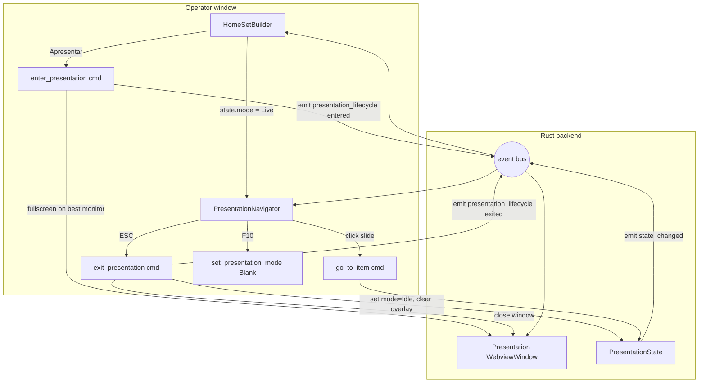

# Phase 6 — Corrections — Design

**Spec:** `.specs/features/phase6-corrections/spec.md`
**Status:** Draft

---

## Architecture Overview

Phase 6 is a corrections phase — no new domains, no new aggregates. The changes split into four layers:

1. **Window/presentation lifecycle** — a single Rust command (`enter_presentation` ≅ refactored `open_presentation_window`) becomes the *only* way to start projecting; a new `exit_presentation` command tears down the window AND resets state.mode. The operator window listens to a new `presentation_lifecycle` event and switches its main view between `home` and `navigator` accordingly.
2. **Operator UI in presentation mode** — a new `PresentationNavigator` component renders all slides of the current set (computed client-side from `presentationState.set.items`), with the current slide highlighted and click-to-jump dispatching the existing `go_to_item(itemIdx, slideIdx)` command.
3. **Theme polish** — mechanical sweep across all components, replacing `bg-gray-*`/`text-white`/`bg-blue-*` hardcodes with the semantic tokens already in `index.css`; adds two missing tokens (`--color-fg`, `--color-fg-on-primary`) so input text has a valid foreground in dark mode.
4. **Countdown finish-at** — `CountdownConfig` gains a `CountdownTarget` enum field (`Duration { duration_ms }` | `FixedTime { hour, minute }`); the existing drift-free ticker is unchanged (it already counts to a wall-clock target — only the *resolution* step at `start_countdown` differs).

Removals (Stage, redundant button) are pure deletions — no design needed beyond the inventory in the spec.



---

## Code Reuse Analysis

### Existing Components to Leverage

| Component | Location | How to Use |
|---|---|---|
| `go_to_item` command | `src-tauri/src/commands/presentation.rs:307-342` | Already accepts `item_index` + `slide_index: Option<usize>` — the navigator just calls this on click. No new command needed. |
| `do_blank_presentation` | `src-tauri/src/commands/presentation.rs:139-154` | Reused for F10 blackout (same code path as B key) |
| `set_presentation_mode` | `src-tauri/src/commands/presentation.rs:344-373` | Used by `exit_presentation` to set `Idle` |
| `open_presentation_window` | `src-tauri/src/commands/window.rs:97-141` | Refactor in-place: rename intent to "ensure projection window exists in fullscreen", drop the 1280×720 fallback when single-monitor, broadcast lifecycle event |
| `pick_secondary_index` + `logical_placement` | `src-tauri/src/commands/window.rs:41-89` | Pure functions — unchanged |
| `clear_overlay` command | `src-tauri/src/commands/overlay.rs` | Called from `exit_presentation` |
| Drift-free countdown ticker | `src-tauri/src/commands/countdown.rs:24-79` | Unchanged — already wall-clock based; only the `target_epoch_ms` resolution at `start_countdown` differs for `FixedTime` mode |
| `PresentationState` + `presentation_slides` (`Arc<RwLock<Vec<Vec<Slide>>>>`) | `state.rs`, `commands/presentation.rs` | Source of truth for the navigator. We already store the per-item slide vectors server-side; navigator gets slides from the `state_changed` event (need to expose them — see "Data Models" below) |
| `installKeyboardDispatcher` | `src/runtime/keyboard.ts` | Add F10 handler (hardcoded, not via bindings) and rewire `exitPresentation` callback to invoke the new lifecycle command |
| Semantic tokens (`bg-bg`, `bg-surface`, `bg-surface-2`, `border-border`, `text-muted`, `bg-primary`) | `src/index.css` | Already exist (D-23) — sweep replaces literals with these |
| `check-theme-tokens.ps1` | `scripts/check-theme-tokens.ps1` | Existing helper script — extend its deny-list and treat as the CI gate |
| `dnd-kit` SortableContext | `SetBuilder.tsx`, `HomeSetBuilder.tsx` | Not strictly reused, but the navigator's keyboard-up/down + click-to-jump shouldn't conflict with dnd patterns (navigator is read-only — no drag) |

### Integration Points

| System | Integration Method |
|---|---|
| `state_changed` event | Existing event; payload extended with `all_slides_per_item` (the flat slide list per item) so the navigator can render without an extra round-trip. Backward-compatible serde addition. |
| `countdown_config` JSON column | Existing TEXT column in `set_items.countdown_config`; new `CountdownTarget` enum lives inside the JSON blob (no migration needed if we accept tagged JSON; serde with `#[serde(default)]` + alias keeps Phase 5 data loading). |
| Tauri `invoke_handler!` registry | `enter_presentation` and `exit_presentation` replace `open_presentation_window`; `open_stage_window` removed |
| asset:// protocol | Untouched |
| `key_bindings` settings table | `exitPresentation` action stays (we just hardcode ESC as a permanent default); F10 → blackout is **not** added as a binding (P6-06 AC 6) — it lives directly in the keyboard dispatcher as a hardcoded handler |

### Concerns / Risks

| Risk | Mitigation |
|---|---|
| `state_changed` payload grows large for big sets (e.g. 60-slide hymn × 8 items) | Slides only have `lines: Vec<String>` + 2 ids — empirically <2 KB per song. Acceptable. If profiling shows lag, switch to a separate `slides_loaded` event emitted once at `load_set_for_presentation` and skip re-broadcasting on every nav. |
| ESC also closes modals (existing behavior in `KeyBindingsScreen`, dialogs, etc.) | Modals already capture ESC at the DOM level (`onKeyDown` stopPropagation on dialog) — the keyboard dispatcher's `exitPresentation` only fires when no input is focused (line 50-56). No regression. |
| Removing Stage subsystem breaks Phase 3 tests | `StageApp.test.tsx` is deleted; `OperatorApp.smoke.test.tsx` updated to drop the stage button assertion. The 109 → 124 Rust counts already absorbed; expect a delta around -8 Vitest tests and stable Rust counts. |
| Single-monitor fullscreen makes the projection window inescapable on a one-screen machine | ESC always exits (P6-06). The navigator on the operator window is on the *same* monitor when single-screen — but the projection window covers everything. Acceptable because ESC works from either window via `installKeyboardDispatcher` + `onForwardKeydown` (forwarded keydown event already exists). |
| Native `<input type="time">` color in dark mode | Apply `style={{ colorScheme: 'dark' }}` (or via CSS) — browser uses this hint for native control rendering. Verified pattern. |
| F10 may be captured by browser DevTools or OS | WebView2 does not bind F10 by default; we still call `e.preventDefault()` to suppress propagation. If Windows assigns F10 to a menu, the WebView gets it first. |

---

## Components

### Backend — `enter_presentation` command (refactor of `open_presentation_window`)

- **Purpose:** Idempotently ensure the projection window exists fullscreen on the best monitor; emit a lifecycle event so operator UI can switch to the navigator.
- **Location:** `src-tauri/src/commands/window.rs` (rename in place — old name kept as a deprecated re-export if any binding-action still uses it; we drop the toolbar button so the only callers are the operator's "Apresentar" handler and the existing `openPresentationWindow` ActionId — both updated)
- **Interfaces:**
  - `pub async fn enter_presentation(app: AppHandle) -> Result<(), ErrorPayload>`
- **Behavior:**
  - If `presentation` window exists → `set_focus()` and return (no event re-broadcast — already in presentation mode)
  - Else: pick secondary monitor (existing `pick_secondary_index`); build window with `.fullscreen(true)` regardless of monitor count (drop the conditional)
  - Emit `presentation_lifecycle` with payload `{ phase: "entered" }`
- **Dependencies:** `pick_secondary_index`, `logical_placement`, `Emitter::emit`
- **Reuses:** All existing window builder code; only changes the always-`.fullscreen(true)` and the new event emission

### Backend — `exit_presentation` command (new)

- **Purpose:** Close the projection window AND reset PresentationState to `Idle`, clear any overlay, broadcast lifecycle exit.
- **Location:** `src-tauri/src/commands/window.rs` (next to `enter_presentation`) — alternatively `commands/presentation.rs`; window.rs is more natural since the destructive action is the window close
- **Interfaces:**
  - `pub async fn exit_presentation(app: AppHandle, state: State<'_, AppState>) -> Result<(), ErrorPayload>`
- **Behavior:**
  1. If `presentation` window exists → `.close()` (idempotent — silently no-op if absent)
  2. Acquire `state.presentation` write lock → set `mode = Idle`, `frozen_at = None`, `overlay = None` (resolve current/next slides via existing helpers); drop lock
  3. Emit `state_changed` (existing event)
  4. Emit `presentation_lifecycle` with payload `{ phase: "exited" }`
- **Dependencies:** `Manager::get_webview_window`, `do_set_idle`-like helper (refactor existing `set_presentation_mode` body so we can call it without an Idle round-trip via the public command)
- **Reuses:** `clear_overlay` logic (inline it or call internally), `set_presentation_mode` body
- **Tests:**
  - `exit_when_no_window_is_open_is_noop` (Rust unit, mocks AppState)
  - `exit_clears_overlay` (sets overlay, calls exit, asserts None)

### Backend — `CountdownTarget` enum + `start_countdown` resolution change

- **Purpose:** Allow countdowns to be expressed as a wall-clock target time instead of a duration; ticker stays unchanged downstream.
- **Location:** `src-tauri/src/domain/countdown.rs` (enum + config struct change); `src-tauri/src/commands/countdown.rs` (resolution at `start_countdown`)
- **Interfaces:**
  - New enum `CountdownTarget` (see Data Models)
  - `CountdownConfig.target: CountdownTarget` (replaces `duration_ms: u64`)
  - `start_countdown` accepts an optional `target: Option<CountdownTarget>` *or* keeps the existing `duration_ms: Option<u64>` and adds `target_time: Option<(u8, u8)>` — choosing the latter to keep the wire shape backward-compatible (see Tech Decisions)
- **Behavior at `start_countdown`:**
  - If `target_time` provided → compute `target_epoch_ms` = today's epoch ms at `HH:MM:00` local-time; if `≤ now` → add 24h; set `duration_ms = target - now`
  - Else if `duration_ms` provided → existing behavior (`target_epoch_ms = now + duration_ms`)
  - Else use stored config (which may have `target: FixedTime` — resolve same as above)
- **Reuses:** Existing drift-free ticker (no change); only `target_epoch_ms` initialization differs
- **Tests:**
  - `fixed_time_today_future_resolves_to_today` (give 23:59 at 08:00 → ~16h duration)
  - `fixed_time_today_past_resolves_to_tomorrow` (give 06:00 at 08:00 → ~22h duration)
  - `config_round_trip_with_fixed_time_serde` (JSON round-trip preserves variant)
  - `config_round_trip_with_legacy_duration_field` (backward compat: old JSON `{"durationMs": 600000}` deserializes into `target: Duration { duration_ms: 600000 }`)

### Backend — `PresentationState` extended with `all_slides_per_item`

- **Purpose:** Give the operator's PresentationNavigator the full slide list without a separate round-trip; piggy-back on `state_changed`.
- **Location:** `src-tauri/src/domain/presentation.rs`
- **Interface change:**
  - Add `pub all_slides_per_item: Vec<Vec<Slide>>` field
  - Populate at `load_set_for_presentation` (it already builds `computed_slides` — just clone into the state)
- **Compat:** Field marked `#[serde(default)]` so TS can drop it from the wire when unused; new field is purely additive
- **Reuses:** Existing `computed_slides` machinery

### Frontend — `PresentationNavigator` (new)

- **Purpose:** Scrollable, click-to-jump slide list shown in the operator window while in presentation mode.
- **Location:** `src/components/presentation/PresentationNavigator.tsx`
- **Interfaces (props):**
  - Reads `usePresentationStore().state` — needs `set.items`, `currentItemIndex`, `currentSlideIndex`, `allSlidesPerItem`, `mode`
  - No own props
- **Layout:**
  ```
  ┌──────────────────────────────────────────────┐
  │ [Item 0: "Que se abra o céu"]   ◀ sticky    │
  │  ─────────────────────────────────────────   │
  │  ▸ verse 1 lines                  ← current  │
  │  • verse 1 cont.                              │
  │  • chorus                                     │
  │  • bridge                                     │
  │ [Item 1: "Tu reinas"]                         │
  │  • verse 1                                    │
  │  • ...                                        │
  └──────────────────────────────────────────────┘
  ```
- **Behavior:**
  - Render flat: each item becomes a sticky header (`top-0` within scroll container) + a `<ul>` of slide cards
  - Slide card text: first 3-4 lines of `slide.lines` (clamp via `line-clamp-4`)
  - Click → `invoke('go_to_item', { itemIndex, slideIndex })`
  - Highlight current slide: `bg-primary/10 ring-2 ring-primary` (or use `aria-current="true"`); other items show normal `bg-surface`
  - Auto-scroll: `useEffect` on `[currentItemIndex, currentSlideIndex]` → `currentRef.current?.scrollIntoView({ block: 'nearest', behavior: 'smooth' })`
  - Non-song items render a single card showing the item type icon + title ("Countdown — 10:00", "Mídia — sunset.mp4", "WebView — http://…", "Apresentação — slide 3/12")
  - For `SlideShow` items, render one card per pseudo-slide with `Slide N/M` label (pseudo-slides have no text)
- **Dependencies:** `usePresentationStore`, `go_to_item` (via `api/commands.ts`), `i18n` for labels
- **Reuses:** Theme tokens; clamp utilities; no dnd
- **Tests (Vitest):**
  - Renders all slides for a 2-item set
  - Click on slide card calls `go_to_item` with correct indices
  - Current slide is highlighted; on state change the highlight follows
  - Auto-scroll fires on currentSlideIndex change (jsdom: assert `scrollIntoView` called via spy)
  - Renders non-song items as single cards (countdown/webview/media/slideshow)

### Frontend — `OperatorApp` view-routing change

- **Purpose:** When `state.mode != "idle"`, show navigator as main content; otherwise show whatever the current nav tab is.
- **Location:** `src/windows/operator/OperatorApp.tsx`
- **Behavior:**
  - Add a derived `isPresenting = state?.mode === "live" || state?.mode === "blank" || state?.mode === "frozen"` (i.e. mode != idle and set is loaded)
  - Render order in `<main>`:
    1. If `isPresenting` → `<PresentationNavigator />` (regardless of `currentView`)
    2. Else → existing switch on `currentView`
  - Top-bar navigation tabs remain visible and clickable during presentation — clicking a tab while presenting *does not* exit presentation; it sets `currentView` so that exiting presentation returns to that tab. (Alternative: disable tabs during presentation — simpler but more restrictive. We choose the former.)
  - Subscribe to `presentation_lifecycle` event: on `exited`, ensure `currentView` is sensible (no behavior change needed since `isPresenting` flips by itself)
- **Removals:**
  - Drop `handleOpenStage`, `stageMonitorIdx`, `loadPersistedMonitor("window.stage.monitor")`, `openStageWindow` import
  - Drop the "Janela de Apresentação" toolbar button (`<button onClick={handleOpenPresentation}>`)
  - The "Apresentar" button moves into `HomeSetBuilder` (where the set is built) — or remains in the header but renamed/repurposed. **Decision:** keep it in `HomeSetBuilder` next to "Limpar" to keep header lean. Header gains nothing in its place.
- **Reuses:** Existing presentation store subscription, existing event listener wiring

### Frontend — `CountdownSetItemEditor` extension

- **Purpose:** Toggle between "Duração" and "Horário fixo" modes; render the appropriate input.
- **Location:** `src/components/set/CountdownSetItemEditor.tsx`
- **Behavior:**
  - Toggle group (two radio-like buttons) bound to local state `mode: 'duration' | 'fixedTime'`
  - When `mode === 'duration'`: render existing mm:ss input
  - When `mode === 'fixedTime'`: render `<input type="time">` with explicit `style={{ colorScheme: 'dark or light' }}` (driven by theme store) → store HH:MM as `{ hour: 0..23, minute: 0..59 }`
  - On save, serialize as new tagged form `{ target: { kind: 'duration', durationMs } | { kind: 'fixedTime', hour, minute } }`
  - Switching modes preserves the unused value in component state so the user can flip back and forth
- **Reuses:** Existing form chrome; only the input swaps
- **Tests:** New unit test for the editor — render in both modes; verify the JSON shape sent to `update_set_item`

### Frontend — `NotesField` and the textbox sweep

- **Purpose:** Fix the most visible light-theme defect.
- **Location:** `src/components/common/NotesField.tsx` (and a mechanical sweep across every other `<textarea>`/`<input>`)
- **Single-file change in NotesField:**
  - `bg-gray-700 border-gray-600 focus:border-blue-500` → `bg-surface-2 border-border focus:border-primary text-fg`
- **Sweep targets:** see spec P6-02 file list. The check script (`scripts/check-theme-tokens.ps1`) grows the deny-list to include: `bg-gray-(700|800|900)`, `border-gray-(600|700)`, `text-white`, `text-gray-(800|900)`, `bg-blue-(500|600)`, `bg-emerald-(500|600)`
- **No new abstractions** — direct class replacement per file

### Frontend — Keyboard handler additions

- **Purpose:** Hardcode ESC and F10 for presentation parity with PowerPoint.
- **Location:** `src/runtime/keyboard.ts` AND `src/windows/operator/OperatorApp.tsx` (callbacks)
- **Behavior:**
  - In `installKeyboardDispatcher`'s `handler`, after the bindings match check (line 60ish), add an unconditional branch: `if (e.key === "Escape") { onEscape(); e.preventDefault(); return; }` and `if (e.key === "F10") { onF10(); e.preventDefault(); return; }` — but only if `isPresenting()` getter returns true (callbacks can take a getter or just no-op if not presenting)
  - Wire callbacks in OperatorApp: `onEscape: () => exitPresentation()`, `onF10: () => toggleBlank()`
  - The existing `exitPresentation` ActionId callback can be removed from the bindings table since ESC is now hardcoded — leave the binding entry intact for backward UX but mark the row read-only in KeyBindingsScreen
- **PresentationApp side:** Same handler installed in `PresentationApp.tsx`; ESC there forwards to the operator via `emitForwardKeydown` (existing pattern) OR directly invokes `exit_presentation`. Directly invoking is simpler and works whether the keypress lands on operator or projection window.
- **Reuses:** Existing dispatcher infra and `onForwardKeydown` channel

### Removals — Stage subsystem

Pure deletion. Inventory tracked in the spec; tasks.md will enumerate exact files. No component design needed.

---

## Data Models

### `CountdownTarget` (new) and `CountdownConfig` (modified)

```rust
// src-tauri/src/domain/countdown.rs
#[derive(Serialize, Deserialize, Clone, Debug, PartialEq)]
#[serde(tag = "kind", rename_all = "camelCase")]
pub enum CountdownTarget {
    Duration { duration_ms: u64 },
    FixedTime { hour: u8, minute: u8 }, // 0..=23, 0..=59 — local timezone, today, rolls to tomorrow if past
}

#[derive(Serialize, Deserialize, Clone, Debug, PartialEq)]
#[serde(rename_all = "camelCase")]
pub struct CountdownConfig {
    #[serde(flatten)]
    // Default = Duration { 0 } so old JSON without 'target' but with 'durationMs' migrates via custom deserializer
    pub target: CountdownTarget,
    pub message: Option<String>,
    pub end_behavior: CountdownEndBehavior,
    pub background_media_id: Option<String>,
}
```

**Wire shape** (new):
```json
{ "target": { "kind": "duration", "durationMs": 600000 }, "endBehavior": "holdZero", ... }
{ "target": { "kind": "fixedTime", "hour": 9, "minute": 30 }, "endBehavior": "advanceSet", ... }
```

**Backward-compat deserializer:** Use a manual `impl<'de> Deserialize for CountdownConfig` that first tries the new tagged shape, then falls back to the old flat `{ "durationMs": 600000, ... }` shape and synthesizes `target: Duration { duration_ms }`. Add a unit test for each shape.

**CountdownState (no change):**
- `target_epoch_ms: Option<u64>` already exists and is what the ticker consumes
- `duration_ms` stays as the *resolved* remaining duration at start time (so existing UI showing total duration still works for both modes — for FixedTime mode it's "duration computed at start", which is fine)

### `PresentationState` addition

```rust
// src-tauri/src/domain/presentation.rs
pub struct PresentationState {
    // ... existing fields ...
    pub all_slides_per_item: Vec<Vec<Slide>>,  // NEW — populated by load_set_for_presentation
}
```

TypeScript mirror in `src/types/index.ts`:
```typescript
export interface PresentationState {
  // ... existing fields ...
  allSlidesPerItem: Slide[][];
}
```

### `presentation_lifecycle` event (new)

```typescript
type PresentationLifecycleEvent = {
  phase: "entered" | "exited";
};
```

Emitted from `enter_presentation` (entered, only on initial open — not on focus-existing) and `exit_presentation` (exited, always).

---

## Error Handling Strategy

| Error Scenario | Handling | User Impact |
|---|---|---|
| `enter_presentation` with empty set | Don't open the window. Return `Err(ErrorPayload::new("presentation.empty_set"))`. Frontend surfaces a toast: "Adicione itens ao conjunto antes de apresentar". | Toast appears, no window opens |
| `enter_presentation` and no monitors available | Skip the secondary-monitor logic; build windowed (existing fallback in `apply_monitor`); still `.fullscreen(true)` — Windows will fullscreen on the only available display | Window opens fullscreen on whatever monitor Windows picks |
| `exit_presentation` when window already closed | Idempotent: state still reset to Idle, lifecycle event still emitted, no error returned | No-op visible, state correct |
| Countdown `FixedTime { hour: 99 }` (invalid) | Validator at `start_countdown`: `hour < 24 && minute < 60`, else `Err("countdown.invalid_time")` | Toast in operator window; no ticker started |
| Countdown `FixedTime` and system clock skew at boundary (e.g. crossing midnight) | Ticker recomputes `remaining = target - now()` every second — already drift-free. If clock jumps forward past target, `remaining = 0` → end_behavior fires (acceptable) | None visible |
| TypeScript receives `state_changed` with `allSlidesPerItem` undefined (old Rust + new TS) | TS type has `allSlidesPerItem?: Slide[][]`; navigator falls back to empty array. No runtime crash | Navigator shows item titles only, no slide cards. Recover by reloading the set. |
| `<input type="time">` in dark mode shows black-on-black native chrome on older Chromium | `colorScheme: 'dark'` style hint on the input is the documented fix (Chromium 81+) | Native control respects dark theme |

---

## Tech Decisions (non-obvious)

| Decision | Choice | Rationale |
|---|---|---|
| Rename `open_presentation_window` to `enter_presentation` vs keep the name | Rename | Old name suggests "show a window"; new behavior is mode entry. Clarity wins. The frontend `openPresentationWindow` ActionId stays as the *binding name* (it's a stored user setting) — only the underlying invoke target changes. |
| Where to put the "Apresentar" button | Inside `HomeSetBuilder`, near the items list | Header had two buttons (Presentation + Stage); both are dead. Header stays lean. Keeping "Apresentar" near the set context is more discoverable. |
| Add F10 to `key_bindings` settings vs hardcode | Hardcode | Spec P6-06 AC 6 explicitly says not reassignable. Keeping it out of the bindings table avoids breakage if the user assigns F10 to something else by accident. |
| Wire-format for CountdownTarget: extra field on existing config vs full enum replacement | Tagged enum replacing `duration_ms` | Cleaner forward shape; the manual `Deserialize` handles legacy JSON. One source of truth, not a `duration_ms_legacy` + `target` shadow split. |
| Expose `all_slides_per_item` in state vs separate "get_navigator_slides" command | Embed in state | The frontend already subscribes to `state_changed` for every nav action — getting the slide list "for free" with each update keeps Navigator UI perfectly in sync. Payload size is acceptable (≤10 KB for typical sets). |
| Should clicking a navigator tab while presenting exit presentation? | No — clicks just change the under-mode `currentView`; presentation stays | Operator may want to peek at Mídia or Cronômetro mid-service without dropping projection. Exit is dedicated (ESC). |
| Where the `exit_presentation` command lives | `commands/window.rs` | It owns the window-close side effect; placing in `presentation.rs` would split related logic |
| Should `enter_presentation` also clear overlays | No — entering doesn't clear; exiting does | Entering after closing the operator's home with an overlay set should preserve overlay intent. Exiting is a full reset. |

---

## Implementation Order Notes

The spec's suggested order (P6-08 → P6-07 → P6-04 → P6-05 → P6-06 → P6-01/02 → P6-03 → P6-09) is sound. Specifically:

1. **P6-08 first (remove Stage)** — shrinks `OperatorApp.tsx`, `commands/window.rs`, and the i18n surface before we touch them again
2. **P6-07 second (remove redundant button)** — micro-step; isolates header
3. **P6-04 (mode entry)** — refactor `open_presentation_window` → `enter_presentation`; add `exit_presentation`; add lifecycle event; flip single-monitor to fullscreen
4. **P6-05 (navigator)** — depends on the lifecycle signal and the extended state payload
5. **P6-06 (keys)** — depends on having something to exit/blank
6. **P6-01 + P6-02 (theme sweep)** — independent of all the above; can run in parallel from a separate branch if desired
7. **P6-03 (dark text contrast)** — adds the missing `--color-fg` token and replaces `text-black`/`text-gray-900`
8. **P6-09 (countdown FixedTime)** — fully independent; ships last to keep the diff focused

---

## Open Questions to Confirm Before Tasks

1. **Header button** — Should the "Apresentar" button live in HomeSetBuilder (proposed) or remain a header button? *Recommendation: HomeSetBuilder, but easy to change.*
2. **Tabs during presentation** — Stay clickable (proposed) or disabled? *Recommendation: stay clickable.*
3. **Navigator for SlideShow items** — One card per pseudo-slide (proposed, gives jump granularity) or single card per item with current-slide annotation only? *Recommendation: one card per pseudo-slide.*
4. **F10 binding row in settings** — Hide entirely (proposed) or show as read-only with an info tooltip? *Recommendation: show read-only — gives the user a discoverable mapping.*

These are minor; can be resolved during Tasks or first implementation pass.
