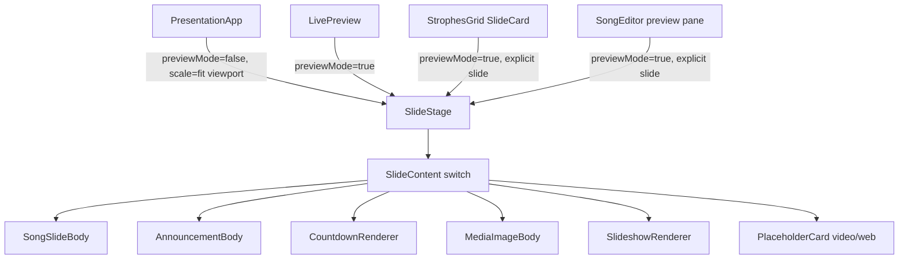

# Phase 9 — Fidelity & UX Design

**Spec**: `.specs/features/phase9-fidelity-ux/spec.md`
**Context**: `.specs/features/phase9-fidelity-ux/context.md`
**Status**: Draft

---

## Architecture Overview

The centerpiece is a **single shared slide renderer**. Today there are three
divergent renderers:

- `PresentationApp.SongSlide` — the projection (uses `SIZE_STYLE` vw-clamps +
  `POSITION_CLASS` + `MARGIN_CLASS` + `PRESET_COLORS`).
- `LivePreview.SongSlidePreview` — ad-hoc, ignores position/margin/size.
- `SlideChip` — already faithful (1280×720 virtual stage, fixed px, scaled).

We promote the `SlideChip` approach into a shared **`SlideStage`** (the scaling
shell) + **`SlideContent`** (the renderer switch), and route every surface
through it. The projection and previews then differ only by `scale` and a
`previewMode` flag (which swaps real video/iframe for placeholder cards per
D-34).



The remaining stories are localized fixes that do not depend on the renderer
(P9-01 i18n, P9-06 tabs, P9-07 drag) plus two that ride on it (P9-03 warning,
P9-09 blackout slide marker).

---

## Code Reuse Analysis

### Existing Components to Leverage

| Component | Location | How to Use |
| --- | --- | --- |
| `SlideChip` | `src/components/presentation/SlideChip.tsx` | Promote its virtual-stage + scale logic into `SlideStage`; then reimplement `SlideChip` as a thin caller (or delete in favor of `SlideStage`) |
| `layout.ts` maps | `src/components/presentation/layout.ts` | Single source for `FONT_CLASS`, `POSITION_CLASS`, `MARGIN_CLASS`, `PRESET_COLORS`, `stepSize`; add a stage-px size map (reuse `PREVIEW_SIZE_PX`) |
| `PresentationApp.SongSlide` | `src/windows/presentation/PresentationApp.tsx` | Becomes a thin `SlideStage`+`SlideContent` consumer; existing per-item switch (media/countdown/web/slideshow) moves into `SlideContent` |
| `CountdownRenderer`, `SlideshowRenderer` | `src/components/presentation/` | Render inside the stage unchanged (they already fill their box) |
| `AnnouncementRenderer` | `src/components/presentation/AnnouncementRenderer.tsx` | Refactor body into a `SlideContent` warning branch on the full stage |
| SectionCard dnd-kit pattern | `src/components/library/SectionCard.tsx` | Copy `DndContext`/`SortableContext`/`useSortable` usage for set-item rows |
| `reorderSetItems` | `src/api/commands.ts:254` | Persist drag order (already wired in `SetBuilder`) |
| `useSettingsStore` | `src/stores/settings.ts` | Add `loadLocale`, announcement margin, blackout toggle |
| `read_bool_setting` | `src-tauri/src/commands/presentation.rs:39` | Read the blackout toggle in `load_set_for_presentation` |

### Integration Points

| System | Integration Method |
| --- | --- |
| `state_changed` / appearance reload | Previews already reload on `onSettingChanged` (`presentation.*` / `announcement.*`); new keys reuse this path |
| `app.locale` setting | Read at boot into the store; `onLocaleChanged` already syncs live |
| `reorder_set_items` command | Unchanged Rust; new drag UI calls it |
| Settings key/value table | New keys `announcement.margin`, `presentation.blackout_after_song` — **no migration** (key/value rows) |

### CONCERNS.md check

`PresentationApp` is the highest-traffic render path. The refactor must be
behavior-preserving for the projection: gate it behind the same outputs (same
fonts/positions for real screens). Keep the existing Vitest suites
(`PresentationApp.test.tsx`, `LivePreview.test.tsx`, `StrophesGrid.test.tsx`)
green; add stage tests. Risk mitigation: land `SlideStage` first with the
projection routed through it and verify visually before touching previews.

---

## Components

### `SlideStage` (new)
- **Purpose**: Scale a fixed 1280×720 virtual slide to fit any container,
  preserving aspect (letterbox with preset bg), so one composition serves
  projection and previews.
- **Location**: `src/components/presentation/SlideStage.tsx`
- **Interfaces**:
  - `props: { children: ReactNode; backgroundColor?: string }`
  - Internally: `scale = min(cw/1280, ch/720)` via `ResizeObserver`; inner
    `1280×720` absolutely-positioned, `transform: scale()` + centering translate.
- **Dependencies**: `ResizeObserver` (already used by `SlideChip`).
- **Reuses**: `SlideChip` stage/scale logic.

### `SlideContent` (new)
- **Purpose**: The single item-type switch that paints a slide's body onto the
  stage coordinate space (1280×720, fixed px sizes).
- **Location**: `src/components/presentation/SlideContent.tsx`
- **Interfaces**:
  - `render({ itemType, slideLines, sectionLabel, background, appearance, previewMode, countdownConfig?, mediaRecord?, slideshow?, warningText? })`
  - Branches: `song`/`blank` → `SongSlideBody`; `__title__` label → title/author
    layout; `__blackout__` label → solid black; `warning` → `AnnouncementBody`;
    `countdown` → `CountdownRenderer`; `media` image → ``,
    video → placeholder (preview) / `MediaSlideRenderer` (projection);
    `slide_show` → `SlideshowRenderer`; `web_view` → placeholder/`WebViewRenderer`.
- **Dependencies**: `layout.ts` maps, existing renderers.
- **Reuses**: `PresentationApp.SongSlide` body, `AnnouncementRenderer` body,
  `LivePreview` placeholder cards.

### `SongSlideBody` (new, extracted)
- **Purpose**: Title/author + lyric layout on the stage; honors appearance.
- **Location**: co-located in `SlideContent.tsx` (or `presentation/bodies.tsx`).
- **Interfaces**: `({ slideLines, sectionLabel, appearance, background })`.
- **Title rule (P9-05)**: title = `stepSize(fontSize, +1)`, **author =
  `stepSize(fontSize, -1)`** (was `fontSize`), color = title fg @ opacity-80.
- **Reuses**: existing `SongSlide` JSX.

### `PresentationApp` (modified)
- **Purpose**: Projection window; now composes `SlideStage` + `SlideContent`.
- **Changes**: Replace inline `SongSlide` + per-item branches with
  `<SlideStage backgroundColor={presetBg}><SlideContent previewMode={false} .../></SlideStage>`.
  Overlay/announcement branch routes through `SlideContent warning`.
- **Reuses**: existing state wiring, transitions (`TransitionStage` wraps the
  stage).

### `LivePreview` (modified, P9-02)
- **Purpose**: Operator live pane; delete `SongSlidePreview`, render
  `SlideStage`+`SlideContent` with `previewMode`.
- **Location**: `src/components/presentation/LivePreview.tsx`.
- **Reuses**: derives `SlideContent` props from `usePresentationStore` state +
  settings; keeps `FrameTag` (BLACKOUT/CONGELADO).

### `StrophesGrid` / `SlideCard` (modified, P9-08)
- **Purpose**: Larger faithful thumbnails.
- **Changes**: `SlideCard` body becomes `SlideStage`+`SlideContent` (explicit
  slide), with a section-label badge overlay. Grid min-column ~`minmax(220px,1fr)`;
  keep active highlight + `scrollIntoView`. Blackout slide → black thumb +
  badge.
- **Reuses**: shared renderer; `itemMeta` for non-song items.

### Song editor preview pane (modified, P9-04)
- **Purpose**: Right-side, default-open, whole-song faithful preview.
- **Location**: `src/components/library/SongEditor.tsx` (layout) — wrap form +
  new `SongPreviewPane`. Remove `previewOpen`/Eye from `SectionCard`.
- **New**: `SongPreviewPane` builds the slide list = optional title slide +
  `sections.flatMap(splitSectionBody(...))` (+ blackout if enabled, to mirror
  projection) and renders each via the shared stage. Two-column flex:
  `flex-1` form / `w-[360px]` (or ~40%) scrollable preview.
- **Reuses**: `splitSectionBody` (`src/utils/slidePreview.ts`), `previewBackground`
  memo already present, `appearance` already assembled.

### `AnnouncementRenderer` (refactored, P9-03)
- **Purpose**: Warning body that fills the stage.
- **Changes**: Body moves into `SlideContent` warning branch; container fills the
  full stage with `backgroundColor: preset.bg`; padding driven by new
  `announcementMargin` via `MARGIN_CLASS`; position via `POSITION_CLASS`.
- **Result**: no gray edges; honors position + margin; identical in preview and
  projection.

### `OperatorApp` nav tabs (modified, P9-06)
- **Changes**: When `isPresenting`, add `disabled` + `disabled:opacity-50
  disabled:cursor-not-allowed` to the five nav buttons and `title={t("nav.lockedWhilePresenting")}`.
- **Location**: `src/windows/operator/OperatorApp.tsx:220-272`.

### Set-item drag reorder (modified, P9-07)
- **Changes**: Wrap the item list in `SetBuilder` (`src/components/set/SetBuilder.tsx`)
  with `DndContext`+`SortableContext` (vertical); each row `useSortable` with a
  grip handle; `onDragEnd` → `arrayMove` local state → `reorderSetItems(setId, ids)`.
  Keep `ArrowUp`/`ArrowDown`. Apply the same to the `HomeSetBuilder` set list if
  it renders reorderable items.
- **Reuses**: `SectionCard` dnd pattern; `reorderSetItems`.

### Settings additions (modified)
- **`SettingsScreen`**: add toggle "Black slide after each song"
  (`blackoutAfterSong`) and an announcement margin picker.
- **`useSettingsStore`**: add `announcementMargin`, `blackoutAfterSong`,
  `loadLocale()`, and include the two new keys in `PRESENTATION_SETTING_KEYS`
  reload + `loadPresentationSettings`.

---

## Backend Changes (Rust)

### Blackout slide (P9-09)
- **`presentation.rs`**: add `pub const BLACKOUT_SLIDE_LABEL: &str = "__blackout__";`
  and `fn blackout_slide(song_id) -> Slide { lines: vec![], section_label: BLACKOUT_SLIDE_LABEL, section_id: format!("{song_id}__blackout") }`.
- In `load_set_for_presentation`, after building a **Song** item's `s` (post
  title-slide insert), `if read_bool_setting(pool, "presentation.blackout_after_song", true).await { s.push(blackout_slide(...)); }`.
- Only Song items get it (not media/countdown/web/slideshow/blank).
- `next_slide`/`resolve_*` logic is index-based and needs **no change** — the
  blackout is just another slide in the vec.

### Frontend rendering of blackout
- `SlideContent`: `sectionLabel === "__blackout__"` → solid black div, no text.
- `StrophesGrid`: black thumbnail + `t("presentation.blackoutSlide")` badge.

### i18n bug (P9-01)
- `useSettingsStore.loadLocale()`: read `app.locale`, set store `locale`, and
  `i18next.changeLanguage`. Call in `OperatorApp` + `PresentationApp` boot effect
  (alongside `loadPresentationSettings`). `main.tsx` may keep its early
  `changeLanguage` for flash-prevention; the store sync is the fix.
- Alternative considered: bind `LanguagePicker` to `i18n.language` instead of the
  store — rejected; keeping the store as the single source is cleaner and
  consistent with `onLocaleChanged`.

---

## Data Models

No DB schema change. Two new settings rows (string `"true"/"false"` / enum):

```
announcement.margin            : "none"|"sm"|"md"|"lg"|"xl"   (default "lg")
presentation.blackout_after_song : "true"|"false"            (default "true")
```

New slide marker (frontend-detected, no type change):

```
sectionLabel === "__blackout__"  → render solid black
```

`Slide` struct is unchanged (reuses `lines`, `section_label`, `section_id`).

---

## Error Handling Strategy

| Error Scenario | Handling | User Impact |
| --- | --- | --- |
| `app.locale` missing/invalid | `loadLocale` falls back to default, no throw | Picker shows default locale |
| Non-16:9 projector | Stage letterboxes, preset bg fills bars | Slight bars, full fidelity |
| Background media fails to load | Existing `onError` hide + preset bg behind | Black/preset fallback |
| Drag dropped outside list | dnd-kit no-op; local state unchanged | Order preserved |
| Blackout setting unreadable | `read_bool_setting` returns default `true` | Blackout still appended |

---

## Tech Decisions (non-obvious)

| Decision | Choice | Rationale |
| --- | --- | --- |
| Renderer unification | One `SlideStage`+`SlideContent` for projection + all previews | Guarantees fidelity; eliminates 3-way drift (chosen by user) |
| Stage scaling | Fixed 1280×720, `transform: scale(min(cw/1280,ch/720))`, letterbox | Preview == projection up to scale; proven in `SlideChip` |
| Blackout representation | Sentinel `section_label "__blackout__"`, empty lines | No `Slide`/enum change; index logic untouched; serde-safe |
| Blackout placement | Append per Song item, gated by setting (default ON) | Matches user choice; per-song dark transition |
| Author size | `stepSize(fontSize, -1)` | One notch below body, two below title — visibly smaller, same color |
| Announcement margin | New setting, default `lg` (was hardcoded `p-16`) | Makes overlay margin consistent with songs; enables full-stage fill |
| Tabs while presenting | Disable (visible) not hide | Stable layout; clearer affordance |
| Drag reorder | dnd-kit, keep arrows | Reuses existing dep/pattern; a11y fallback |
| No migration | Settings are key/value rows | New keys read with defaults; zero schema risk |

---

## Suggested Build Order (for Tasks phase)

1. **P9-01** i18n `loadLocale` (isolated, quick win).
2. **SlideStage + SlideContent** extracted; route **PresentationApp** through it
   (behavior-preserving) — verify projection unchanged.
3. **P9-03** warning via `SlideContent` (full-stage fill + margin setting).
4. **P9-05** author size in `SongSlideBody`.
5. **P9-02** route `LivePreview` through shared renderer; **P9-08** `StrophesGrid`.
6. **P9-04** editor right preview pane; remove section Eye toggle.
7. **P9-09** Rust blackout slide + setting + frontend black render + grid badge.
8. **P9-06** disable tabs; **P9-07** drag reorder + settings UI + i18n strings.
9. Tests: stage/content unit tests, blackout splitter test, locale-sync test,
   reorder test; full gate (`tsc`, `cargo test`, `clippy`, Vitest).

---

## Open Questions for Tasks/Execute

- Should the editor preview also render the trailing blackout slide for full
  parity? (Leaning yes, low cost — mirrors projection.)
- Exact preview-pane width / responsive collapse on narrow operator windows
  (agent discretion; default ~360px, collapsible).
</content>
